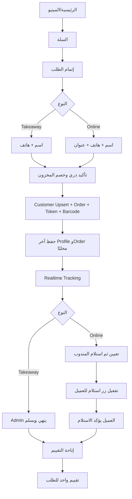

# المرجع التنفيذي النهائي — جميع الموديولات والأداء والتزامن

الإصدار 6.0. MERN وMongoDB/Mongoose. المرجع الكامل بعد إضافة سياسات Race Conditions وهدف استجابة من نصف ثانية إلى ثانية.

الأهداف: p95 أقل من أو يساوي 500ms، وp99 أقل من أو يساوي 1000ms للطلبات التفاعلية. العمليات الثقيلة Async. كل الجداول Pagination 10 عدا Board الطربيزات.

---

# المرجع النهائي الموحد للباك إند — جميع الموديولات

الإصدار 5.0. تقنية MERN وMongoDB/Mongoose. يحتوي كل المواصفات والتكاملات المتفق عليها حتى موديول خدمات الطربيزات، مع مراجعة موحدة للبيانات والـWorkflows.

كل جدول وسجل Pagination من الخادم بقيمة 10 افتراضيًا، عدا Board الطربيزات الذي يعرض 20 كارد. عند التعارض تسري مراجعة التكامل في نهاية الملف.

---

# المرجع النهائي الشامل للباك إند حتى التقارير وسجل الأحداث

الإصدار 4.0. مرجع MERN الجامع لكل الموديولات التي تم تحليلها حتى الآن.

يشمل الموردين، المواد الخام، التحذيرات، المشتريات، المرتجعات، المنتجات، الدرج، الموظفين، الأجهزة والحضور والصلاحيات، الطلبات الأونلاين والتيك أواي، التحضير، المندوبين، العملاء، سجل الطلبات، طلبات الطربيزات، التقارير المالية، وسجل الأحداث الشامل.

عند التعارض تسري القرارات الأحدث في هذا الملف. كل الجداول والسجلات Pagination من الخادم بقيمة 10 افتراضيًا، عدا Board العشرين طربيزة.

---

# المرجع الشامل للباك إند — الموردون حتى منظومة الطلبات

الإصدار 3.3. مرجع MERN الجامع، ويشمل دورة طلبات الطربيزات العشرين والتحضير والإلغاء والإنهاء والطباعة.

كل الجداول والسجلات Server-side Pagination بقيمة 10 افتراضيًا، بينما Board الطربيزات يعرض العشرين كارد ثابتة. عند التعارض تسري القرارات الأحدث هنا.

---

# المرجع التنفيذي الكامل للباك إند — من الموردين إلى الموظفين

الإصدار 2.0 — وثيقة التحليل والـWorkflow والـData Flow والـSchemas الكاملة.

التقنية MERN: MongoDB وExpress وReact وNode.js مع Mongoose. الباك القديم خارج التصميم. تضم الوثيقة الموردين والمواد الخام والتحذيرات والمشتريات والمرتجعات والمنتجات والدرج وموديول الموظفين الذي يضم الأجهزة والحضور والانصراف والصلاحيات وسجل أحداث الشخص. سجل الأحداث العام خدمة مشتركة من نفس Audit Collection.

عند التعارض مع مستند أقدم تسري هذه الوثيقة. كل جدول أو سجل يستخدم Server-side Pagination بقيمة 10 افتراضيًا. معاينات التحرير المؤقتة ليست سجلات.

---

# المواصفات الكاملة للنظام حتى مودول المنتجات

> هذه النسخة مدمجة داخل المرجع التنفيذي، ويأتي بعدها مباشرة تصميم الدرج ثم موديول الموظفين.

الإصدار 1.0 — المرجع الرئيسي الحالي للتحليل وتصميم البيانات.

النطاق: الموردون، المواد الخام، التحذيرات، المشتريات، مرتجعات المواد الخام، والمنتجات. التقنية المعتمدة: MERN باستخدام MongoDB وExpress وReact وNode.js، مع Mongoose في الباك إند.

هذه وثيقة تصميم وليست تنفيذًا. المرجع هو قرارات المستخدم ومراجعة الفرونت الموجود؛ الباك القديم خارج التصميم. عند التعارض مع وثيقة أقدم، تسري هذه الوثيقة.

## 1. القرارات الحاكمة

- حساب المورد مستقل تمامًا عن المشتريات والمرتجعات. الدين والمستحق ودفعاتهما تُسجّل يدويًا فقط من صفحة المورد.
- دفعة الدين اليدوية تصرف من الدرج، وتحصيل المستحق اليدوي يدخل الدرج. تسجيل أصل الدين أو المستحق لا يحرك نقدًا.
- تعريف المادة لا يضيف مخزونًا. كل كمية جديدة تدخل كدفعة من قسم المشتريات فقط.
- لكل مادة وحدة كبيرة وصغيرة ومعامل تحويل. المستخدم يدخل الكبيرة والصغيرة تظهر تلقائيًا.
- سحب التالف هو السحب النهائي نفسه: حركة واحدة لا تُعدل ولا تُحذف ولا تُستعاد.
- انتهاء الصلاحية يظهر في التحذيرات ولا يمنع البيع أو المرتجع أو الإدراج، ولا يغيّر أولوية الدفعة.
- فاتورة المشتريات يمكن أن تجمع عدة موردين، ثم ينشئ زر واحد فاتورة مستقلة لكل مورد.
- مرتجع المواد يخصم من الدفعة التي يحددها المستخدم بتكلفتها الفعلية، بلا أثر على حساب المورد أو الدرج.
- تكلفة المنتج الحالية هي تكلفة إنتاج الوحدة التالية من الدفعات التي سيخصم منها حسب الأولوية. الطلب الفعلي يحفظ تكلفته من الدفعات التي خُصمت فعلًا.
- جميع العمليات لها تاريخ تجاري عند الحاجة، ووقت تسجيل حقيقي من الخادم، والموظف المنفذ.

## 2. قواعد تقنية مشتركة

### 2.1 الهوية والوقت والدقة

المعرفات `ObjectId`. كل لحظة تخزن `Date` بتوقيت UTC وتعرض في `Africa/Cairo`. التاريخ التجاري أو الصلاحية يحفظ كنص صحيح `YYYY-MM-DD` حتى لا يتحول ليوم آخر. المال والكميات تستخدم `Decimal128` وتُنقل في JSON كسلاسل؛ لا تستخدم JavaScript Number في الحسابات المالية.

سياسة الدقة المقترحة: المال منزلتان عند الإدخال، تكلفة المخزون الداخلية حتى 8 منازل، والكمية الصغيرة حتى 6 منازل. العملة EGP مبدئيًا.

### 2.2 المعاملات ومنع التكرار

أي عملية تمس أكثر من Collection تنفذ في MongoDB transaction واحدة على Replica Set. الدفعة النقدية تحفظ قيد المورد وحركة الدرج معًا. تسجيل مادة مشتراة يحفظ الدفعة وحركة المخزون وسطر الفاتورة معًا. البيع يحفظ الطلب وتخصيص الدفعات وحركات المخزون معًا.

كل أمر مالي أو مخزني يستخدم `Idempotency-Key`. إعادة نفس الطلب تعيد نتيجته، ونفس المفتاح بمحتوى مختلف ينتج تعارضًا. تحديثات الرصيد مشروطة بالنسخة والكمية الحالية لمنع المخزون أو الدين السالب عند التزامن.

Collection مشتركة `operationRequests`: `_id`, `actorId`, `scope`, `key`, `requestHash`, `responseStatus`, `responsePayload`, `createdAt`, `completedAt`. فهرس unique على `{actorId, scope, key}`.

### 2.3 التدقيق والصلاحيات

كل إنشاء أو تعديل أو إيقاف أو حركة يسجل actor، server time، الكيان، العملية، والفرق/السبب. إخفاء الزر لا يكفي؛ Express يفحص الصلاحية. السجلات المالية والمخزنية لا تُعدل أو تُحذف؛ التصحيح بقيد مستقل عندما يكون مسموحًا.

## 3. الموردون

### 3.1 الشاشة والبيانات

أعلى الصفحة نموذج إضافة، وأسفله جدول 10 موردين في الصفحة. الحقول الخمسة الإلزامية: اسم المورد، اسم المسؤول، الهاتف، نوع المورد، والمدينة. الهاتف نص للحفاظ على الصفر. البحث بالاسم أو الهاتف أو المدينة مقترح.

صفحة المورد تعرض البيانات والتواريخ، المواد الخام المرتبطة، إجمالي رصيد الديون علينا، إجمالي رصيد المستحقات لنا، نموذج العمليات، وسجلًا مقسمًا للصفحات. الرصيدان منفصلان ولا يُسوّيان تلقائيًا.

### 3.2 العمليات والمعادلات

- DEBT يزيد رصيد الدين ولا يحرك الدرج.
- RECEIVABLE يزيد المستحق ولا يحرك الدرج.
- DEBT_PAYMENT يقلل الدين ويسجل OUT في الوردية المفتوحة.
- RECEIVABLE_COLLECTION يقلل المستحق ويسجل IN في الوردية المفتوحة.

رصيد الدين = تسجيلات الدين − دفعات الدين + القيود العكسية. رصيد المستحق = تسجيلات المستحق − التحصيلات + القيود العكسية.

المبلغ موجب بمنزلتين. الدفعة الأكبر من الرصيد أو لحساب صفر مرفوضة. صرف دين يحتاج نقدًا كافيًا ووردية مفتوحة. فشل حركة الدرج يرجع العملية كلها. عمليتان متزامنتان لا تتجاوزان الرصيد.

### 3.3 التواريخ والتصحيح

`occurredOn` تاريخ العملية و`recordedAt` وقت إدخالها. الدين والمستحق يمكن إدخالهما بتاريخ سابق مع ملاحظة؛ الدفعة النقدية وقتها الحالي ووردية التنفيذ. لا تاريخ مستقبلي.

القيد لا يُعدل أو يُحذف. العكس الكامل ينشئ REVERSAL مرتبطًا بالأصل وسببًا إلزاميًا. عكس دفعة دين يعيد الدين ويسجل قبضًا، وعكس تحصيل مستحق يعيد المستحق ويسجل صرفًا يحتاج نقدًا. لا عكس يجعل رصيدًا سالبًا، ولا عكس لنفس الأصل مرتين.

إيقاف المورد مقترح بدل حذفه إذا له تاريخ. المورد الموقوف يظل قابلًا للعرض وتسوية رصيده، ولا يظهر لإضافة مواد جديدة.

### 3.4 Schema الموردين

`suppliers`: `_id`, `name`, `contactPerson`, `phone`, `phoneNormalized`, `supplierType`, `city`, `status` ACTIVE/INACTIVE, `createdAt/By`, `updatedAt/By`, `statusChangedAt/By`, `statusChangeReason`, `version`, `coordinationVersion`. الاسم والهاتف ليسا unique. فهارس القائمة والحالة والهاتف.

`supplierAccounts`: `_id`, `supplierId` unique، `currency`, `debtBalance`, `receivableBalance`, `version`, `createdAt`, `updatedAt`. لا API لتعديل الرصيد مباشرة.

`supplierAccountEntries`: `_id`, `supplierId`, `sequenceNo`, `kind`, `accountSide`, `direction`, `amount`, `occurredOn`, `recordedAt/By`, `notes`, `debtBalanceAfter`, `receivableBalanceAfter`, `reversesEntryId`, `reversalReason`, `origin` MANUAL/REVERSAL، `operationRequestId`. unique `{supplierId, sequenceNo}` وunique جزئي للعكس.

`cashDrawerTransactions` يحتاج `shiftId`, direction, amount, currency, `supplierEntryId` unique جزئي، recordedAt/By ومرجع العكس. تصميم الدرج الكامل لاحقًا.

### 3.5 API الموردين

POST/GET `/api/suppliers`، GET/PATCH `/api/suppliers/:id`، PATCH الحالة، GET المواد، GET الحساب، GET القيود، POST قيد يدوي، POST عكس. القائمة pageSize=10.

## 4. المواد الخام

### 4.1 تعريف المادة والوحدات

صفحة التعريف تحتوي الاسم، المورد، الوحدة الكبيرة والصغيرة، معامل التحويل، سعرًا مرجعيًا مقترحًا، حد المخزون، وأيام تنبيه الصلاحية. لا كمية افتتاحية ولا صلاحية عامة؛ الرصيد يبدأ صفرًا والصلاحية تخص الدفعة.

أمثلة: كيلو=1000 جرام، لتر=1000 ملليلتر، كرتونة=عدد عبوات يحدد للمادة. لا تحويل وزن إلى حجم بلا تعريف إضافي. المستخدم يدخل الكبيرة والصغيرة للقراءة فقط؛ الخادم يعيد الحساب.

الكمية الصغيرة = الكبيرة × المعامل. تكلفة الصغيرة للعرض في دفعة = تكلفة الدفعة ÷ كميتها الصغيرة. لا تقريب مبكر؛ آخر خروج يحمل باقي القيمة لضمان وصول كمية وقيمة الدفعة إلى صفر معًا.

### 4.2 صفحة القائمة والتفاصيل

صفحة المواد: نموذج التعريف ثم جدول. الإجراءات تعديل، حذف تعريف غير مستخدم، وسحب. لا زر Refresh يدوي وفق التفسير الحالي. الجدول يعرض المادة، المورد، الوحدتين، الموجود، آخر سعر شراء، أقرب صلاحية، الحدود، والإجراءات.

صفحة المادة تعرض بياناتها ودفعاتها. كل دفعة تعرض رقمها، المورد التاريخي، الأصل والمتبقي، المباع، المسحوب، السعر والقيمة، الاستلام والصلاحية، الموظف، الأولوية والحالة. لا إضافة دفعة من الصفحة ولا تعديل كمية/سعر دفعة مرحلة.

### 4.3 الدفعات والأولوية

كل إدراج ناجح من المشتريات ينشئ دفعة مستقلة. الدفعة الجديدة تأخذ آخر أولوية افتراضيًا. الأولوية 1 تخصم أولًا، ثم التالية. تغيير الترتيب يؤثر على الخصم القادم فقط.

الدفعة الفارغة لا تدخل الخصم. المنتهية تدخل عادي حسب الأولوية. إذا احتاج البيع كمية موزعة على دفعتين، تحفظ حصة وتكلفة كل دفعة.

### 4.4 السحب النهائي

اختيار دفعة، إدخال كمية كبيرة مع الصغيرة التلقائية، سبب إلزامي ومعاينة التكلفة، ثم تأكيد. يقل المتبقي والقيمة، وتُكتب WITHDRAWAL، ويظهر في سجل المواد المسحوبة. لا تأثير على المورد أو الدرج.

السحب لا يتجاوز المتبقي، ولا يتكرر، ويتنافس بأمان مع البيع. لا تعديل أو حذف أو استعادة. «تالف» سبب للسحب النهائي وليس نوع حركة ثانية. سجل المسحوب يعرض المادة والدفعة والمورد التاريخي والوحدتين والتكلفة والسبب والمنفذ والتاريخ والطباعة إن أضيفت لاحقًا.

### 4.5 Schema المخزون

`measurementUnits`: `_id`, `code` unique، `nameAr`, `kind` MASS/VOLUME/COUNT/CONTAINER، `physicalFactor`, `createdAt`.

`rawMaterials`: `_id`, `name`, `supplierId`, `largeUnitId`, `smallUnitId`, `conversionFactor`, `smallQuantityStep`, `referenceLargeUnitPrice`, `currency`, `minStockSmall`, `expiryAlertDays`, `createdAt/By`, `updatedAt/By`, `version`, `priorityVersion`, `stockVersion`, `unitsLocked`. الوحدات تثبت بعد أول استلام أو وصفة.

`rawMaterialBatches`: `_id`, `materialId`, `batchNumber`, `purchaseReceiptItemId` unique، `supplierId`, snapshots للأسماء والوحدات والمعامل، `initialQuantitySmall`, `remainingQuantitySmall`, `purchaseLargeUnitPrice`, `initialInventoryValue`, `remainingInventoryValue`, `currency`, `receivedOn`, `expiryOn`, `recordedAt/By`, `salePriority`, priorityChangedAt/By، `version`, `balanceUpdatedAt`.

`inventoryMovements`: `_id`, `batchId`, `sequenceNo`, `kind` PURCHASE_RECEIPT/SALE_CONSUMPTION/WITHDRAWAL/PURCHASE_RETURN، `quantitySmall`, `inventoryValue`, `quantityAfterSmall`, `inventoryValueAfter`, `occurredOn`, `recordedAt/By`, `reason`, snapshots، `operationRequestId`, ومراجع المصدر. immutable، مع فهارس unique للمصادر وتسلسل الدفعة.

## 5. التحذيرات

### 5.1 الأنواع

- OUT_OF_STOCK: متاح المادة صفر.
- LOW_STOCK: المتاح أكبر من صفر وأقل من أو يساوي الحد. لا يظهر مع النفاد.
- EXPIRED: دفعة لها صلاحية أقدم من يوم القاهرة وبها رصيد.
- EXPIRING_SOON: دفعة غير فارغة داخل أيام التنبيه ولم تنتهِ. NULL يعطل القرب فقط، وصفر ينبه يوم الصلاحية.

المنتهي لا يمنع البيع. انتهاء الصلاحية لا يغير الكمية أو القيمة ولا ينشئ سحبًا. تحذير الدفعة يختفي عندما يصبح رصيدها صفرًا بالبيع أو السحب أو المرتجع.

### 5.2 الصفحة والـData Flow

أربع بطاقات أعداد، وفلاتر النوع والمادة والمورد والبحث ورقم الدفعة، وجدول 10 في الصفحة. تحذير المخزون يخص المادة، وتحذير الصلاحية يخص الدفعة. مورد الدفعة تاريخي.

التحذيرات Read Model مشتقة لحظيًا من المواد والدفعات؛ لا Collection إلزامية ولا زر حذف. `evaluatedAt` هو وقت التقييم وليس وقت أول ظهور. مرور يوم جديد يغيّرها دون حركة مخزون. الصفحة تعيد القراءة بعد شراء أو بيع أو سحب أو مرتجع وتعديل الحدود.

`WarningItem`: id ثابت مشتق، type، materialId/name، supplierId/name، batchId/number عند الحاجة، الكميتان والوحدتان، threshold، expiryOn، daysUntilExpiry، evaluatedAt، details، materialPath. الاستجابة تشمل pagination، summary، businessToday وtimezone.

## 6. المشتريات

### 6.1 الصفحات والحالات

ثلاثة أقسام: إنشاء فاتورة، غير المدرجة، والمدرجة. الفاتورة المجمعة تجمع عدة موردين ولا تحتوي اختيار مورد في الرأس. الرقم والتاريخ والوقت والمنشئ تلقائية.

الحالات: DRAFT، SPLIT، PARTIALLY_REGISTERED، REGISTERED. غير المدرجة تشمل الثلاث الأولى، والمدرجة الأخيرة فقط.

### 6.2 إنشاء السطور

بحث المادة يعيد المادة وموردها والوحدات وآخر سعر دفعة. عند الاختيار يظهر: المادة، المورد، آخر سعر، الكمية الكبيرة، الصغيرة التلقائية، سعر الكبيرة القابل للتعديل، وإجمالي السطر. مادة بلا سعر سابق تعرض ذلك بوضوح وتحتاج سعرًا.

الإجمالي يحسب بالخادم. مادة واحدة مرة واحدة في المجموعة هو المقترح الأبسط. حفظ المسودة لا يغير المخزون أو المورد أو الدرج، ويسمح بالتعديل قبل بدء التسجيل.

### 6.3 إنشاء فاتورة لكل مورد

زر صريح يجمع السطور حسب مورد Snapshot وينشئ فاتورة طفل لكل مورد. 40 مادة موزعة على 4 موردين تنتج 4 فواتير. الفاتورة المجمعة تبقى الغلاف.

الزر لا يعمل على فاتورة غير محفوظة أو سطر بلا مورد. الضغط مرتين لا يكرر. فشل طفل يرجع الجميع. قبل تسجيل أي سطر يمكن التعديل، ثم يصبح التقسيم قديمًا ويحتاج «تحديث فواتير الموردين». بعد تسجيل أول سطر تتقفل السطور كلها.

### 6.4 تسجيل المادة

في فاتورة المورد، زر لكل سطر. يعرض المادة والمورد والكمية والسعر، ويدخل تاريخ الصلاحية الاختياري؛ تاريخ الاستلام مقترح اليوم. التأكيد ينشئ دفعة وحركة PURCHASE_RECEIPT، ويربطهما بالسطر، ثم يحدث حالات الطفل والمجموعة.

السطر لا يسجل مرتين. المنتهي يقبل ويظهر بالتحذيرات. حد المخزون وأيام التنبيه لا يعاد إدخالهما. بعد آخر سطر تنتقل المجموعة إلى سجل المدرجة.

### 6.5 الفصل المالي والطباعة

المشتريات لا تنشئ دينًا أو مستحقًا أو دفعة أو حركة درج في أي مرحلة. عادي ألا يساوي الدين اليدوي قيمة مشتريات المورد.

زر طباعة لكل مجموعة ولكل فاتورة مورد وفي القوائم. الطباعة تعرض الحالة؛ لا تغيرها. المجمعة تعرض التجميع حسب المورد، والطفل يعرض موردًا واحدًا. تستخدم snapshots كي لا تتغير الفاتورة القديمة.

### 6.6 Schema المشتريات

`purchaseGroups`: `_id`, `groupNo` unique، `invoiceDate`, `status`, `currency`, item/supplier/registered counts، `subtotal`, `splitVersion`, `splitOutdated`, `version`, created/updated/registered timestamps and actors.

`purchaseItems`: `_id`, `groupId`, `supplierInvoiceId`, `materialId`, material/supplier/unit snapshots، `lastBatchLargePriceAtSelection`, `quantityLarge/Small`, `largeUnitPrice`, `lineTotal`, status PENDING/REGISTERED، `batchId`, `inventoryMovementId`, `receivedOn`, `expiryOn`, registeredAt/By، version. unique مقترح `{groupId, materialId}`.

`supplierPurchaseInvoices`: `_id`, `groupId`, `supplierId`, supplier snapshot، `invoiceNo` unique، status، counts، subtotal، splitVersion، timestamps and actors. unique `{groupId,supplierId,splitVersion}`.

`purchaseCounters`: scope سنوي وnextValue لتوليد الأرقام ذريًا. فجوات الأرقام مقبولة؛ التكرار ممنوع.

### 6.7 API

POST/GET/PATCH purchase groups، قائمتي unregistered/registered، GET التفاصيل، POST split-by-supplier، POST register item، وGET print-data للمجمعة والطفل.

## 7. مرتجعات المواد الخام

### 7.1 الهدف والصفحة

قسمان: إنشاء فاتورة مرتجع وسجل المرتجعات. الرقم والتاريخ والوقت والمنشئ تلقائية. الفاتورة تقبل مادة أو أكثر، ويمكن أن تضم موردين مختلفين؛ المورد يأتي من الدفعة ولا يُدخل في الرأس.

إضافة سطر: البحث عن المادة، ثم اختيار دفعة بها رصيد. آخر دفعة متاحة تظهر افتراضيًا، مع إمكانية اختيار دفعة أخرى. بعد الاختيار يظهر المورد التاريخي، الاستلام والصلاحية، المتبقي، السعر والتكلفة.

المستخدم يدخل الكمية بالوحدة الكبيرة، والصغيرة تحسب تلقائيًا. إجمالي السطر هو تكلفة الكمية من نفس الدفعة، وليس متوسط تكلفة المادة. سبب المرتجع مقترح إلزامي وملاحظات اختيارية.

### 7.2 التنفيذ

الفاتورة تبقى DRAFT أثناء التجهيز. زر «إرجاع» يعرض معاينة ويطلب تأكيدًا. داخل transaction واحدة لكل الفاتورة: يعاد فحص كل دفعة، تخصم الكميات والقيم، تنشأ PURCHASE_RETURN لكل سطر، وتصبح الفاتورة RETURNED وتدخل السجل.

إذا فشل سطر واحد لا يُرجع أي سطر، لمنع فاتورة نصف منفذة. الضغط مرتين لا يكرر. البيع أو السحب المتزامن قد يجعل المتبقي غير كافٍ؛ تُرفض الفاتورة وتعرض السطر المتعارض.

لا أثر على حساب المورد أو الدرج. قيمة المرتجع تنقص المخزون وتظهر كتقرير مرتجعات مشتريات فقط. لا تعتبر تالفًا أو بيعًا.

### 7.3 الحالات الخاصة

- صفر/سالب/أكبر من المتبقي مرفوض.
- الدفعة الفارغة لا تظهر.
- المنتهية يمكن إرجاعها.
- يمكن إضافة نفس المادة من دفعتين كسطرين مختلفين؛ unique يكون على batch داخل الفاتورة.
- لا يمكن إضافة نفس الدفعة مرتين؛ يعدل السطر الموجود.
- بعد RETURNED لا تعديل أو حذف أو استعادة تلقائية.
- تغيير اسم المادة أو المورد لا يغير السجل القديم.
- المرتجع لا يعيد فتح أو تعديل فاتورة المشتريات الأصلية، لكنه يحتفظ بمرجع الدفعة وبند الشراء للاستدلال.
- مجموع المرتجعات من دفعة لا يتجاوز ما تبقى فعليًا؛ الكمية المباعة أو المسحوبة ليست قابلة للمرتجع كمخزون.

### 7.4 سجل وطباعة المرتجعات

سجل 10 في الصفحة، بحث بالرقم أو المادة أو المورد أو الدفعة، وفلاتر التاريخ. يعرض رقم المرتجع، التاريخ، عدد المواد والموردين، الكميات، القيمة، المنفذ والحالة.

لكل صف عرض وطباعة. داخل التفاصيل تظهر المادة والدفعة والمورد والوحدتان والكمية والتكلفة والسبب والتواريخ. زر طباعة داخل الفاتورة وفي السجل. الطباعة لا تغير الحالة.

### 7.5 Schema المرتجعات

`purchaseReturns`: `_id`, `returnNo` unique، `status` DRAFT/RETURNED، `returnDate`, `currency`, itemCount, supplierCount, `totalInventoryValue`, `notes`, `version`, createdAt/By، returnedAt/By، `operationRequestId` unique عند التنفيذ.

`purchaseReturnItems`: `_id`, `returnId`, `materialId`, `batchId`, `purchaseItemId` اختياري للمرجع، snapshots للمادة والمورد والوحدات والمعامل، `quantityLarge`, `quantitySmall`, `unitCostSnapshot`, `totalInventoryValue`, `reason`, `movementId`, createdAt، returnedAt/By. unique `{returnId,batchId}` وunique جزئي `movementId`.

حركة PURCHASE_RETURN سالبة الاتجاه الكمي، immutable، وتحتفظ بالرصيد والقيمة بعد الحركة. لا `supplierAccountEntryId` ولا `cashDrawerTransactionId`.

### 7.6 API المرتجعات

POST create draft، PATCH draft قبل التنفيذ، POST `/api/purchase-returns/:id/return`، GET السجل والتفاصيل وprint-data. لا API restore أو تعديل بعد RETURNED.

## 8. المنتجات والوصفات

### 8.1 بنية المنتج

صفحة قائمة وصفحة إضافة/تعديل. بيانات المنتج: الاسم، الصورة، القسم، الوصف، و`isVisibleInMenu`. الإخفاء يمنع ظهوره في المنيو وطلبات جديدة، لكنه يحفظ التاريخ.

الفرونت الحالي يدعم الأقسام والأنواع والأحجام والإضافات. التصميم يعتمد: Product ينتمي لقسم، له أنواع مثل ساخن/بارد، وكل نوع له أحجام. الوصفة الفعلية تكون على الحجم لأنها تحدد الكمية. النوع يحدد المواد المسموحة تنظيميًا، والحجم يحدد مقدار كل مادة.

كل حجم: type، الاسم، الوصفة، سعر البيع اليدوي، حالة الإتاحة. كل وصفة تستخدم المادة ووحدتها الصغيرة وكمية موجبة. لا مادة مخصصة نصية خارج مخزون المواد؛ كل مكون يجب أن يكون RawMaterial حقيقيًا.

### 8.2 التكلفة المتوقعة الحالية

هي إجابة سؤال: «لو صنعنا وحدة الآن، ستكلف كام؟» النظام يحاكي خصم وصفة وحدة واحدة من الدفعات الحالية حسب `salePriority` دون كتابة أو خصم.

مثال: الوصفة تحتاج 20 جرام. أولوية 1 فيها 5 جرام بتكلفة 0.5، وأولوية 2 تكمل 15 جرام بتكلفة 0.7؛ التكلفة المتوقعة = 2.5 + 10.5 = 13.

لذلك لا تعتمد على آخر دفعة. تتغير عند تغير الأرصدة أو الأولوية أو إدراج/سحب/مرتجع دفعة. دفعة جديدة بسعر مختلف وآخر أولوية لا تغير التكلفة فورًا إذا الدفعات السابقة تكفي الوحدة التالية.

لو مادة لا تكفي وحدة، ترجع التكلفة `UNAVAILABLE` مع المادة والكمية الناقصة، لا تكلفة ناقصة أو صفر. هذه القيمة Read Model وتحسب عند الطلب أو تحفظ Cache بإصدار مخزون واضح؛ ليست سعرًا ثابتًا داخل المنتج.

### 8.3 سعر البيع والربح

سعر البيع يدخله المستخدم لكل حجم. الربح المتوقع = سعر البيع − التكلفة المتوقعة الحالية. هامش الربح = الربح ÷ سعر البيع ×100. سعر أقل من التكلفة يظهر تحذيرًا، والمنع غير مطلوب حاليًا.

التكلفة والربح المعروضان يتغيران مع الدفعات. لا يعاد كتابة سعر البيع تلقائيًا. الطلبات القديمة لا تتغير.

### 8.4 الخصم الفعلي عند الطلب

عند نقطة الخصم التي ستُحسم في مودول الطلبات، يقرأ النظام Snapshot وصفة الحجم، يجمع احتياجات الكمية المطلوبة، ثم يخصص كل مادة على دفعاتها حسب الأولوية. المنتهية مسموحة. يحفظ لكل تخصيص batchId وquantitySmall وinventoryValue.

إما تتوفر كل المواد ويُعتمد الخصم كله، أو لا تخصم أي مادة. بعد النجاح تنشأ SALE_CONSUMPTION وتقل الدفعات. التكلفة الفعلية للطلب هي مجموع قيم التخصيصات، وتُحفظ مع الطلب ولا تتغير لاحقًا.

لو طلب عميل وحدتين، تجمع الوصفة ×2 قبل التخصيص حتى تحسب العبور بين الدفعات مرة واحدة بدقة. طلبان متزامنان يتنافسان على stockVersion فلا ينتج مخزون سالب.

### 8.5 التعديل والحذف والظهور

تغيير الوصفة أو السعر يؤثر على الطلبات الجديدة فقط. يحتفظ الطلب بـSnapshots. لا تغيير وحدات مادة مستخدمة في وصفة. حذف منتج/حجم له تاريخ ممنوع؛ يستخدم الإيقاف/الإخفاء. حذف عنصر غير مستخدم ممكن مع Audit.

إظهار المنتج يحتاج اسمًا وقسمًا وحجمًا فعالًا ووصفة صحيحة وسعر بيع. نقص المخزون لا يخفيه تلقائيًا؛ يظهر «غير متاح» عند محاولة الطلب أو في المنيو إذا اعتمدنا فحص الإتاحة الحي.

تكرار المادة في وصفة حجم ممنوع؛ تعدل كميتها. إزالة مادة من نوع تستلزم إزالة/منع أحجام تستخدمها. تعديل متزامن يستخدم version.

### 8.6 الإضافات

الفرونت الحالي يجعل الإضافة اسمًا وسعرًا ووصفًا بلا وصفة. لم يحسم المستخدم إن كانت تخصم خامات. حتى الحسم، `addons` عناصر بيع بلا خصم مخزون وتكلفتها المخزنية غير محسوبة؛ يجب ألا ندّعي ربحًا كاملًا إذا كانت لها تكلفة فعلية. إذا رُبطت لاحقًا بوصفة، تعامل مثل مكونات الحجم.

### 8.7 Schema المنتجات

`productCategories`: `_id`, `name`, `normalizedName` unique، `isActive`, sortOrder، created/updated timestamps and actors.

`products`: `_id`, `name`, `description`, `image`, `categoryId`, `isVisibleInMenu`, `status` ACTIVE/INACTIVE، `version`, created/updated timestamps and actors. فهارس category/visibility والقائمة.

`productTypes`: `_id`, `productId`, `name`, `isActive`, `allowedMaterialIds`, `sortOrder`, timestamps. unique `{productId, normalizedName}`.

`productSizes`: `_id`, `productId`, `typeId`, `name`, `sellingPrice` Decimal128، `currency`, `isActive`, `version`, sortOrder، timestamps. لا `costPrice` ثابت كمصدر حقيقة.

`productRecipes`: `_id`, `productSizeId` unique، `version`, `ingredients` Array محدود من subdocuments: `materialId`, `quantitySmall`, `smallUnitId`, material/unit snapshots للعرض. unique منطقي للمادة داخل الوصفة. الوصفة صغيرة ومحدودة، لذلك التضمين مناسب.

`productAddons`: `_id`, `productId`, `name`, `sellingPrice`, `notes`, `isActive`, `sortOrder`, timestamps. recipe تضاف فقط عند اتخاذ قرار صريح.

`orderInventoryAllocations` المقترح لمودول الطلبات: `_id`, orderId/itemId، product/size/recipe snapshots، materialId، batchId، quantitySmall، inventoryValue، movementId، recordedAt. unique لمصدر الطلب/المادة/الدفعة لمنع التكرار.

### 8.8 API المنتجات

CRUD للأقسام، POST/GET/PATCH المنتجات والتكوين الكامل، PATCH الظهور، GET تكلفة حجم حالية مع breakdown الدفعات، وGET availability. الحذف مقيد بالاستخدام. API الطلبات هو الوحيد الذي ينفذ الخصم؛ endpoint التكلفة محاكاة قراءة فقط.

## 9. Data Flow الكامل بين المودولات

مورد → تعريف مادة ووحداتها → فاتورة مشتريات مجمعة → فواتير الموردين → تسجيل السطر → دفعة وحركة دخول → تحديث التحذيرات المشتقة.

تعريف منتج وحجم ووصفة → محاكاة دفعات الأولوية → تكلفة وربح متوقعان → طلب فعلي → تخصيص دفعات وحركات بيع → تكلفة فعلية محفوظة → أرصدة وتحذيرات جديدة.

مادة ودفعة → سحب نهائي أو فاتورة مرتجع → حركة خروج من الدفعة → نقص كمية وقيمة → تحديث التكلفة المتوقعة للمنتجات والتحذيرات.

صفحة المورد → دين/مستحق يدوي → رصيد المورد فقط. صفحة المورد → دفعة يدوية → رصيد المورد + الدرج. لا سهم من المشتريات أو المرتجعات إلى حساب المورد.

## 10. الصلاحيات المقترحة

Suppliers: read/create/update/change_status/account.read/account.create/account.pay/account.reverse.

Materials: read/create/update/delete_unused/reorder_batches/withdraw/read_cost.

Warnings: read.

Purchases: read/create/update_draft/split_by_supplier/register_item/print/cancel_unused.

Returns: read/create/update_draft/execute/print.

Products: read/create/update/change_visibility/delete_unused/read_cost/manage_categories.

توزيعها على الأدوار يؤجل لمودول الموظفين.

## 11. سيناريوهات قبول شاملة

1. إضافة مورد تنشئ حسابًا بصفر ولا تنشئ مخزونًا.
2. دفعة مورد أكبر من الرصيد أو من نقد الدرج تُرفض بالكامل.
3. 23 موردًا يظهرون 10/10/3.
4. تعريف مادة يبدأ صفرًا والوحدتان تتحولان بدقة.
5. لا endpoint من المواد يضيف دفعة خارج المشتريات.
6. سحب نهائي ينقص دفعة مرة واحدة ولا يمكن استعادته.
7. المنتهي يظهر تحذيرًا ويظل صالحًا للبيع والمرتجع.
8. LOW وOUT لا يظهران معًا للمادة نفسها.
9. دفعة فارغة لا تظهر تحذير صلاحية.
10. حفظ مسودة شراء لا يغير المخزون أو المورد أو الدرج.
11. 40 مادة موزعة على 4 موردين تنشئ 4 فواتير أطفال بالضبط.
12. إعادة التقسيم أو الضغط مرتين لا يكرر الأطفال.
13. تسجيل السطر ينشئ دفعة وحركة دخول مرة واحدة.
14. التسجيل الجزئي يبقي المجموعة في غير المدرجة؛ آخر سطر ينقلها للمدرجة.
15. المشتريات لا تكتب أي قيد في حساب المورد.
16. طباعة أي فاتورة لا تغير حالتها.
17. مرتجع من دفعة يحسب بسعرها الفعلي لا بمتوسط المادة.
18. فشل سطر مرتجع يرجع الفاتورة كلها.
19. المرتجع لا يغير المورد أو الدرج ولا يستعاد بعد التنفيذ.
20. تكلفة المنتج الحالية تحاكي أولوية الدفعات دون خصم.
21. تغير آخر دفعة لا يغير التكلفة إذا لم تدخل في تخصيص الوحدة التالية.
22. نفاد جزء من أولوية يجعل التكلفة تعبر إلى الدفعة التالية بدقة.
23. الطلب الفعلي يحفظ توزيعه وتكلفته ولا يتأثر بتغيرات لاحقة.
24. نقص مادة واحدة يمنع خصم بقية الوصفة.
25. طلبان متزامنان لا يستهلكان نفس الكمية.
26. تغيير الوصفة والسعر يؤثر على الطلبات الجديدة فقط.
27. إخفاء المنتج يمنع طلبًا جديدًا ويحفظ القديم.
28. فشل تحميل سعر أو مخزون لا يتحول إلى صفر موثوق.
29. كل عملية تعرض التاريخ التجاري ووقت التسجيل والمنفذ المناسبين.
30. إعادة نفس أمر مالي/مخزني بمفتاحه لا تضاعف الأثر.

## 12. قرارات تشغيلية مكملة لإغلاق الحالات

- تاريخ استلام سطر المشتريات هو يوم تسجيله بتوقيت القاهرة تلقائيًا، والمستخدم يدخل تاريخ الصلاحية فقط. أي Backdate لاحق يحتاج صلاحية مستقلة.
- المادة تظهر مرة واحدة داخل الفاتورة المجمعة. الكمية أو الصلاحية المختلفة تسجل في فاتورة/سطر مستقل حتى تبقى الدفعة واضحة.
- النسخة البسيطة لا تحتوي خصمًا أو ضريبة أو نقلًا أو طريقة دفع في فاتورة المشتريات. رقم فاتورة المورد الخارجي حقل اختياري للملاحظة فقط إن أضيف، ولا يحرك الحساب.
- مسودة DRAFT غير مقسمة يمكن حذفها Soft Delete بصلاحية وسبب؛ بعد التقسيم تستخدم إعادة البناء، وبعد أول إدراج لا حذف.
- في المرتجعات تظهر آخر دفعة متاحة افتراضيًا، ويمكن اختيار دفعة أقدم لها رصيد. السبب إلزامي، والفاتورة الواحدة يمكن أن تضم عدة موردين لأن المورد Snapshot من الدفعة.
- الأنواع والأحجام والوصفات مطلوبة كما اتفقنا. الإضافات خارج النطاق الحالي حتى يطلب لها Workflow واضح.
- خصم وصفة المنتج يحدث عند اعتماد الطلب وقبوله للتنفيذ، لا عند وضعه في السلة أو حفظ مسودة. فشل أي خامة يرجع اعتماد الطلب كله.
- تصحيح شراء بعد وجود استهلاك لا يغير الدفعة القديمة؛ يستخدم مرتجعًا للمتبقي أو قيد تصحيح مستقل موثق. لا إعادة كتابة للتكلفة التاريخية.
- تصميم الدرج والموظفين وسجل الأحداث مدمج بالكامل في الأجزاء التالية من نفس المرجع.

## 13. ملفات الفرونت المراجعة

- الموردون: `new desktop/src/modules/admin/suppliers/`.
- المخزون: `new desktop/src/modules/admin/inventory/`.
- التحذيرات: `new desktop/src/modules/admin/warnings/`.
- المشتريات: `new desktop/src/modules/admin/purchases/`.
- المرتجعات: `new desktop/src/modules/admin/returns/`.
- المنتجات: `new desktop/src/modules/admin/products/`.

لم تُعدل هذه الملفات. التصميم الجديد يأخذ الحقول والسلوك المفيد منها ويطبق قرارات المستخدم الأحدث.


---

# الدرج — التحليل الكامل والـWorkflow والـData Flow والـSchema

الإصدار 1.0 — تصميم MERN/Mongoose. هذه وثيقة تصميم ترتبط بـ[المواصفات الكاملة حتى المنتجات](./04-complete-system-spec-through-products.md)، وليست تنفيذًا.

## 1. القرارات المؤكدة

- فتح الدرج وإدخال الرصيد الافتتاحي.
- تسجيل كل الوارد والصادر، سواء تلقائيًا من مودول آخر أو يدويًا.
- الرصيد الافتتاحي نقد موجود داخل الدرج فقط؛ لا يُسجل إيرادًا أو مصروفًا ولا يدخل الربح.
- عند الإغلاق يدخل الموظف المبلغ الفعلي بعد العد.
- تسجيل الفرق بين الختامي والافتتاحي، وتحديد العجز أو الزيادة أو التطابق.
- حفظ كل ذلك في سجل أدراج بـPagination.
- صفحة تفاصيل وفاتورة قابلة للطباعة لكل درج.

## 2. مراجعة الفرونت

الحالي يدعم فتح الدرج برصيد افتتاحي، وارد وصادر يدويين، عرض الحركات، إغلاق برصيد فعلي، وسجلًا بسيطًا. يحسب المتوقع = الافتتاحي + الوارد − الصادر.

المطلوب تحسينه: سجل الواجهة يحمل 50 بلا Pagination حقيقية، والحركات كلها ضمن الوردية، ولا توجد فاتورة/طباعة لكل درج. الأنواع المعرفة هي SALES وCOLLECTION وأي نوع آخر يعامل صادرًا، وده خطر؛ النوع المجهول يجب رفضه. الحساب الحالي يستخدم Number بدل Decimal، ولا يفصل تدفق النقد عن الإيراد والمصروف المحاسبي.

## 3. معنى الدرج وحالاته

كل فتح ينشئ وردية/درج مستقلًا برقم تلقائي. لا توجد ورديتان مفتوحتان لنفس نطاق التشغيل، الذي قد يكون نقطة بيع أو موظفًا حسب القرار النهائي.

- OPEN: يقبل الحركات.
- CLOSING: قفل قصير أثناء الإغلاق يمنع حركات جديدة.
- CLOSED: نهائي للقراءة والطباعة.

إغلاق التطبيق أو تسجيل خروج الموظف لا يغلق الدرج تلقائيًا. يظل مفتوحًا حتى إغلاق صريح أو إغلاق إداري موثق.

## 4. الأرقام والمعادلات

`openingBalance` هو النقد المعدود عند الفتح. لا توجد له حركة IN، ولا يدخل totalIn أو totalOut أو الإيراد أو المصروف.

`totalCashIn` = مجموع حركات IN. `totalCashOut` = مجموع OUT.

`netCashMovement` = totalCashIn − totalCashOut. هذا صافي حركة النقد وليس الربح.

`expectedClosingBalance` = openingBalance + totalCashIn − totalCashOut.

`actualClosingBalance` هو النقد المعدود فعليًا عند الإغلاق.

`closingVsOpeningDifference` = actualClosingBalance − openingBalance. يوضح زيادة/نقص النقد مقارنة ببداية الوردية.

`reconciliationDifference` = actualClosingBalance − expectedClosingBalance. وهو رقم العجز أو الزيادة الحقيقي:

- صفر: MATCHED.
- سالب: SHORTAGE، والعجز هو القيمة المطلقة.
- موجب: SURPLUS.

مثال: افتتاحي 500، وارد 1000، صادر 200، المتوقع 1300. لو الفعلي 1250: الفرق عن الافتتاحي +750، لكن العجز 50. لا نسمي +750 ربحًا، ولا نسجل الـ500 إيرادًا.

## 5. الفصل بين حركة النقد والمحاسبة

كل حركة تغير النقد لكنها ليست دائمًا إيرادًا أو مصروفًا:

- بيع كاش: IN وREVENUE.
- إيراد يدوي حقيقي: IN وREVENUE.
- إيداع نقد أو مساهمة مالك: IN وTRANSFER/CAPITAL، ليس إيراد بيع.
- تحصيل مستحق مورد: IN وBALANCE_SETTLEMENT، ليس إيرادًا.
- دفع دين مورد: OUT وBALANCE_SETTLEMENT، ليس مصروف شراء جديدًا.
- مصروف يدوي: OUT وEXPENSE.
- رد مبلغ لعميل مستقبلًا: OUT وREFUND.
- الافتتاحي والختامي والعجز والزيادة بيانات تسوية وليست حركات إيراد/مصروف تلقائية.

التقارير المالية تستخدم `accountingClass` والمصدر، لا اتجاه IN/OUT وحده.

## 6. فتح الدرج

المدخل: رصيد افتتاحي غير سالب وملاحظة اختيارية. الرقم والوقت والموظف والنطاق من الخادم.

Workflow: صلاحية → التأكد من عدم وجود درج نشط لنفس النطاق → فحص المبلغ → إنشاء OPEN بالرصيد كحقل مستقل → Audit وIdempotency → إعادة الملخص.

الضغط مرتين لا يفتح درجين. صفر مسموح، السالب أو دقة أكثر من قرش مرفوضة. لا يقبل openedAt أو openedBy من العميل.

## 7. الحركات التلقائية

كل مودول يستخدم خدمة داخلية موحدة، وليس endpoint عامًا يسمح باختراع sourceType.

المصادر المؤكدة حاليًا:

- CASH_SALE: IN وREVENUE.
- SUPPLIER_DEBT_PAYMENT: OUT وBALANCE_SETTLEMENT.
- SUPPLIER_RECEIVABLE_COLLECTION: IN وBALANCE_SETTLEMENT.

المشتريات ومرتجعات المواد الخام لا تحرك الدرج. البطاقة والتحويل وVodafone Cash لا تدخل درج النقد. مصادر مستقبلية مثل رد مبيعات أو تحصيل عميل أو مندوب أو نقل بين أدراج تحتاج عقدًا صريحًا.

كل حركة آلية تحفظ `sourceType`, `sourceId`, `sourceNumber`. فهرس unique للمصدر يمنع التكرار. إلغاء المصدر لا يحذف الحركة؛ ينشئ REVERSAL إذا كان المودول يسمح.

## 8. الحركات اليدوية

نموذجان: وارد يدوي وصادر يدوي. كلاهما يحتاج مبلغًا وبيانًا وتصنيفًا، والصادر يحتاج سببًا. تصنيفات وارد مقترحة: OTHER_REVENUE، CASH_DEPOSIT، OWNER_CONTRIBUTION، CORRECTION_IN. صادر: OPERATING_EXPENSE، CASH_WITHDRAWAL، OWNER_WITHDRAWAL، CORRECTION_OUT.

لا يعتبر كل وارد إيرادًا ولا كل صادر مصروفًا. المبلغ موجب. الصادر لا يتجاوز المتوقع الحالي في المقترح. المنفذ والوقت من الخادم. بعد الحفظ لا تعديل أو حذف؛ التصحيح بعكس كامل ثم حركة صحيحة.

## 9. عرض الدرج المفتوح

بطاقات: الافتتاحي، إجمالي الوارد، إجمالي الصادر، صافي الحركة، والرصيد المتوقع الآن.

حركات الدرج Pagination من الخادم، افتراضي 10. الأعمدة: الوقت، المرجع، تلقائي/يدوي، المصدر، التصنيف، البيان، الموظف، وارد، صادر، الرصيد بعد الحركة، وحالة العكس. فلاتر الاتجاه والمصدر والتصنيف والموظف والفترة والبحث. المجاميع من كل الحركات لا الصفحة المعروضة.

## 10. إغلاق الدرج

المدخل `actualClosingBalance` بعد العد، وسبب إلزامي عند وجود عجز أو زيادة. الواجهة تعرض فرقًا مبدئيًا، والخادم يعيد الحساب داخل المعاملة.

Workflow: صلاحية وحالة OPEN → تحديث تنافسي إلى CLOSING → التحقق من مجاميع السجل → حساب expected/actual/الفروق → تحديد MATCHED/SHORTAGE/SURPLUS → حفظ وقت ومنفذ الإغلاق والسبب → CLOSED وAudit.

العجز لا يتحول مصروفًا والزيادة لا تتحول إيرادًا. لا نعدل actual ليطابق المتوقع. أي معالجة محاسبية لاحقة تكون حركة تصحيح صريحة في وردية جديدة مرتبطة بالقديمة.

لو حركة آلية تتزامن مع الإغلاق: إن دخلت قبل CLOSING تدخل المتوقع، وإن سبق الإغلاق ترفض العملية النقدية كلها. لا تظل حركة مصدر بلا حركة درج إذا كان المصدر يشترط النقد.

## 11. سجل الأدراج والـPagination

يعرض المفتوحة والمغلقة، افتراضي 10 في الصفحة. فلاتر الحالة والموظف وتاريخ الفتح/الإغلاق وحالة التسوية، وبحث بالرقم.

الأعمدة: رقم الدرج، فاتح الدرج ومغلقه، أوقات الفتح والإغلاق، الافتتاحي، الوارد، الصادر، صافي الحركة، المتوقع، الفعلي، الفرق بين الختامي والافتتاحي، حالة وقيمة العجز/الزيادة، الحالة، العرض والطباعة.

المجاميع من الخادم. الصفحة خارج النطاق تعيد قائمة فارغة وPagination صحيحة، ولا تعيد آخر صفحة بصمت.

## 12. فاتورة الدرج والطباعة

لكل درج صفحة تفاصيل وفاتورة، مفتوحًا أو مغلقًا. فاتورة المفتوح تحمل «أرقام حتى وقت الطباعة»، والمغلق «مغلق ونهائي».

الرأس: الرقم، الحالة، نطاق/نقطة البيع، الموظفون، الفتح والإغلاق، ووقت الطباعة. الملخص: الافتتاحي، الوارد، الصادر، صافي الحركة، المتوقع، الفعلي، الفرق عن الافتتاحي، وحالة وقيمة التسوية.

التفاصيل: كل حركة برقمها ووقتها واتجاهها ومصدرها ومرجعها وتصنيفها وبيانها وموظفها ومبلغها. Endpoint الطباعة يجلب كل الحركات، لا صفحة الشاشة فقط. الطباعة لا تغير الحالة أو الأرقام وتستخدم snapshots. حدث الطباعة في Audit مقترح.

## 13. العكس والتصحيح

- الحركة الأصلية immutable.
- REVERSAL بنفس المبلغ وعكس الاتجاه وسبب ومرجع unique للأصل.
- عكس مرة واحدة، ولا عكس للعكس في النسخة البسيطة.
- عكس وارد يحتاج رصيدًا كافيًا؛ عكس صادر يصبح واردًا.
- الحركة الآلية يعكسها مودول المصدر، لا زر عام من الدرج.
- اليدوية يمكن عكسها بصلاحية.
- وردية CLOSED لا تتغير؛ التصحيح يحدث في الحالية ويرتبط بالحركة/الوردية القديمة.

## 14. الحالات المحكمة

- لا درج مفتوح: أي عملية تتطلب كاش ترفض بالكامل.
- لا اختيار أول درج عشوائي عند تعدد الأدراج؛ يجب تحديد النطاق.
- صفر/سالب/أكثر من منزلتين: رفض.
- ضغط مزدوج أو timeout: حركة واحدة.
- مصدر آلي مكرر: لا حركة ثانية.
- نوع مجهول: رفض، ولا يصنف صادرًا افتراضيًا.
- نقد غير كافٍ للصادر: رفض المصدر والحركة معًا.
- CLOSING/CLOSED لا يقبل حركة.
- فرق صفر لا يحتاج سبب؛ عجز/زيادة يحتاج سببًا.
- actual صفر مسموح والسالب مرفوض.
- إغلاق مكرر يعيد النتيجة أو ALREADY_CLOSED.
- فتح جديد قبل إغلاق السابق لنفس النطاق مرفوض.
- وردية تعبر منتصف الليل تظل وردية واحدة.
- فشل قراءة لا يظهر أصفارًا صحيحة ظاهريًا.
- عدم تطابق مجاميع الإسقاط وسجل الحركات يمنع الإغلاق؛ لا إصلاح صامت.
- موظف معطل ودرجه مفتوح: مدير يغلقه بصلاحية وسبب، ويسجل المنفذ الحقيقي.
- تعطل الجهاز لا يفقد الوردية لأنها بالخادم.
- لا Offline cash queue؛ يلزم تأكيد الخادم.

## 15. Data Flow

فتح → CashDrawerShift OPEN برصيد افتتاحي مستقل.

مصدر تلقائي/يدوي → خدمة الدرج → تحقق الوردية والرصيد والمصدر → CashDrawerTransaction → تحديث إجماليات الوردية → Audit → تحديث الواجهة.

إغلاق → منع الحركات → حساب المتوقع → حفظ الفعلي → حساب فرق البداية والتسوية → CLOSED → السجل والفاتورة.

التقارير تقرأ المصدر والتصنيف، فلا تجمع كل IN كإيراد أو OUT كمصروف.

## 16. Mongoose Schema

### 16.1 cashDrawerShifts

- `_id`: ObjectId.
- `shiftNo`: String unique مولد تلقائيًا.
- `scopeType`: POS/EMPLOYEE، و`scopeId`.
- `status`: OPEN/CLOSING/CLOSED.
- `currency`: EGP.
- `openingBalance`: Decimal128 غير سالب.
- `totalCashIn`, `totalCashOut`: Decimal128 غير سالبة.
- `expectedClosingBalance`: Decimal128، حالي أثناء الفتح ونهائي عند الإغلاق.
- `actualClosingBalance`: Decimal128 اختياري حتى الإغلاق.
- `netCashMovement`: Decimal128.
- `closingVsOpeningDifference`: Decimal128 اختياري signed.
- `reconciliationDifference`: Decimal128 اختياري signed.
- `reconciliationStatus`: PENDING/MATCHED/SHORTAGE/SURPLUS.
- `shortageAmount`, `surplusAmount`: Decimal128 غير سالبة.
- `openingNotes`, `closingNotes`, `differenceReason`.
- `openedAt`, `openedBy`, `closedAt`, `closedBy` وsnapshots للأسماء.
- `version`, `createdAt`, `updatedAt`.

فهارس: unique `shiftNo`؛ unique جزئي `{scopeType,scopeId}` للحالة OPEN/CLOSING؛ وفهارس الحالة والفتح والموظف والتسوية.

### 16.2 cashDrawerTransactions

- `_id`: ObjectId.
- `shiftId`: ref CashDrawerShift.
- `sequenceNo`: Number موجب داخل الوردية.
- `direction`: IN/OUT صريح.
- `amount`: Decimal128 موجب.
- `accountingClass`: REVENUE/EXPENSE/BALANCE_SETTLEMENT/REFUND/TRANSFER/CAPITAL/CORRECTION.
- `sourceType`: CASH_SALE/SUPPLIER_DEBT_PAYMENT/SUPPLIER_RECEIVABLE_COLLECTION/MANUAL_IN/MANUAL_OUT/REVERSAL والأنواع المعتمدة لاحقًا.
- `sourceId`, `sourceNumber`, `isAutomatic`.
- `description`, `reason`.
- `balanceAfter`: Decimal128 غير سالب.
- `reversesTransactionId` اختياري.
- `recordedAt`, `recordedBy`, employeeNameSnapshot.
- `operationRequestId`.

فهارس unique `{shiftId,sequenceNo}`؛ unique جزئي `{sourceType,sourceId}` للآلي؛ unique جزئي للعكس وoperationRequest؛ وفهارس القراءة. الحركات immutable. كل حركة وإجماليات الوردية وAudit تُحفظ في transaction.

### 16.3 drawerCounters

`_id` مثل DRAWER-2026 و`nextValue` باستخدام `$inc` ذري. فجوات الأرقام مقبولة، والتكرار ممنوع.

## 17. API

- POST `/api/drawers/open`.
- GET `/api/drawers/current?scopeId=...`.
- POST `/api/drawers/:id/manual-in` و`manual-out`.
- POST `/api/drawers/transactions/:id/reverse` لليدوي فقط.
- GET `/api/drawers/:id/transactions?page=1&pageSize=10&...`.
- POST `/api/drawers/:id/close`.
- GET `/api/drawers?page=1&pageSize=10&...`.
- GET `/api/drawers/:id` و`/print-data`.

كل POST يستخدم Idempotency-Key. الخدمات الآلية داخلية ولا تسمح للعميل بتحديد نوع مصدر حر.

## 18. الصلاحيات

`drawer.read_current`, `drawer.open`, `drawer.manual_in`, `drawer.manual_out`, `drawer.close_own`, `drawer.close_any`, `drawer.read_history`, `drawer.read_transactions`, `drawer.print`, `drawer.reverse_manual`, `drawer.read_reconciliation`.

## 19. معايير القبول

1. فتح 500 ينتج opening=500 وin=out=0 وexpected=500، ولا إيراد 500.
2. فتح صفر مسموح والسالب مرفوض.
3. فتحان لنفس النطاق: ينجح واحد.
4. بيع كاش 100 يزيد IN وREVENUE.
5. بيع بطاقة لا يدخل درج النقد.
6. دفع دين مورد 50 ينقص الدرج ولا يصنف مصروف شراء.
7. تحصيل مستحق 40 يزيد الدرج ولا يصنف إيرادًا.
8. المشتريات ومرتجعات الخام لا تنشئ حركة درج.
9. اليدوي يحتاج تصنيفًا وبيانًا.
10. صادر أكبر من المتوقع مرفوض دون أثر.
11. مصدر آلي أو مفتاح مكرر لا يكرر الحركة.
12. النوع المجهول يرفض.
13. عكس وارد يكتب صادرًا واحدًا ويحتاج رصيدًا.
14. عكس صادر يكتب واردًا، والأصل يبقى.
15. الأصل لا يعكس مرتين.
16. Pagination الحركات لا تغير مجاميع الوردية.
17. المثال 500+1000−200 وactual=1250 يحفظ expected=1300 وفرق البداية=750 وSHORTAGE=50.
18. actual=expected ينتج MATCHED.
19. actual>expected ينتج SURPLUS فقط.
20. سبب مطلوب للعجز/الزيادة.
21. العجز/الزيادة لا يتحولان تلقائيًا لإيراد/مصروف.
22. حركة تنافس الإغلاق تدخل قبل CLOSING أو ترفض بعده.
23. CLOSED لا يقبل حركة أو تعديل.
24. إغلاق مكرر لا يغير الأرقام.
25. السجل يعرض حقول الفتح والإغلاق والتسوية بـ10 في الصفحة.
26. فاتورة المفتوح تحمل وقت اللقطة والمغلق أرقامًا نهائية.
27. الطباعة تشمل كل الحركات لا الصفحة فقط.
28. الطباعة لا تغير الحالة.
29. فشل القراءة لا يظهر صفرًا موثوقًا.
30. عدم تطابق الإسقاط والسجل يمنع الإغلاق.
31. الإغلاق الإداري يسجل المنفذ والسبب.
32. الوردية العابرة لمنتصف الليل صحيحة بتوقيت القاهرة.
33. التقارير تعتمد accountingClass لا الاتجاه وحده.
34. Decimal128 يخرج نصًا دون فقد قرش.
35. كل حركة تظهر المصدر والمرجع والمنفذ والوقت والرصيد بعدها.

## 20. قرارات تشغيل الدرج المعتمدة للنسخة الأولى

- يوجد درج نقدي واحد نشط للكافيه في النسخة الأولى. لا يفتح درج ثان قبل إغلاق الحالي. الـSchema يحتفظ locationId وdrawerKey لتوسعة مستقبلية بلا تغيير السجل.
- الوارد اليدوي يصنف REVENUE أو BALANCE_SETTLEMENT أو TRANSFER أو NON_ACCOUNTING، والصادر EXPENSE أو BALANCE_SETTLEMENT أو TRANSFER أو NON_ACCOUNTING. اختيار التصنيف إلزامي، والقيمة المجهولة مرفوضة.
- الطباعة تعتمد Print Data ثابتة من الخادم وصفحة HTML للطباعة. PDF مؤرشف تحسين لاحق ولا يغير الحسابات.
- العجز والزيادة وتفاصيل المصالحة تظهر فقط لمن يملك drawer.reconciliation.read؛ باقي المصرح لهم يرون حالة الإغلاق وفق صلاحيتهم.

## 21. ملفات الفرونت المراجعة

`new desktop/src/modules/admin/drawer/`: DrawerPage، OpenDrawerForm، CloseDrawerForm، DrawerMovementForms، DrawerOverview، DrawerTransactionsTable، DrawerHistoryTable، drawerUtils، useDrawer، drawerService.

لم تُعدل ملفات الفرونت أو الباك الحالي.


---

# موديول الموظفين الكامل

الإصدار 1.0. الموديول جزء واحد يضم الموظفين والأجهزة والحضور والانصراف والصلاحيات وسجل أحداث الشخص. التقنية MERN وMongoDB وMongoose. الباك القديم خارج التصميم، والفرونت الحالي مرجع للحقول وشكل الاستجابة.

## 1. النطاق والقرارات

- إنشاء الموظف وتعديله وإيقافه وأرشفته.
- صفحة شخصية تعرض البيانات والمنصب والمواعيد وكلمة المرور حسب الصلاحية.
- أكثر من جهاز معتمد للموظف، وكل جهاز جديد يحتاج موافقة.
- الحضور يحدث تلقائيًا عند أول دخول ناجح من جهاز معتمد.
- الانصراف ينفذه الأدمن من صفحة الموظف.
- الصلاحيات تشمل ظهور الصفحة والأفعال داخلها.
- سجل الشخص يعرض الأحداث التي نفذها.
- كل جدول وسجل يستخدم Pagination من الخادم، 10 صفوف افتراضيًا.
- كلمة المرور تحفظ كنص واضح passwordPlainText حسب قرار مالك النظام. لا تظهر إلا بصلاحية employees.view_password، ولا تدخل القوائم أو تسجيل الدخول أو السجلات أو الطباعة.

حفظ كلمة المرور بهذه الصورة يجعلها قابلة للقراءة لمن يصل إلى قاعدة البيانات أو النسخة الاحتياطية. لذلك مشاهدة الكلمة من الواجهة نفسها حدث مدقق، والوصول لقواعد البيانات والنسخ الاحتياطية يجب أن يكون محصورًا.

## 2. الشاشات

### 2.1 قائمة الموظفين

نموذج الإنشاء: الاسم، كلمة المرور الظاهرة، اسم المنصب، بداية العمل، نهاية العمل. الجدول: الاسم، المنصب، بداية ونهاية العمل، الحالة، تاريخ الإنشاء، آخر دخول، وزر عرض. البحث بالاسم والمنصب، وفلتر الحالة، والترتيب الافتراضي بالأحدث.

الاسم مطلوب، وكلمة المرور ستة أحرف على الأقل بما يوافق الفرونت. المقترح أن normalizedName فريد حتى لا يلتبس اسم تسجيل الدخول. البداية والنهاية بصيغة HH:mm. يسمح بدوام يعبر منتصف الليل، مثل 20:00 إلى 04:00، ويسجل crossesMidnight. تساوي البداية والنهاية مرفوض ما لم يضاف لاحقًا مفهوم دوام 24 ساعة.

### 2.2 صفحة الموظف

تعرض البيانات الأساسية، وكلمة المرور لمن يملك الصلاحية، وتعديل الاسم والمنصب والمواعيد والحالة. وتضم زر الانصراف إذا كان له حضور مفتوح، وجدول الأجهزة، وإعداد الصلاحيات، وجدول الحضور، وجدول سجل أحداث الشخص.

كل جدول له page وpageSize وفلاتر مستقلة. استجابة التفاصيل لا تحمل كل السجلات؛ الجداول تقرأ من endpoints منفصلة.

## 3. حالات الموظف

- ACTIVE: يمكنه الدخول والعمل.
- SUSPENDED: لا يحصل على جلسة جديدة وتلغى جلساته الحالية.
- ARCHIVED: محفوظ للتاريخ ولا يستخدم تشغيليًا.

الانتقالات ACTIVE إلى SUSPENDED والعكس، ثم ACTIVE أو SUSPENDED إلى ARCHIVED. لا حذف فعلي لموظف له حضور أو أجهزة أو عمليات. لا يستطيع الموظف إيقاف نفسه، ولا إيقاف آخر SUPER_ADMIN نشط، ولا تعديل شخص أعلى منه.

إنشاء الموظف ينشئ الموظف وصلاحياته الافتراضية ويسجل EMPLOYEE_CREATED في transaction واحدة. تعديل البيانات يزيد version. تعديل المواعيد لا يغير حضورًا بدأ؛ الحضور يحتفظ بنسخة من الموعد. تغيير كلمة المرور يلغي الجلسات ولا يحذف الأجهزة، ولا تسجل القيمة القديمة أو الجديدة في Audit.

## 4. الأجهزة وFingerprintJS

FingerprintJS يرسل fingerprint مع اسم الجهاز وUser Agent. البصمة إشارة تعريف وليست وحدها إثبات هوية؛ الدخول يحتاج كلمة صحيحة وموظفًا نشطًا وجهازًا معتمدًا.

حالات الجهاز: PENDING ينتظر الأدمن، APPROVED مسموح، REJECTED مرفوض، وBLOCKED محظور حتى فك الحظر.

### 4.1 جهاز جديد

1. يتحقق الخادم من الاسم وكلمة المرور أولًا.
2. كلمة خاطئة لا تنشئ جهازًا.
3. الموظف الموقوف لا ينشئ جلسة أو حضورًا.
4. بصمة جديدة تنشئ جهازًا PENDING.
5. لا تصدر Tokens ولا يسجل حضور.
6. تعاد pendingDeviceApproval=true وبيانات آمنة.
7. التكرار يحدث lastSeenAt وعداد المحاولات ولا يكرر الصف.

الموافقة تغير PENDING أو REJECTED إلى APPROVED وتسجل المراجع والوقت. يمكن اعتماد عدة أجهزة. الموافقة لا تسجل حضورًا؛ يعيد الموظف الدخول. الرفض يحول PENDING إلى REJECTED. الحظر يلغي جلسات الجهاز فورًا. فك الحظر يحتاج صلاحية وسببًا.

القرارات المتزامنة تستخدم version؛ الأول ينجح والثاني VERSION_CONFLICT. إعادة الأمر بنفس Idempotency-Key تعيد نفس النتيجة.

## 5. تسجيل الدخول والجلسة

ترتيب الفحص: البيانات، الموظف، كلمة المرور، حالته، الجهاز، ثم الجلسة والحضور. رسالة الاسم أو الكلمة الخطأ عامة.

استجابة الانتظار تحتوي success وpendingDeviceApproval وmessage وdevice بالحالة PENDING.

استجابة النجاح تحتوي employee ببياناته وحضوره الحالي، role، permissions بعناصر page_key وlabel وvisible وactions، notifications، shift، وauth الذي يضم access_token وrefresh_token. هذا يطابق ما ينتظره الفرونت.

الـSidebar يعتمد page_key وvisible. الباك يفحص actions لكل endpoint. shift يخص الدرج ولا يفتح بالحضور. Refresh token مرتبط بالموظف والجهاز؛ حظر الجهاز أو إيقاف الموظف يمنع التجديد.

## 6. الحضور

أول دخول ناجح خلال يوم العمل من جهاز APPROVED ينشئ attendanceRecord مفتوحًا. الدخول المتكرر يعيد الحضور المفتوح ولا يكرر الصف. يحفظ checkInAt من الخادم، والجهاز والجلسة، ونسخة workStart وworkEnd والمنطقة الزمنية.

lateMinutes هو الفرق بعد البداية مع graceMinutes. قبل الموعد وفترة السماح ON_TIME، وبعدها LATE. دوام منتصف الليل ينسب الدخول بعد منتصف الليل ليوم العمل السابق عندما يقع داخل نافذة الدوام.

إذا وجد حضور قديم مفتوح خارج نافذة الدوام فلا ينشأ سجل ثان بصمت؛ يحتاج إغلاقًا إداريًا بوقت وسبب. pending وblocked وكلمة خطأ لا تنشئ حضورًا.

## 7. الانصراف

زر الانصراف يظهر لمن يملك employees.attendance.check_out عند وجود حضور OPEN. يتحقق الخادم من الصلاحية، ويستخدم وقته، ويسجل checkOutAt وcheckedOutBy وADMIN، ويحسب workedMinutes، ويغلق السجل ويسجل الحدث.

لا حضور مفتوح يرجع NO_OPEN_ATTENDANCE. لا يمكن أن يسبق الانصراف الحضور. الضغط بنفس المفتاح يعيد النتيجة، وبعد الإغلاق لا ينشئ ثانيًا. التصحيح AttendanceAdjustment بسبب وصلاحية.

الحضور والدرج دورتان مستقلتان. إذا كان الموظف مسؤولًا عن درج مفتوح تظهر المعلومة. السياسة المقترحة تمنع الانصراف حتى إغلاق الدرج أو نقل مسؤوليته إداريًا.

## 8. الصلاحيات

الصلاحيات مستويان: ظهور الصفحة والأفعال. الظهور لا يمنح التنفيذ، والإخفاء لا يغني عن منع API.

مفاتيح الفرونت: suppliers, inventory, warnings, purchases, returns, products, orders_online, orders_tables, orders_table_services, orders_history, orders_preparation, customers, delegates, drawer, employees. يضاف audit_log للسجل العام.

أفعال الموظفين تشمل read وcreate وupdate وchange_status وview_password وchange_password وpermissions.manage وdevices.read/review/block/unblock وattendance.read/check_out/correct وaudit.read.

لا يمنح المستخدم صلاحية لا يملكها، ولا يعدل رتبة مساوية أو أعلى حسب role.level. تغيير الصلاحيات يزيد permissionsVersion لتطبق فورًا.

## 9. سجل أحداث الشخص

مصدره auditEvents العام مع actorEmployeeId. الأحداث الإدارية الواقعة عليه تستخدم subjectEmployeeId وتعرض بفلتر مستقل. لا Collection مكررة لسجل الشخص.

الحدث يحتوي المنفذ والموديول والصفحة والفعل والكيان ووصفًا آمنًا والتغييرات غير الحساسة وIP والجهاز وrequestId والنتيجة والوقت. لا يحتوي كلمة مرور أو Token أو Authorization أو بصمة كاملة. مشاهدة الكلمة تسجل EMPLOYEE_PASSWORD_VIEWED فقط.

السجلات immutable. أحداث النظام actorType=SYSTEM. جدول الشخص والسجل العام Pagination 10 مع فلاتر التاريخ والموديول والفعل والنتيجة.

## 10. Pagination

كل endpoint قائمة يقبل page موجبًا وpageSize افتراضي 10، والحد الأقصى 100. الاستجابة تحتوي data وpagination: page وpageSize وtotalItems وtotalPages وhasNext وhasPrevious. الفلاتر تسبق العد، والترتيب يضم _id كفاصل ثابت. الصفحة بعد النهاية تعيد قائمة فارغة وبيانات صحيحة.

## 11. Schemas

### employees

_id، name، normalizedName unique، passwordPlainText مع select:false، position، roleId، status، workStart، workEnd، crossesMidnight، timezone، graceMinutes، permissionsVersion، lastLoginAt، createdAt/By، updatedAt/By، statusChangedAt/By، statusChangeReason، version.

### roles والصلاحيات

roles: _id، name unique، level، description، isSystem، timestamps.

permissions: _id، key unique، pageKey، action، label.

rolePermissions: roleId، permissionId، unique عليهما.

employeePermissions: employeeId، permissionId، effect ALLOW أو DENY، grantedAt/By، reason، unique عليهما. DENY يغلب ALLOW.

employeePageAccess: employeeId، pageKey، visible، updatedAt/By، unique employeeId مع pageKey. عقد عرض للـSidebar، والحماية الفعلية permissions.

### employeeDevices

_id، employeeId، fingerprint، fingerprintHash، name، browser، os، userAgentSummary، status، firstSeenAt، lastSeenAt، lastLoginAt، attemptCount، approvedAt/By، rejectedAt/By، blockedAt/By، decisionReason، version، timestamps. unique employeeId مع fingerprintHash.

### authSessions وloginAttempts

authSessions: employeeId، deviceId، refreshTokenHash، issuedAt، lastUsedAt، expiresAt TTL، revokedAt/By، revokeReason، IP وUser Agent. Tokens لا تحفظ واضحة.

loginAttempts: employeeId nullable، normalizedLoginName، deviceId، fingerprintHash، result، IP، occurredAt، requestId. النتائج SUCCESS وINVALID_CREDENTIALS وPENDING_DEVICE وBLOCKED_DEVICE وSUSPENDED. لا كلمة مرور.

### attendanceRecords

_id، employeeId، attendanceDate، scheduledStart، scheduledEnd، crossesMidnightSnapshot، timezoneSnapshot، graceMinutesSnapshot، checkInAt، checkInDeviceId، checkInSessionId، checkOutAt، checkedOutBy، checkOutMethod، lateMinutes، workedMinutes، status OPEN/CLOSED/ADMIN_CORRECTED، notes، version، timestamps.

فهرس employeeId مع attendanceDate، وunique جزئي لحضور OPEN واحد. attendanceAdjustments يحتفظ attendanceId والقيم القديمة والجديدة الآمنة والسبب والمنفذ والوقت.

### auditEvents

_id، eventNo، actorType، actorEmployeeId، subjectEmployeeId، module، pageKey، action، entityType، entityId، description، changesSafe، result، ipAddress، deviceId، requestId، correlationId، occurredAt، metadataSafe. فهارس المنفذ والموضوع والموديول والكيان مع الوقت. لا update أو delete API.

## 12. API

- GET وPOST /api/users.
- GET وPUT /api/users/:id وPATCH للحالة.
- GET /api/users/:id/password للمشاهدة المدققة.
- PUT /api/users/:id/password للتغيير وإلغاء الجلسات.
- GET وPUT /api/users/:id/page-access.
- GET أجهزة الموظف، وأوامر approve وreject وblock وunblock.
- POST auth/login وrefresh وlogout وlogout-all.
- GET حضور الموظف، وPOST attendance/check-out، وPOST adjustments.
- GET أحداث الموظف وGET السجل العام.

## 13. الربط مع النظام

كل createdBy وupdatedBy وrecordedBy وapprovedBy وregisteredBy وreturnedBy وopenedBy وclosedBy يشير إلى employees._id. المستندات التاريخية المهمة تحفظ employeeNameSnapshot وpositionSnapshot.

دفعة دين المورد تحتاج موظفًا ودرجًا مفتوحًا. المشتريات تسجل المنفذ وتضيف مخزونًا بلا حركة مورد أو درج. السحب والمرتجع والبيع يحفظون المنفذ. فتح وإغلاق الدرج مرتبط بموظف. كل ذلك ينشئ auditEvent وصفحة الموظف تعرض ما نفذه.

## 14. الحالات واختبارات القبول

1. كلمة خاطئة لا تنشئ جهازًا أو حضورًا.
2. جهاز جديد صحيح يصبح PENDING بلا Tokens.
3. الموافقة لا تسجل الحضور حتى إعادة الدخول.
4. عدة أجهزة APPROVED تعمل.
5. حظر جهاز يلغي جلساته فقط.
6. إيقاف الموظف يلغي جميع جلساته.
7. أول دخول يسجل حضورًا واحدًا.
8. التأخير يحسب من Snapshot.
9. منتصف الليل ينسب لليوم الصحيح.
10. الانصراف الإداري يحدث مرة واحدة.
11. الانصراف بلا OPEN مرفوض.
12. تعديل الموعد لا يغير القديم.
13. تغيير الكلمة يلغي الجلسات ويحفظ الأجهزة.
14. القوائم لا تعرض الكلمة.
15. عرضها يحتاج صلاحية ويسجل الحدث.
16. المدير لا يمنح ما لا يملك.
17. الموظف الموقوف يبقى تاريخيًا.
18. Pagination مستقلة لكل جدول.
19. Audit لا يسرب أسرارًا.
20. تزامن قرار الجهاز يحسمه version.
21. Idempotency يمنع تكرار الانصراف.
22. الدرج المفتوح يعالج قبل الانصراف.
23. لا حذف لموظف ذي مراجع.
24. انتهاء الجلسة لا يغلق الحضور تلقائيًا.
25. إعادة الدخول بعد انقطاع لا تكرر الحضور.
26. BLOCKED لا يعود تلقائيًا.
27. تغير البصمة يعامل كجهاز جديد.
28. ملخص العد يعتمد count لا طول الصفحة.
29. فشل جزء من transaction يرجع العملية كلها.
30. كل وقت يسجل UTC ويعرض Africa/Cairo.

## 15. مراجعة الفرونت

تمت مراجعة AddEmployeeForm وEmployeeEditor وEmployeeDevices وEmployeePageAccess وEmployeeActivity وEmployeeDetailsPage وemployeesService وloginService وuseLogin وAuthBootstrap وProtectedRoute وSidebar وendpoints. العقد يحافظ على page_key وvisible وauth وemployee وrole وpermissions وnotifications وshift.


---

## امتداد الموديولات التالية

تم تحليل الطلبات والتحضير والمندوبين والعملاء وسجل الطلبات في الوثيقة التالية، وهي امتداد ملزم لهذا المرجع:

- [الطلبات والتحضير والمندوبون والعملاء وسجل الطلبات](./08-orders-preparation-delegates-customers-history.md)


---

# الطلبات والتحضير والمندوبون والعملاء وسجل الطلبات — التحليل الكامل

الإصدار 1.0. امتداد للمرجع التنفيذي MERN. يغطي خمسة موديولات مترابطة: الطلبات الأونلاين والتيك أواي، التحضير، المندوبون، العملاء، وسجل الطلبات. طلبات الطاولات تستخدم نفس محرك الطلب والمخزون والتحضير، ويأتي تحليل جلسة الطربيزة وإنهائها كاملًا داخل هذه الوثيقة.

## 1. القرارات الحاكمة

1. شاشة الطلبات الأونلاين تحتوي كارد إنشاء طلب وكروت الطلبات النشطة.
2. صفحة البيع تختار PICKUP للتيك أواي أو DELIVERY للأونلاين.
3. PICKUP يحتاج الاسم والهاتف. DELIVERY يحتاج الاسم والهاتف والعنوان.
4. تأكيد الطلب ينشئ العميل أو يربطه، يثبت الأسعار والوصفة، يخصم المخزون من الدفعات حسب الأولوية، وينشئ الطلب في Transaction واحدة.
5. كل عنصر طلب له حالة PREPARING أو READY أو CANCELLED. الظاهر للمستخدم جاري التحضير أو جاهز.
6. حالة الطلب PREPARING إذا بقي عنصر نشط غير جاهز، وREADY إذا كانت كل العناصر النشطة جاهزة.
7. إضافة عنصر لطلب READY تعيده إلى PREPARING، وتبقي العناصر القديمة READY والجديدة PREPARING.
8. إلغاء عنصر أو الطلب يعيد نفس الكميات إلى نفس الدفعات التي خُصمت منها، وفق قرار المستخدم، وينشئ حركات عكسية مستقلة.
9. إنهاء PICKUP الجاهز يحوله إلى COMPLETED ويسلمه للعميل.
10. إنهاء DELIVERY الجاهز يحتاج اختيار مندوب، ثم يصبح OUT_FOR_DELIVERY. يظهر زر «تسليم» في صفحة المندوب بجوار الطلب، ويضغطه الأدمن بعد تأكيد الاستلام، فيتحول الطلب إلى COMPLETED.
11. لكل طلب رقم فريد، Tracking Code، وQR/Barcode يحمل رابط تتبع آمن.
12. كل طلب له فاتورة قابلة للطباعة من شاشة الطلب ومن العميل والمندوب والسجل.
13. كل جدول أو سجل Server-side Pagination، افتراضي 10.
14. كل تغيير حالة أو مخزون أو تسليم أو مشاركة واتساب يسجل الوقت والمنفذ وسجل أحداث.
15. الأسعار والتكاليف والوصفات والعناوين والأسماء تحفظ Snapshots حتى لا يتغير التاريخ.

## 2. المصطلحات وحدود الموديولات

- Order: رأس الطلب ومصدره والعميل والإجماليات والحالة.
- Order Item: سطر بيع لحجم منتج وكمية وحالة مستقلة.
- Inventory Allocation: توزيع خامات السطر على دفعات المخزون الفعلية.
- Preparation: قراءة تشغيلية للطلبات وعناصرها، وليست نسخة ثانية منها.
- Delivery Assignment: تسليم طلب DELIVERY لمندوب.
- Customer: حساب العميل الذي ترتبط به طلباته.
- Delegate: بيانات المندوب وحالته وتكليفاته.
- Invoice: Read Model ثابت من الطلب وSnapshots، وليست Collection مالية مكررة.
- Tracking: قراءة عامة محدودة للطلب باستخدام Code وToken.

الموديولات الخمسة تشترك في orders وorderItems، ولا تنسخ الطلب في كل قسم. التحضير والسجل والعملاء والمندوبون يعرضون Queries مختلفة لنفس المصدر.

## 3. حالات الطلب

### 3.1 الحالات الداخلية

- PREPARING: مؤكد ومخزونه مخصوم ويوجد عنصر نشط غير جاهز.
- READY: كل العناصر النشطة جاهزة ولم تُسلّم.
- OUT_FOR_DELIVERY: طلب توصيل سُلّم لمندوب ولم يؤكد التسليم.
- COMPLETED: تيك أواي سُلّم للعميل أو توصيل تم تسليمه.
- CANCELLED: أُلغي الطلب كله.
- PARTIALLY_CANCELLED ليست حالة رئيسية؛ تظهر كعلامة إذا أُلغي بعض العناصر وبقي غيرها.

يمكن الاحتفاظ بحالة DRAFT في الفرونت فقط قبل الضغط على التأكيد. لا تحفظ Draft على الخادم في النسخة البسيطة. إذا دعمت الطلبات العامة الواردة لاحقًا يمكن إضافة PENDING_ACCEPTANCE، لكن الطلب الذي ينشئه الموظف يبدأ PREPARING بعد نجاح التأكيد.

### 3.2 انتقالات الطلب

- تأكيد ناجح: لا شيء إلى PREPARING.
- تجهيز آخر عنصر نشط: PREPARING إلى READY.
- إضافة منتج إلى READY: READY إلى PREPARING.
- إضافة منتج إلى PREPARING: يبقى PREPARING.
- إلغاء بعض العناصر مع بقاء غير جاهز: يبقى PREPARING.
- إلغاء كل العناصر غير الجاهزة وباقي العناصر READY: يتحول READY.
- إلغاء آخر عنصر نشط: يتحول CANCELLED.
- إنهاء PICKUP من READY: COMPLETED.
- تعيين مندوب لـDELIVERY من READY: OUT_FOR_DELIVERY.
- ضغط الأدمن زر «تسليم» من صفحة المندوب: OUT_FOR_DELIVERY إلى COMPLETED مع deliveredAt وdeliveredConfirmedBy.
- إلغاء الطلب قبل COMPLETED: CANCELLED مع إرجاع كل التخصيصات غير المعكوسة.
- COMPLETED لا يعود إلى حالة سابقة. التصحيح بعد التسليم يحتاج Workflow استرجاع/Refund مستقل.

الخادم يشتق حالة الطلب ولا يقبل من العميل كتابة أي انتقال غير مسموح.

## 4. حالات عناصر الطلب

- PREPARING: جاري التحضير ومخزونه مخصوم.
- READY: تم التحضير.
- CANCELLED: أُلغي وعُكست تخصيصاته.
- يمكن إضافة DELIVERED للعرض فقط، لكن المصدر الأبسط يجعل التسليم على رأس الطلب؛ العناصر النشطة تعتبر مسلمة باكتمال الطلب.

زر تم التحضير يعمل على PREPARING فقط. READY مرة ثانية Idempotent. CANCELLED لا يعود READY. إلغاء عنصر PREPARING أو READY مسموح قبل تسليم الطلب، ويعيد مخزونه حسب القرار المتفق عليه. بعد OUT_FOR_DELIVERY لا تعديل عناصر أو إضافة أو إلغاء عادي حتى يعود الطلب من المندوب بأمر إداري موثق.

## 5. موديول الطلبات الأونلاين والتيك أواي

### 5.1 الصفحة الرئيسية

تحتوي كارد إنشاء طلب أونلاين، ثم كروت الطلبات غير المكتملة من النوع PICKUP وDELIVERY. كل كارد يعرض رقم الطلب، النوع، العميل، الوقت، الإجمالي، عدد العناصر، جاهز من إجمالي، الحالة العامة، وحالة كل عنصر. READY تظهر ككلمة جاهز، وPREPARING تظهر جاري التحضير.

الأزرار حسب الحالة:

- فتح ومتابعة في PREPARING.
- إضافة منتجات أخرى في PREPARING أو READY.
- إلغاء الطلب قبل التسليم.
- إنهاء الفاتورة في READY فقط.
- طباعة الفاتورة في كل حالة مع توضيح الحالة.
- عرض المندوب والتتبع في OUT_FOR_DELIVERY.
- لا تظهر COMPLETED وCANCELLED في الكروت النشطة؛ تظهر في السجل.

الكروت نفسها قائمة paginated، 10 في الصفحة. تحديث الحالة يصل بـSocket.IO، مع إعادة مزامنة بعد reconnect.

### 5.2 صفحة البيع

أعلى الصفحة Switch بين PICKUP وDELIVERY. DELIVERY هو معنى أونلاين/توصيل داخل شاشة الموظف.

حقول PICKUP: customerName وphone.
حقول DELIVERY: customerName وphone وaddress.
يمكن البحث بالهاتف أثناء الكتابة؛ إذا وجد عميل تُملأ بياناته ويمكن تعديل عنوان الطلب دون الكتابة فوق عنوانه الافتراضي إلا بموافقة صريحة.

يمين الصفحة الأقسام، ويسارها المنتجات والأحجام المتاحة، وأسفلها معاينة الفاتورة. اختيار المنتج يحدد النوع والحجم والكمية. المنتج المخفي أو الحجم غير النشط لا يظهر. عدم كفاية خامة يظهر قبل التأكيد كتقدير، لكن الفحص الحاسم داخل Transaction.

الإجماليات: عدد الوحدات، subtotal، خصم وضريبة ورسوم توصيل إن أضيفت بسياسة واضحة، total. النسخة الأولى: الخصم والضريبة ورسوم التوصيل صفر ما لم يُدخل لها إعداد صريح. الخادم يعيد حساب كل سعر ولا يثق في إجمالي الفرونت.

### 5.3 تأكيد الطلب

داخل MongoDB Transaction:

1. التحقق من Idempotency-Key والموظف والصلاحية والدرج عند وجود تحصيل نقدي فوري.
2. التحقق من النوع وبيانات العميل.
3. العثور على العميل بالهاتف normalizedPhone أو إنشاؤه.
4. توليد orderNumber وtrackingCode وtrackingToken.
5. قراءة المنتجات والأحجام والوصفات الحالية.
6. جمع احتياج كل مادة لكل العناصر قبل الخصم.
7. تخصيص الكميات من الدفعات حسب salePriority، والمنتهي مسموح كما اتفقنا.
8. إذا نقصت أي خامة يرجع الطلب كله ولا ينشأ عميل جديد أو طلب جزئي أو خصم جزئي.
9. إنشاء order وorderItems وorderInventoryAllocations وحركات SALE_CONSUMPTION.
10. حفظ تكلفة كل سطر والتكلفة الفعلية للطلب.
11. إنشاء OrderStatusEvent وAudit.
12. Commit ثم نشر Socket event وتحديث التحذيرات وCache التكلفة.

رقم الطلب لا يكرر. فقدان الرد ثم إعادة نفس المفتاح يعيد نفس الطلب. طلبان متزامنان يستخدمان stockVersion ومعاملة لمنع السالب.

## 6. العميل وربطه بالطلب

الهاتف هو مفتاح المطابقة التشغيلي بعد التطبيع، وليس الاسم. السيناريوهات:

- هاتف جديد: ينشأ Customer ثم يرتبط الطلب.
- هاتف موجود والاسم نفسه: يرتبط ويحدث lastOrderAt.
- هاتف موجود واسم مختلف: لا ينشأ حساب ثان تلقائيًا؛ تعرض الواجهة العميل الموجود، ويمكن تعديل الاسم بصلاحية أو حفظ الاسم الجديد Snapshot للطلب فقط.
- PICKUP بلا عنوان: لا يحذف عنوان العميل القديم.
- DELIVERY بعنوان جديد: يحفظ orderAddressSnapshot، ويمكن اختيار تحديث العنوان الافتراضي.
- فشل الطلب بسبب المخزون: لا ينشأ حساب عميل يتيم؛ الإنشاء جزء من Transaction.
- حذف العميل ممنوع إذا له طلبات؛ يستخدم ACTIVE/ARCHIVED.
- دمج حسابين مكررين عملية إدارية مستقلة تحفظ redirects والمراجع.

## 7. إضافة منتجات أخرى

زر الإضافة يفتح صفحة البيع في وضع append، ويعرض رقم الطلب والمنتجات الحالية للقراءة. يسمح للطلب PREPARING أو READY فقط.

التدفق:

1. يختار المستخدم المنتجات الجديدة.
2. الخادم يقرأ الطلب وversion ويتحقق أنه غير مسلّم أو ملغي.
3. يثبت أسعار ووصفات المنتجات الجديدة وقت الإضافة.
4. يخصص خاماتها من الدفعات الحالية، وليس من Snapshot تكلفة العناصر القديمة.
5. ينشئ سطورًا وتخصيصات وحركات خصم جديدة في Transaction.
6. يعيد حساب totals وcounts.
7. العناصر الجديدة PREPARING.
8. إذا كان الطلب READY يعود PREPARING ويسجل READY_TO_PREPARING بسبب ADD_ITEMS.
9. العناصر القديمة READY تبقى READY.
10. ينشر تحديثًا للتحضير وشاشة الطلب والعميل.

إذا عنصر واحد من الإضافة غير متاح تفشل الإضافة كلها، ولا تمس الطلب القديم. الضغط مرتين لا يكرر العناصر. سعر المنتج تغير منذ فتح الصفحة: الخادم يعيد السعر الجديد قبل التأكيد ويطلب قبول الفرق إذا كان مختلفًا عن العرض.

الإضافة غير متاحة في OUT_FOR_DELIVERY أو COMPLETED أو CANCELLED. لإضافة شيء بعد التسليم ينشأ طلب جديد.

## 8. إلغاء عنصر

يمكن إلغاء PREPARING أو READY قبل خروج الطلب للتوصيل أو اكتماله. السبب إلزامي، والصلاحية orders.items.cancel.

داخل Transaction:

1. فحص حالة الطلب والعنصر وversion.
2. قراءة كل allocations غير المعكوسة للعنصر.
3. زيادة remainingQuantitySmall والقيمة في نفس rawMaterialBatch لكل allocation.
4. إنشاء SALE_CANCELLATION_RESTORE في inventoryMovements مرتبطًا بحركة الاستهلاك الأصلية.
5. تعليم allocation reversedAt وreversalMovementId.
6. تعليم العنصر CANCELLED مع السبب والمنفذ والوقت.
7. خصم سعر السطر من subtotal وtotal، وتحديث activeItemCount وreadyCount.
8. اشتقاق حالة الطلب.
9. تسجيل OrderItemStatusEvent وOrderStatusEvent عند تغير الرأس وAudit.
10. Commit ثم Socket events.

لا إعادة إلى دفعة مختلفة ولا استخدام آخر سعر. تعاد الكمية والقيمة اللتان خرجتا فعلًا. العملية المكررة لا تضاعف الإرجاع. إذا بقي صفر عناصر نشطة يصبح الطلب CANCELLED. إذا بقيت كلها READY يصبح READY.

إذا تم تحصيل مال قبل الإلغاء، استرجاع المال يحتاج Refund transaction في الدرج؛ إرجاع المخزون وحده لا يعني رد نقدي. النسخة الأولى تمنع إلغاء عنصر بعد تحصيل نهائي إلا بصلاحية Refund واضحة.

## 9. إلغاء الطلب بالكامل

مسموح في PREPARING وREADY. وفي OUT_FOR_DELIVERY يحتاج أولًا إلغاء/استرجاع تكليف المندوب وتأكيد عودة الطلب. لا يسمح بعد COMPLETED عبر زر الإلغاء العادي.

ينفذ نفس منطق عكس المخزون لكل العناصر النشطة في Transaction واحدة، ثم يجعل العناصر CANCELLED والطلب CANCELLED. فشل عكس دفعة واحدة يرجع العملية كلها. السبب إلزامي. العناصر التي ألغيت سابقًا لا تعكس مرة ثانية.

إذا كان الطلب غير مدفوع فلا حركة درج. إذا كان مدفوعًا نقديًا، الإلغاء الكامل ينشئ Refund OUT من الدرج ويربطه بالطلب، ويحتاج درجًا مفتوحًا ونقدًا كافيًا. فشل رد المال يرجع إلغاء الطلب كله أو يحوله إلى PENDING_REFUND وفق سياسة مالية صريحة؛ المقترح الأبسط منع الإلغاء المالي حتى يمكن تنفيذ رد كامل ذريًا.

رقم الطلب والفاتورة لا يحذفان. يظهر في السجل CANCELLED مع سبب الإلغاء والقيمة قبل وبعد.

## 10. موديول التحضير

### 10.1 الصفحة

تبويبان: الطلبات الحالية PREPARING، والطلبات الجاهزة READY. داخل كل تبويب جدول طلبات الطاولات وجدول الأونلاين/التيك أواي. كل جدول Pagination مستقل 10.

الأعمدة: رقم الطلب، المصدر، الطاولة أو العميل، وقت التأكيد، عدد الوحدات، جاهز/الإجمالي، النسبة، الحالة، مدة الانتظار، وزر فتح. ترتيب الجاري بالأقدم أولًا، والجاهز بالأقدم جاهزية أولًا.

OUT_FOR_DELIVERY وCOMPLETED وCANCELLED لا تظهر في التحضير. إضافة عنصر لطلب READY تنقله لحظيًا من تبويب الجاهزة إلى الحالية.

### 10.2 صفحة فتح الطلب

كل عنصر في كارد مستطيل يعرض المنتج والنوع والحجم والكمية والملاحظات، ومكونات الوصفة Snapshot وكميات الوحدة الصغيرة، والحالة، وزر تم التحضير، وزر إلغاء حسب الصلاحية.

الملخص يعرض:

- عدد السطور النشطة.
- مجموع وحدات المنتجات.
- readyItemCount وpreparingItemCount وcancelledItemCount.
- النسبة readyActiveItems / activeItems.
- الإجمالي المالي للطلب.
- createdAt وconfirmedAt وreadyAt.
- زمن الانتظار وزمن التحضير.

إذا quantity للسطر أكبر من واحد، قرار النسخة الأولى أن السطر كله وحدة تشغيل واحدة ويصبح READY دفعة واحدة. إذا احتاج تجهيز جزئي مستقبلًا نضيف preparedQuantity؛ لا نغيّر status عدة مرات بلا كمية.

### 10.3 تم التحضير

POST على العنصر بـIdempotency-Key. PREPARING إلى READY فقط. عند آخر عنصر نشط، يحسب الخادم الطلب READY ويحفظ readyAt مرة واحدة. إذا ألغي عنصر غير جاهز وكان الباقي جاهزًا يتحول الطلب READY أيضًا.

ضغط موظفين في الوقت نفسه: تحديث شرطي على version/status؛ أحدهما يكتب والآخر يعيد الحالة الحالية. لا خصم مخزون هنا لأنه خُصم عند التأكيد.

## 11. إنهاء الفاتورة والتسليم

### 11.1 تيك أواي

زر إنهاء الفاتورة متاح فقط عندما order.type=PICKUP وstatus=READY. يعرض تأكيدًا ووسيلة الدفع. في النسخة النقدية:

1. يتأكد من درج مفتوح.
2. ينشئ CashDrawerTransaction IN وaccountingClass=REVENUE بالمبلغ المستحق.
3. يجعل paymentStatus=PAID.
4. يجعل الطلب COMPLETED ويحفظ completedAt وcompletedBy وcompletionMethod=DIRECT_PICKUP.
5. ينشئ Invoice Read Snapshot وأحداث الحالة.
6. كل ذلك Transaction واحدة.

إذا كان الطلب مدفوعًا مسبقًا لا تكرر حركة الدرج. إذا فشل الدرج لا ينتهي الطلب. الفاتورة تطبع قبل أو بعد الإنهاء، وتوضح حالة الدفع والتسليم.

### 11.2 توصيل

زر إنهاء الفاتورة في DELIVERY وREADY يفتح قائمة المندوبين ACTIVE غير المشغولين أو يعرض حالة انشغالهم. اختيار المندوب ثم التأكيد:

1. يفحص أن الطلب READY وغير مكلف.
2. يفحص المندوب ACTIVE.
3. ينشئ deliveryAssignment.
4. يغير الطلب OUT_FOR_DELIVERY.
5. يحفظ handedOverAt وhandedOverBy وdelegate Snapshot.
6. يسجل الحدث ويظهر الطلب في صفحة المندوب.
7. لا يسجل إيرادًا نقديًا لمجرد التسليم للمندوب.

إذا كان المندوب لديه حد أقصى للطلبات يتجاوز الحد يرفض. يمكن للمندوب حمل عدة طلبات إذا maxActiveOrders يسمح.

بعد أن يبلغ المندوب بوصول الطلب، يفتح الأدمن صفحة المندوب ويضغط زر «تسليم» بجوار الطلب. يتحقق الخادم من أن الطلب OUT_FOR_DELIVERY وأنه مكلف لهذا المندوب، ثم يسجل deliveredAt وdeliveredConfirmedBy، ويغلق التكليف DELIVERED، ويحول الطلب إلى COMPLETED. بعدها يظهر للعميل خيار ترك تقييم في صفحة طلباته. العميل لا يملك صلاحية تغيير حالة التسليم.

إذا كان الدفع Cash on Delivery، يسجل التأكيد أن المندوب حصل المبلغ paymentStatus=COLLECTED_BY_DELEGATE. لا يدخل النقد الدرج حتى يسلمه المندوب فعليًا للدرج؛ عندها يصبح SETTLED. اكتمال التسليم منفصل عن اكتمال التسوية المالية.

تعذر التسليم يسجل FAILED_ATTEMPT وسببًا، ويبقى OUT_FOR_DELIVERY أو يعود READY/RETURNED_TO_STORE بقرار إداري. عودته للمحل لا تعيد المخزون تلقائيًا؛ الإلغاء المنفصل هو الذي يعكسه.

## 12. موديول المندوبين

### 12.1 البيانات والشاشات

نموذج: الاسم، الهاتف، رقم واتساب، الحالة، maxActiveOrders وملاحظات اختيارية. الجدول: الاسم والهاتف والواتساب والحالة وعدد الطلبات النشطة والمكتملة وآخر تسليم وزر عرض. Pagination 10 وبحث وفلاتر.

صفحة المندوب تعرض بياناته، الطلبات الحالية، وسجل الطلبات التي استلمها أو وصلها. كل جدول Pagination مستقل. لكل طلب فتح، طباعة الفاتورة، إرسال على واتساب، تم التسليم، وتعذر التسليم حسب الحالة.

الهاتف وواتساب نصان normalized ويحافظان على كود الدولة. رقم واتساب يمكن أن يساوي الهاتف. الاسم ليس unique، والرقم normalizedPhone unique مقترح.

### 12.2 حالات المندوب

ACTIVE، INACTIVE، BLOCKED. لا تكليف جديد لغير ACTIVE. إيقاف مندوب لديه طلبات نشطة ممنوع حتى نقلها أو إرجاعها. لا حذف مندوب له تاريخ.

### 12.3 تكليف ونقل الطلب

طلب واحد له تكليف نشط واحد فقط. إعادة الضغط لا تنشئ تكليفًا ثانيًا. نقل طلب من مندوب لآخر يحتاج سببًا؛ يغلق التكليف الأول REASSIGNED وينشئ ثانيًا ويحفظ السجل. لا نقل COMPLETED أو CANCELLED.

حالات التكليف: ASSIGNED، ACCEPTED اختياري، OUT_FOR_DELIVERY، DELIVERED، FAILED، RETURNED، REASSIGNED، CANCELLED. النسخة البسيطة يمكن أن تبدأ مباشرة OUT_FOR_DELIVERY عند التسليم الفعلي للمندوب.

### 12.4 واتساب

الخادم يبني invoiceShareText من Snapshot الفاتورة: رقم الطلب، العميل، العنوان، العناصر، الإجمالي، رابط التتبع. الفرونت يفتح wa.me على رقم المندوب أو يستخدم WhatsApp API إذا رُبطت خدمة رسمية لاحقًا.

فتح رابط واتساب لا يثبت أن الرسالة وصلت. نسجل WHATSAPP_SHARE_OPENED عند الضغط. لا نسجل SENT أو DELIVERED إلا عند وجود API يعيد Webhook موثوقًا. النص لا يحتوي trackingToken إداريًا أو بيانات غير لازمة.

## 13. موديول العملاء

### 13.1 البيانات

الاسم، الهاتف، العناوين، وروابط السوشيال. Social links مصفوفة من platform وurl وlabel. يمكن وجود عدة عناوين: label، addressLine، area، landmark، notes، isDefault. الطلب يحتفظ بنسخة العنوان المستخدم.

صفحة القائمة بها النموذج وجدول العملاء Pagination 10: الاسم، الهاتف، العنوان الافتراضي، عدد الطلبات، إجمالي الطلبات المكتملة، آخر طلب، الحالة، عرض.

صفحة العميل تعرض بياناته وعناوينه وروابطه وجدول كل طلباته Pagination 10. كل صف: الرقم، النوع، التاريخ، الحالة، العناصر، الإجمالي، الدفع، التتبع، زر الفاتورة والطباعة.

### 13.2 الإنشاء التلقائي واليدوي

الإنشاء اليدوي يتحقق من الهاتف. إنشاء الطلب يستعمل upsert داخل Transaction على normalizedPhone. لا يعتمد على الاسم. الطلب يرتبط customerId ويحتفظ customerNameSnapshot وphoneSnapshot وaddressSnapshot.

تعديل العميل لا يغير طلبًا أو فاتورة قديمة. إيقاف العميل لا يمنع بالضرورة طلبًا جديدًا إلا إذا BLOCKED؛ ACTIVE عادي، ARCHIVED يعاد تنشيطه بمراجعة، BLOCKED يمنع ويظهر السبب للأدمن.

إجماليات العميل لا تجمع CANCELLED. orderCount وcompletedOrderCount وlifetimeValue يمكن اشتقاقها أو حفظ Projection يعاد بناؤه. لا تعتمد على الصفحة الظاهرة.

## 14. موديول سجل الطلبات

صفحة واحدة بتبويبين:

1. الأونلاين والتيك أواي: fulfillmentType DELIVERY أو PICKUP.
2. طلبات الطاولات: DINE_IN.

كل تبويب جدول Pagination مستقل 10. الفلاتر: رقم الطلب، Tracking Code، العميل/الهاتف، المندوب، الحالة، نوع الطلب، طريقة الدفع، التاريخ، الموظف. الأعمدة: الرقم، النوع/الطاولة، العميل، عدد العناصر، الإجمالي، التكلفة الفعلية، الربح الفعلي حسب الصلاحية، الدفع، الحالة، التاريخ، المندوب، طباعة.

السجل يشمل COMPLETED وCANCELLED، ويمكن بصلاحية عرض كل الحالات. الضغط على الصف يفتح Timeline كاملًا. زر الطباعة لا يغير الحالة. الترتيب بالأحدث مع _id tie-breaker.

طلبات الطاولات تستخدم نفس orders وorderItems والفاتورة والمخزون والحالات، مع fulfillmentType=DINE_IN وtableSessionId وtableNumberSnapshot. دورة إنشاء جلسة الطربيزة وتتبعها وإغلاقها موضحة في قسم موديول طلبات الطربيزات.

## 15. التتبع والباركود

عند التأكيد يولد:

- orderNumber داخلي قابل للقراءة مثل ORD-2026-000001.
- trackingCode قصير وفريد يكتبه العميل.
- trackingToken عشوائي طويل، يخزن Hash فقط.
- QR يحمل رابط /customer/orders/{trackingCode}/track?token=...

واجهة التتبع العامة تعرض رقم الطلب والنوع والحالة العامة، حالة كل عنصر، readyCount/totalCount، Timeline آمن، ووقت آخر تحديث. للتوصيل يمكن عرض خرج للتوصيل دون بيانات المندوب الشخصية كاملة.

لا تكشف التكلفة أو المخزون أو الموظفين أو سجل Audit. محاولات التتبع Rate Limited. تغيير حالة ينشر realtime على room خاص بالطلب باستخدام Token صالح. الباركود القديم يستمر لأن Code لا يتغير.

## 15.1 تأكيد التسليم من صفحة المندوب والتقييم

### زر تسليم في صفحة المندوب

يظهر زر «تسليم» بجوار كل طلب نشط في صفحة المندوب عندما يكون تكليف الطلب OUT_FOR_DELIVERY. الزر يراه ويستخدمه الأدمن صاحب صلاحية delegates.mark_delivered. لا يظهر في صفحة العميل، ولا لطلب READY لم يسلم للمندوب، ولا لطلب COMPLETED أو CANCELLED أو FAILED أو RETURNED.

عند الضغط تظهر نافذة تأكيد تعرض رقم الطلب، العميل، المندوب، الإجمالي، وطريقة الدفع. وإذا كان الدفع عند الاستلام يدخل الأدمن المبلغ الذي أكد المندوب تحصيله. السبب أو الملاحظة اختيارية في التسليم الطبيعي وإلزامية لو نفذه مسؤول بصلاحية تجاوز.

داخل Transaction واحدة:

1. التحقق من صلاحية الأدمن وحالة الموظف والجهاز والجلسة.
2. التحقق أن التكليف النشط يخص المندوب المعروض.
3. التحقق أن الطلب OUT_FOR_DELIVERY ولم يسجل تسليمه سابقًا.
4. تسجيل deliveryConfirmation بالمصدر ADMIN ومنفذ العملية.
5. تغيير deliveryAssignment إلى DELIVERED.
6. تغيير order إلى COMPLETED.
7. حفظ deliveredAt وdeliveredConfirmedBy وdelegate Snapshot.
8. إذا كان COD، تسجيل paymentStatus=COLLECTED_BY_DELEGATE والمبلغ المحصل، دون إدخاله للدرج قبل التسوية.
9. إنشاء Delivery Event وOrder Status Event وAudit.
10. نشر Realtime لصفحة المندوب وسجل الطلب وصفحة العميل.
11. إتاحة «ترك تقييم» للعميل.

الضغط مرتين بنفس Idempotency-Key يعيد نفس النتيجة. الضغط بعد اكتمال الطلب يعيد ALREADY_DELIVERED ولا يكرر التحصيل أو الأحداث. إذا نقل الطلب لمندوب آخر، زر التكليف القديم معطل. إذا كان المندوب أو الطلب موقوفًا أثناء العملية، يعتمد التحقق على التكليف النشط وحالة الطلب، ولا يقبل معرف مندوب من الواجهة وحده.

### تعذر التسليم والعودة

بدل «تسليم» يستطيع الأدمن اختيار «تعذر التسليم» بسبب إلزامي. يتحول التكليف FAILED، ويبقى الطلب OUT_FOR_DELIVERY لحين قرار: إعادة المحاولة مع نفس المندوب، نقل لمندوب آخر، أو RETURNED_TO_STORE. العودة للمحل لا تعيد الخام تلقائيًا. إلغاء الطلب هو الذي يعكس تخصيصات المخزون وفق قواعد الإلغاء.

لا يجوز ضغط «تسليم» على تكليف FAILED أو RETURNED قبل إنشاء محاولة/تكليف نشط جديد. نقل الطلب يغلق التكليف القديم REASSIGNED وينشئ تكليفًا جديدًا.

### التقييم لكل طلب

كل طلب DELIVERY أو PICKUP مكتمل يسمح بتقييم واحد مرتبطًا بالطلب والعميل. النموذج: rating من 1 إلى 5، comment اختياري، ووسوم تجربة اختيارية.

- DELIVERY: يظهر «ترك تقييم» في صفحة العميل بعد أن يضغط الأدمن «تسليم» من صفحة المندوب ويصبح الطلب COMPLETED.
- PICKUP: يظهر بعد إنهاء الكاشير وتسليم الطلب مباشرة.
- لا تقييم قبل COMPLETED ولا لطلب CANCELLED.
- العميل لا يغير حالة التسليم؛ صفحة العميل تقرأها فقط.
- كل طلب له Review واحد. إعادة الإرسال لا تكرر.
- التقييم للطلب كله. تقييم المنتجات أو المندوب بشكل منفصل يحتاج حقولًا صريحة مستقبلًا.
- يسمح بتعديل التقييم خلال 24 ساعة مقترحة، مع Review Revisions.
- الأدمن يستطيع إخفاء تعليق مسيء دون حذف النجوم أو التاريخ.
- التقييم لا يغير حالة الطلب أو المخزون أو الدرج أو حساب المندوب.
- جدول طلبات العميل يعرض «ترك تقييم» للمكتمل غير المقيم، و«عرض التقييم» للمقيم.

### Schemas الإضافية

deliveryConfirmations: _id، orderId unique، assignmentId unique، delegateId، source ADMIN، confirmedByEmployeeId، confirmedAt، amountReportedCollected، paymentMethodSnapshot، notes، deviceId، ipAddress، operationRequestId unique.

orderReviews: _id، orderId unique، customerId، fulfillmentTypeSnapshot، rating integer من 1 إلى 5، comment، tags محدودة، status VISIBLE/HIDDEN، submittedAt، updatedAt، hiddenAt/By، moderationReason، version، operationRequestId.

reviewRevisions: _id، reviewId، previousRating، newRating، previousComment، newComment، changedAt، changeSource CUSTOMER/ADMIN، actorId nullable، reason. Immutable.

orders يضاف له deliveredConfirmedByEmployeeId، deliveryConfirmationId، reviewId، reviewSubmittedAt. DTO صفحة العميل يعيد canReview وreviewSummary، ولا يعيد أي Action لتغيير التسليم.

### API الإضافية

- POST /api/delegates/:delegateId/orders/:orderId/deliver للأدمن مع Idempotency-Key.
- POST /api/delegates/:delegateId/orders/:orderId/delivery-failed.
- POST /api/public/orders/:trackingCode/review لإنشاء تقييم العميل.
- PUT /api/public/orders/:trackingCode/review للتعديل داخل المدة.
- GET /api/customers/:id/orders يعيد canReview وreview.
- GET /api/orders/:id/review للإدارة.
- PATCH /api/order-reviews/:id/moderation لإخفاء أو إظهار التعليق.

### حالات القبول الإضافية

1. زر تسليم يظهر في صفحة المندوب للطلب OUT_FOR_DELIVERY فقط.
2. الأدمن المصرح له يكمل الطلب والتكليف مرة واحدة.
3. أدمن بلا delegates.mark_delivered لا يرى الزر ويرفضه API.
4. الطلب لا يسلم من صفحة مندوب غير مكلف به.
5. الضغط المزدوج لا يكرر التسليم أو تحصيل COD.
6. التكليف القديم بعد النقل لا يستطيع إنهاء الطلب.
7. FAILED أو RETURNED لا يقبل تسليمًا دون تكليف نشط.
8. العميل لا يرى زر تغيير حالة التسليم.
9. DELIVERY يعرض ترك تقييم بعد تسليم الأدمن فقط.
10. PICKUP يعرض ترك تقييم بعد إكمال الكاشير.
11. غير المكتمل والملغي لا يقبل Review.
12. طلب واحد لا يقبل Review ثانيًا.
13. التعديل داخل النافذة ينشئ Revision.
14. إخفاء التعليق لا يغير النجوم.
15. التقييم لا يحرك المخزون أو الدرج.
16. صفحة العميل تعرض حالة التقييم لكل طلب مع Pagination.
## 16. الفاتورة والطباعة

Invoice DTO يبنى من Snapshots:

- هوية الكافيه وبياناته.
- invoiceNumber/orderNumber وbarcode.
- نوع الطلب والعميل والعنوان.
- العناصر النشطة والملغاة موضحة، النوع والحجم والكمية وسعر الوحدة والإجمالي.
- subtotal والخصم والضريبة والتوصيل وtotal والمدفوع والمتبقي.
- حالة التحضير والدفع والتسليم.
- المندوب Snapshot في التوصيل.
- createdAt وconfirmedAt وreadyAt وcompletedAt.
- المنشئ ومن أنهى الطلب حسب الصلاحية.

كل مكان يستدعي endpoint print-data نفسه، لذلك فاتورة العميل والمندوب والسجل متطابقة. الطباعة HTML/CSS محسنة لـ80mm وA4. الطباعة لا تغير الحالة ولا الدفع. تعديل الطلب قبل التسليم يغير الفاتورة الحالية ويحفظ invoiceRevision. بعد COMPLETED تصبح النسخة النهائية immutable؛ أي تصحيح يصدر Credit/Refund document مستقل.

## 17. الدفع والدرج

حالة الدفع: UNPAID، PAID، COLLECTED_BY_DELEGATE، SETTLED، REFUNDED، PARTIALLY_REFUNDED.

- PICKUP النقدي: يدخل الدرج عند إنهاء الطلب وتسليمه.
- DELIVERY دفع عند الاستلام: لا يدخل الدرج عند تعيين المندوب. يسجل تحصيل المندوب عند التسليم، ثم يدخل الدرج عند التسوية.
- PREPAID: يسجل مصدر الدفع المناسب وقت تأكيده، ولا يكرر عند الإنهاء.
- CARD/TRANSFER لا يدخل درج النقد، لكنه يظهر في التقارير.
- إلغاء غير مدفوع لا يحرك الدرج.
- إلغاء مدفوع يحتاج Refund مربوطًا بالدفع والأمر.
- المبيعات تسجل REVENUE عند تحقق واقعة الدفع، والتكلفة الفعلية من allocations لتقرير الربح.

Collection orderPayments منفصلة تسمح بأكثر من دفعة وتسوية. مجموع المدفوع والمردود والمستحق يجب أن يطابق total وفق الحالة.

## 18. Data Flow

### 18.1 إنشاء الطلب

Employee إلى Sales UI إلى Customer lookup/upsert إلى Product/Recipe snapshots إلى Batch allocation حسب الأولوية إلى Order/Items/Allocations إلى Inventory Movements إلى Status Events/Audit إلى Preparation وTracking وCustomer history.

### 18.2 التحضير

Preparation Query إلى Order Items PREPARING إلى mark READY إلى Item Event إلى recompute Order إلى READY عند اكتمال الجميع إلى Socket.IO إلى شاشة الطلب وتتبع العميل.

### 18.3 الإضافة

Active Order إلى Add Items UI إلى current Product/Recipe/Price إلى allocate new stock إلى new Items PREPARING إلى totals/version إلى إعادة READY إلى PREPARING إن لزم إلى التحضير.

### 18.4 الإلغاء

Order أو Item إلى allocations الأصلية إلى restore نفس batches والقيم إلى reversal movements إلى cancel statuses إلى totals إلى Refund إن كان مدفوعًا إلى Audit وRealtime.

### 18.5 التوصيل

READY DELIVERY إلى select ACTIVE Delegate إلى Delivery Assignment إلى OUT_FOR_DELIVERY إلى delegate page وinvoice share إلى Delivered أو Failed إلى payment collection/settlement إلى COMPLETED وhistory.

## 19. Schemas

### 19.1 customers

_id، name، normalizedName، phone، normalizedPhone unique، addresses subdocuments، socialLinks subdocuments، status ACTIVE/ARCHIVED/BLOCKED، blockReason، orderCount، completedOrderCount، lifetimeValue، lastOrderAt، createdAt/By، updatedAt/By، version.

### 19.2 delegates

_id، name، phone، normalizedPhone unique، whatsappNumber، normalizedWhatsappNumber، status، maxActiveOrders، activeOrderCount، notes، lastDeliveryAt، createdAt/By، updatedAt/By، statusChangedAt/By، reason، version.

### 19.3 orders

_id، orderNumber unique، trackingCode unique، trackingTokenHash، channel ADMIN/PUBLIC/TABLE، fulfillmentType PICKUP/DELIVERY/DINE_IN، customerId، customer snapshots، addressSnapshot، tableSessionId، tableNumberSnapshot، status، hasPartialCancellation، itemCount، activeItemCount، unitCount، readyItemCount، preparingItemCount، cancelledItemCount، subtotal، discount، tax، deliveryFee، total، actualInventoryCost، actualProfit، currency، paymentStatus، assignedDelegateId، currentDeliveryAssignmentId، invoiceRevision، createdAt/By، confirmedAt/By، readyAt، handedOverAt/By، completedAt/By، cancelledAt/By، cancellationReason، version.

فهارس status مع fulfillmentType والوقت، customerId مع createdAt، assignedDelegateId مع status، trackingCode، orderNumber. partial unique يمنع أكثر من طلب بنفس idempotency operation.

### 19.4 orderItems

_id، orderId، lineNo، productId وproductSizeId، product/type/size snapshots، recipeVersion، recipeSnapshot، quantity، unitSellingPrice، lineSubtotal، actualInventoryCost، actualProfit، notes، status PREPARING/READY/CANCELLED، addedAt/By، readyAt/By، cancelledAt/By، cancellationReason، version.

unique orderId مع lineNo، وفهارس orderId/status. لا دمج سطر جديد مع سطر قديم جاهز؛ الإضافة تنشئ lineNo جديدًا لحفظ تاريخ التحضير والتكلفة.

### 19.5 orderInventoryAllocations

_id، orderId، orderItemId، materialId، batchId، consumptionMovementId unique، quantitySmall، inventoryValue، unitCostSnapshot، reversedQuantitySmall، reversalMovementId، allocatedAt، reversedAt/By، reversalReason، status CONSUMED/REVERSED، operationRequestId.

الـinventoryMovements يستخدم SALE_CONSUMPTION عند التأكيد وSALE_CANCELLATION_RESTORE عند الإلغاء، مع referenceType وreferenceId وفهرس unique للمصدر.

### 19.6 orderStatusEvents وorderItemStatusEvents

كل سجل: orderId، itemId اختياري، fromStatus، toStatus، reasonCode، notes، actorType، actorId، deviceId، occurredAt، requestId، metadataSafe. Immutable، وفهرس orderId/occurredAt. Timeline يعتمد هذه السجلات.

### 19.7 deliveryAssignments

_id، assignmentNo unique، orderId، delegateId، snapshots للمندوب والطلب والعنوان، status، assignedAt/By، acceptedAt، handedOverAt/By، deliveredAt/By، failedAt/By، returnedAt/By، failureReason، deliveryNotes، cashExpected، cashCollected، cashSettled، settlementTransactionId، reassignedFromId، version.

unique جزئي على orderId عندما الحالة نشطة. فهارس delegateId/status/assignedAt.

### 19.8 deliveryEvents

_id، assignmentId، orderId، delegateId، type ASSIGNED/ACCEPTED/HANDED_OVER/DELIVERED/FAILED/RETURNED/REASSIGNED/WHATSAPP_SHARE_OPENED/CASH_SETTLED، actorId، notes، location optional، occurredAt، requestId. Immutable.

### 19.9 orderPayments

_id، orderId، paymentNo، method CASH/CARD/TRANSFER/COD، status PENDING/COLLECTED/SETTLED/REFUNDED، amount، collectedByType، collectedById، collectedAt، settledAt/By، cashDrawerTransactionId، refundedAmount، refundTransactionIds، idempotencyKey، version. unique orderId/paymentNo.

### 19.10 counters وoperationRequests

orderCounters يولد أرقام الطلب والتكليف والفاتورة ذريًا. operationRequests يستخدم actorId وscope وkey وrequestHash وresponse لمنع التكرار في التأكيد والإضافة والإلغاء والتجهيز والتسليم.

الفاتورة Read Model من orders وitems وpayments وassignment snapshots. يمكن إنشاء invoiceSnapshots عند COMPLETED للأرشفة: orderId unique، revision، payloadSafe، finalizedAt، checksum.

## 20. API

- GET /api/orders/catalog للأقسام والمنتجات المتاحة.
- POST /api/orders/admin لإنشاء PICKUP أو DELIVERY.
- GET /api/orders/active مع pagination والفلاتر.
- GET /api/orders/:id.
- POST /api/orders/:id/items لإضافة منتجات.
- POST /api/orders/:id/items/:itemId/ready.
- POST /api/orders/:id/items/:itemId/cancel.
- POST /api/orders/:id/cancel.
- POST /api/orders/:id/complete-pickup.
- POST /api/orders/:id/assign-delegate.
- POST /api/orders/:id/delivery/delivered أو failed أو returned.
- POST /api/orders/:id/payments وsettlements وrefunds.
- GET /api/orders/:id/print-data.
- GET /api/orders/history?scope=online أو tables.
- GET /api/preparation/orders?tab=current أو ready&scope=online أو tables.
- CRUD مقيد للمندوبين، وGET طلبات المندوب وshare-data.
- CRUD مقيد للعملاء، وGET طلبات العميل.
- GET /api/public/orders/:trackingCode/tracking مع Token.

كل GET قائمة يستخدم page=1&pageSize=10 ويعيد data وpagination وsummary. المجاميع من كل النتائج بعد الفلتر، لا من الصفحة الحالية.

## 21. الصلاحيات

Orders: read، create، add_items، cancel_item، cancel_order، complete_pickup، assign_delegate، print، read_cost، read_profit.

Preparation: read، mark_item_ready، cancel_item.

Delegates: read، create، update، change_status، assign_order، reassign_order، mark_delivered، mark_failed، share_whatsapp، read_settlements، settle_cash.

Customers: read، create، update، change_status، merge، read_orders، print_invoice.

History: read_online، read_tables، print، read_cost، read_profit.

Payments: collect، settle، refund، read.

كل Endpoint يفحص الصلاحية. تغيير الواجهة أو إرسال status مباشرة لا يتجاوز state machine.

## 22. التزامن والـRealtime

كل Mutation يحمل Idempotency-Key وexpectedVersion. MongoDB يعمل Replica Set لدعم Transactions. لا يُرسل Socket event قبل Commit. Outbox مقترح لضمان نشر الحدث إذا وقع الخادم بعد Commit.

غرف Socket: preparation، orders-active، order:{id}، tracking:{id}، delegate:{id}، customer:{id}. كل رسالة تحمل entityVersion وeventId. العميل يتجاهل الإصدار الأقدم ويعيد GET بعد reconnect.

عدادات ready/preparing والتكلفة والإجمالي تحدث في نفس Transaction. Job اتساق دوري يقارن projections مع items وallocations ويرفع تنبيهًا ولا يصحح المال أو المخزون بصمت.

## 23. الحالات الاستثنائية ومعايير القبول

1. تأكيد طلب بلا عناصر مرفوض.
2. PICKUP بلا اسم أو هاتف مرفوض.
3. DELIVERY بلا عنوان مرفوض.
4. هاتف جديد ينشئ عميلًا ويربط الطلب.
5. هاتف موجود لا ينشئ عميلًا مكررًا.
6. منتج مخفي أو حجم موقوف مرفوض.
7. نقص خامة واحدة يلغي التأكيد كله.
8. التأكيد يخصم من دفعات الأولوية ويحفظ التكلفة الفعلية.
9. الدفعة المنتهية تشارك وفق الأولوية.
10. إعادة التأكيد بالمفتاح نفسه لا تكرر الطلب أو الخصم.
11. READY لا يحدث إلا عند جاهزية كل العناصر النشطة.
12. تجهيز عنصر مرتين لا يغير العد مرتين.
13. إضافة عنصر إلى READY تعيده PREPARING.
14. فشل إضافة عنصر لا يغير الطلب القديم.
15. سعر جديد يثبت فقط للعنصر المضاف.
16. إلغاء عنصر يعيد نفس الدفعات والكلفة مرة واحدة.
17. إلغاء آخر عنصر يحول الطلب CANCELLED.
18. إلغاء غير الجاهز والباقي جاهز يحول الطلب READY.
19. الإلغاء الكامل يعكس كل allocation غير معكوس.
20. الإلغاء المتكرر لا يزيد المخزون مرتين.
21. لا تعديل بعد OUT_FOR_DELIVERY دون سحب التكليف.
22. PICKUP READY ينتهي مباشرة للعميل.
23. DELIVERY READY لا ينتهي بلا مندوب.
24. تعيين مندوب لا يسجل نقدًا في الدرج.
25. تسليم COD يسجل تحصيل المندوب ثم التسوية.
26. مندوب غير نشط لا يستلم طلبًا.
27. طلب واحد لا يملك تكليفين نشطين.
28. نقل التكليف يحفظ القديم.
29. تعذر التسليم لا يعيد المخزون تلقائيًا.
30. COMPLETED لا يلغى بزر عادي.
31. Refund منفصل عن عكس المخزون لكنه ذري عند الإلغاء المدفوع.
32. كارت الطلب يعرض جاهز/الإجمالي الصحيحين.
33. الجداول الأربعة في التحضير Paginated بصورة مستقلة.
34. السجل مقسم Online/Pickup وTables.
35. صفحة العميل تعرض كل طلباته Pagination.
36. صفحة المندوب تعرض الحالي والتاريخ Pagination.
37. كل فاتورة من كل شاشة تستخدم نفس Print DTO.
38. الطباعة لا تغير حالة.
39. WhatsApp Open لا يدعي وصول الرسالة.
40. QR لا يكشف بيانات إدارية.
41. Token خاطئ أو Rate Limit يمنع التتبع.
42. تغير اسم العميل لا يغير فاتورة قديمة.
43. تغير وصفة المنتج لا يغير عنصرًا قديمًا.
44. تغير المندوب لا يغير Snapshot التكليف القديم.
45. صفحتان تعدلان الطلب؛ version يمنع فقد تحديث.
46. Socket قديم لا يرجع الحالة للخلف.
47. فشل Audit أو Inventory داخل العملية يرجع Transaction.
48. فشل Socket بعد Commit لا يرجع الطلب؛ Outbox يعيد النشر.
49. CANCELLED يظهر بالسجل ولا يظهر بالنشط أو التحضير.
50. OUT_FOR_DELIVERY يظهر بصفحة المندوب وشاشة متابعة الطلب.
51. إجماليات الصفحة تعتمد Count/Aggregation لا طول الصفحة.
52. كل تاريخ يخزن UTC ويعرض Africa/Cairo.
53. Decimal128 ينقل المال كسلاسل.
54. لا Number عائم لحساب المال أو تكلفة المخزون.
55. كل عملية تسجل employeeId وdeviceId وrequestId.
56. باركود الطلب يبقى صالحًا بعد تغير الحالة.
57. عنوان الطلب Snapshot لا يتغير مع تعديل العميل.
58. إيقاف عميل لا يمحو تاريخه.
59. إيقاف مندوب بطلب نشط مرفوض حتى النقل.
60. طلب الطاولة يستخدم نفس التحضير والسجل دون خلطه بإنشاء Online.

## 24. موديول طلبات الطربيزات

### 24.1 الهدف والشاشة الرئيسية

صفحة الطربيزات تعرض 20 كارد مرقمة من 1 إلى 20. العدد ثابت للنسخة الأولى، ويُنشأ عند Seed قاعدة البيانات. كل طربيزة لها اسم/رقم وحالة تشغيل مشتقة:

- EMPTY: الكارد أبيض ومكتوب «فارغ».
- OCCUPIED مع طلب PREPARING: الكارد أخضر ومكتوب «مشغول — جاري التحضير».
- OCCUPIED مع طلب READY: الكارد أخضر ومكتوب «مشغول — جاهز».
- OCCUPIED مع حالة مختلطة: الكارد أخضر ويعرض جاهز X من Y وجاري التحضير Z.
- CLOSING حالة داخلية قصيرة أثناء إنهاء الطلب لمنع ضغطين متزامنين، وتعرض «جاري الإنهاء» إذا استغرق الرد.
- OUT_OF_SERVICE حالة إدارية مقترحة لطربيزة معطلة؛ لون محايد ولا تقبل طلبًا.

اللون ناتج من status ولا يُخزن كقيمة. كل كارد يعرض رقم الطربيزة، الحالة، رقم الطلب النشط، الإجمالي، عدد العناصر، جاهز/الإجمالي، ومدة الجلسة. شبكة العشرين ليست جدول جدول Pagination، لأنها قائمة تشغيل ثابتة وصغيرة. سجل جلسات الطربيزات وجدول الطلبات يستخدمان Pagination 10.

يوجد Socket.IO لتحديث الكروت لحظيًا عند التأكيد أو التجهيز أو الإضافة أو الإلغاء أو الإنهاء. بعد انقطاع الاتصال تعيد الصفحة GET snapshot كاملًا للعشرين.

### 24.2 مصدر حقيقة حالة الطربيزة

لا نحدث table.status يدويًا مع كل طلب. الطربيزة فارغة إذا لم توجد لها tableSession بحالة OPEN أو CLOSING، ومشغولة إذا وجدت. يوجد فهرس unique جزئي يمنع أكثر من جلسة نشطة للطربيزة.

حالة التحضير الظاهرة مشتقة من الطلب النشط المرتبط بالجلسة:

- يوجد عنصر PREPARING واحد على الأقل: جاري التحضير.
- كل العناصر النشطة READY: جاهز.
- لا عناصر نشطة بعد إلغاء الكل: تغلق الجلسة CANCELLED وتعود الطربيزة فارغة.
- وجود مشكلة اتساق، مثل جلسة مفتوحة بلا طلب، يظهر ERROR للإدارة ولا يعتبر فارغًا كي لا تبدأ جلسة ثانية فوقها.

### 24.3 الضغط على طربيزة فارغة

يفتح صفحة البيع نفسها المستخدمة في الأونلاين من حيث الأقسام والمنتجات والأحجام ومعاينة الفاتورة والإجماليات، مع الاختلافات التالية:

- fulfillmentType ثابت DINE_IN.
- يظهر رقم الطربيزة بوضوح.
- لا اسم عميل ولا هاتف ولا عنوان.
- لا اختيار مندوب أو توصيل.
- زر «تأكيد الفاتورة».
- مسودة الاختيار محلية في الفرونت، ولا تجعل الطربيزة مشغولة.

إذا فتح موظفان الطربيزة الفارغة في الوقت نفسه، كلاهما قد يرى صفحة البيع، لكن أول تأكيد ناجح فقط ينشئ الجلسة. الثاني يرجع TABLE_ALREADY_OCCUPIED مع رقم الطلب الحالي، ولا يخصم مخزونًا ولا ينشئ طلبًا ثانيًا.

### 24.4 تأكيد أول طلب للطربيزة

داخل MongoDB Transaction واحدة:

1. التحقق من الطربيزة ACTIVE وليست OUT_OF_SERVICE.
2. التحقق من عدم وجود جلسة نشطة.
3. التحقق من المنتجات والأحجام والأسعار والوصفات.
4. تجميع احتياجات الخام لكل العناصر.
5. تخصيص الدفعات حسب salePriority، والسماح بالدفعات المنتهية كما اتفقنا.
6. فشل أي خامة يرجع العملية كاملة.
7. إنشاء tableSession بحالة OPEN وopenedAt وopenedBy.
8. إنشاء order واحد fulfillmentType=DINE_IN وحالة PREPARING.
9. ربط order.tableSessionId وحفظ tableNumberSnapshot.
10. إنشاء orderItems وallocations وحركات SALE_CONSUMPTION.
11. حفظ السعر والتكلفة والوصفة Snapshots والإجماليات.
12. إنشاء أحداث الطلب والجلسة وAudit.
13. Commit ثم Socket events لشاشة الطربيزات والتحضير والسجل.

بعد النجاح يتحول الكارد إلى أخضر مشغول. Idempotency-Key يمنع إنشاء جلستين إذا فقد الرد وأعيد التأكيد.

### 24.5 فتح طربيزة مشغولة

يفتح صفحة متابعة الطلب، وليس صفحة إنشاء طلب جديد. تعرض:

- رقم الطربيزة والطلب والجلسة.
- كل المنتجات وحالة كل عنصر.
- مكونات كل منتج من Recipe Snapshot.
- إجمالي الوحدات والعناصر.
- جاهز، جاري التحضير، وملغي.
- subtotal وtotal والمدفوع والمتبقي.
- أوقات فتح الجلسة وتأكيد الطلب والجاهزية.
- أزرار إضافة منتجات، إلغاء عنصر، إلغاء الطلب، طباعة فاتورة حالية، وإنهاء الطلب حسب الحالة والصلاحية.

إذا تغيرت الحالة أثناء فتح الصفحة، يصل event بإصدار أعلى. الأمر المرسل بإصدار قديم يرجع VERSION_CONFLICT ويعاد تحميل الطلب.

### 24.6 إضافة منتجات أخرى

زر «إضافة منتجات أخرى» متاح في PREPARING وREADY ويفتح صفحة البيع في وضع append مع رقم الطربيزة والطلب. لا يعرض حقول عميل.

التأكيد يثبت سعر ووصفة العناصر الجديدة ويخصم خاماتها من الدفعات الحالية في Transaction مستقلة، ثم يضيف orderItems جديدة بحالة PREPARING ويحدث الإجماليات. إذا كان الطلب READY يعود PREPARING وينتقل من جاهز إلى الحالي في قسم التحضير. العناصر القديمة الجاهزة تظل READY.

فشل خامة واحدة يلغي الإضافة كلها ولا يغير الطلب أو الطربيزة. الضغط المكرر لا يكرر السطور. لا إضافة أثناء CLOSING أو بعد COMPLETED/CANCELLED.

### 24.7 التحضير والتتبع

فور تأكيد الطلب يظهر في جدول «طلبات الطربيزات» داخل تبويب الطلبات الحالية في قسم التحضير. زر فتح يعرض الكروت المستطيلة لكل منتج ومكوناته.

ضغط «تم التحضير» يحول العنصر PREPARING إلى READY. لا يحدث خصم مخزون هنا. عندما تصبح جميع العناصر النشطة READY:

- order.status يصبح READY.
- يحفظ readyAt.
- ينتقل الصف إلى تبويب الطلبات الجاهزة.
- كارد الطربيزة يظل أخضر ويعرض «جاهز».
- زر إنهاء الطلب يصبح متاحًا في صفحة الطربيزة.

التتبع داخل صفحة الطربيزة يعرض readyItemCount من activeItemCount والنسبة والوقت. لا يحتاج Tracking Token عام لأن الصفحة إدارية محمية. يمكن استخدام QR للطربيزة للواجهة العامة مستقبلًا، لكنه خارج هذا القرار.

### 24.8 إلغاء منتج من طلب الطربيزة

مسموح لعنصر PREPARING أو READY قبل إنهاء الطلب، بسبب إلزامي وصلاحية orders.items.cancel. يستخدم نفس محرك الإلغاء:

1. يقرأ allocations الأصلية.
2. يعيد الكمية والقيمة إلى نفس الدفعات.
3. ينشئ SALE_CANCELLATION_RESTORE لكل حركة.
4. يجعل العنصر CANCELLED.
5. يعيد حساب الإجماليات والأعداد.
6. يشتق حالة الطلب.
7. يحدث كارد الطربيزة والتحضير وAudit.

إذا بقيت العناصر كلها READY يصبح الطلب READY. إذا بقي عنصر غير جاهز يبقى PREPARING. إذا ألغي آخر عنصر نشط يتحول الطلب والجلسة إلى CANCELLED وتعود الطربيزة EMPTY.

الإلغاء المتكرر لا يعيد المخزون مرتين. بعد الدفع أو COMPLETED لا يوجد إلغاء عادي؛ يحتاج Refund/تصحيح مستقل.

### 24.9 إلغاء الطلب كاملًا

متاح في PREPARING أو READY بصلاحية وسبب. يعكس كل allocation غير معكوس في Transaction واحدة، ويجعل كل العناصر النشطة CANCELLED، والطلب CANCELLED، والجلسة CANCELLED مع closedAt/By، والطربيزة فارغة.

إذا فشل عكس دفعة واحدة يرجع كل الإلغاء وتظل الطربيزة مشغولة. إذا كان هناك دفع مسجل، يلزم Refund ذري وحركة OUT من الدرج حسب قواعد الدفع؛ لا يغلق الطلب ويترك مالًا غير مسوى.

إلغاء المسودة قبل التأكيد لا يحتاج API ولا يؤثر على الطربيزة أو المخزون.

### 24.10 إنهاء الطلب

زر «إنهاء الطلب» يظهر داخل كارد/صفحة الطربيزة عندما يكون الطلب READY. لا يعمل في PREPARING أو CLOSING أو COMPLETED أو CANCELLED.

عند الضغط تظهر مراجعة نهائية: رقم الطربيزة، العناصر، الملغي، subtotal، الإجمالي، طريقة الدفع، المدفوع والمتبقي. النسخة الأولى تدعم CASH، مع CARD/TRANSFER دون دخول درج النقد.

داخل Transaction واحدة:

1. التحقق من الحالة READY وversion.
2. قفل الجلسة منطقيًا CLOSING.
3. التحقق من عدم وجود عناصر PREPARING.
4. التحقق من طريقة الدفع والمبلغ.
5. CASH يحتاج درجًا مفتوحًا وينشئ CashDrawerTransaction IN وREVENUE.
6. CARD/TRANSFER ينشئ orderPayment بلا حركة درج نقدي.
7. جعل paymentStatus=PAID أو SETTLED حسب الطريقة.
8. جعل order COMPLETED وحفظ completedAt/By وcompletionMethod=TABLE_DIRECT.
9. جعل tableSession CLOSED وحفظ closing totals وclosedAt/By.
10. إنشاء invoiceSnapshot نهائي غير قابل للتعديل.
11. إنشاء Status Events وAudit.
12. Commit ثم جعل الطربيزة EMPTY ونشر الأحداث.
13. إعادة printData للفرونت لفتح نافذة الطباعة تلقائيًا.

إنشاء الفاتورة وإغلاق الطلب لا يعتمدان على نجاح الطابعة. إذا أغلق المستخدم نافذة الطباعة أو تعطلت الطابعة يبقى الطلب مكتملًا والطربيزة فارغة، ويمكن إعادة الطباعة من سجل الطلبات أو سجل جلسات الطربيزات. لا نرجع البيع بسبب عطل طابعة.

ضغط إنهاء مرتين بنفس Idempotency-Key يعيد الفاتورة نفسها. ضغط بمفتاح مختلف بعد الإكمال يرجع ALREADY_COMPLETED ولا يكرر حركة الدرج.

### 24.11 الفاتورة

كل طلب طربيزة له فاتورة منذ التأكيد بحالة CURRENT، ونسخة نهائية عند الإنهاء. تحتوي:

- بيانات الكافيه.
- رقم الفاتورة والطلب والطربيزة والجلسة.
- العناصر النشطة والملغاة موضحة.
- النوع والحجم والكمية والسعر وإجمالي السطر.
- subtotal والخصم والضريبة وtotal والمدفوع والمتبقي.
- طريقة الدفع.
- أوقات فتح الطربيزة والتأكيد والجاهزية والإنهاء.
- فاتح الجلسة ومن أنهاها.
- QR/Barcode لرقم الطلب للاستخدام الداخلي.
- حالة DRAFT/CURRENT/FINAL/CANCELLED بوضوح.

الطباعة التلقائية عند الإنهاء تستخدم نفس GET print-data. زر طباعة موجود في صفحة الطربيزة وسجل الطلبات وسجل جلسات الطربيزات. Print DTO موحد ويدعم 80mm وA4.

### 24.12 سجل جلسات الطربيزات

سجل مستقل Pagination 10 يعرض sessionNumber، رقم الطربيزة، orderNumber، openedAt/By، closedAt/By، المدة، الحالة، عدد العناصر، الإجمالي، الدفع، وحالة الفاتورة، مع عرض وطباعة.

الفلاتر: الطربيزة، الموظف، الحالة، التاريخ، رقم الطلب. الجلسة الملغاة تبقى في السجل ولا تحذف. المجاميع تعتمد كل النتائج بعد الفلتر لا الصفحة.

سجل الطلبات العام يعرض نفس الطلب في تبويب «طلبات الطربيزات». لا نكرر مستند الطلب؛ سجل الجلسات يعرض زاوية تشغيل الطربيزة، وسجل الطلبات يعرض زاوية البيع.

### 24.13 Schemas الطربيزات

tables:

_id، tableNumber integer unique من 1 إلى 20، displayName، status ACTIVE/OUT_OF_SERVICE، sortOrder، createdAt، updatedAt/By، version. لا يخزن EMPTY/OCCUPIED كمصدر حقيقة.

tableSessions:

_id، sessionNumber unique، tableId، tableNumberSnapshot، activeOrderId، status OPEN/CLOSING/CLOSED/CANCELLED، openedAt/By، closingStartedAt/By، closedAt/By، cancellationReason، subtotalSnapshot، totalSnapshot، paymentStatusSnapshot، invoiceSnapshotId، version، timestamps.

فهرس unique جزئي على tableId للحالات OPEN وCLOSING. فهارس tableId/openedAt وstatus/openedAt وactiveOrderId unique.

orders يستخدم fulfillmentType=DINE_IN وtableSessionId وtableId وtableNumberSnapshot. customerId والعنوان والمندوب null. unique جزئي على tableSessionId للطلب النشط في النسخة الأولى.

tableSessionEvents:

_id، tableSessionId، tableId، orderId، type OPENED/ORDER_CONFIRMED/ITEMS_ADDED/ORDER_READY/CLOSING/CLOSED/CANCELLED/PRINT_REQUESTED/REPRINTED، actorId، fromStatus، toStatus، notes، requestId، occurredAt. Immutable.

invoiceSnapshots:

_id، invoiceNumber unique، orderId unique، tableSessionId، revision، status FINAL/CANCELLED، payloadSafe، totals، finalizedAt/By، checksum، printCount، lastPrintedAt/By. زيادة printCount حدث تشغيلي لا تغير payload النهائي.

### 24.14 API الطربيزات

- GET /api/tables/board يعيد العشرين وملخص الجلسة والطلب.
- GET /api/tables/:tableNumber.
- POST /api/tables/:tableNumber/orders لتأكيد أول طلب.
- GET /api/tables/:tableNumber/active-order.
- POST /api/orders/:orderId/items للإضافة المشتركة.
- POST /api/orders/:orderId/items/:itemId/ready.
- POST /api/orders/:orderId/items/:itemId/cancel.
- POST /api/orders/:orderId/cancel.
- POST /api/tables/:tableNumber/complete.
- GET /api/orders/:orderId/print-data.
- POST /api/orders/:orderId/print-events لتسجيل طلب الطباعة اختياريًا.
- GET /api/table-sessions?page=1&pageSize=10.
- GET /api/table-sessions/:id.
- PATCH /api/tables/:id/status لحالة الخدمة.

Board لا يحتاج Pagination لأنه 20 كارد ثابتة. أي جدول جلسات أو طلبات أو أحداث يستخدم Pagination 10.

### 24.15 الصلاحيات

- tables.read_board.
- tables.open_order.
- tables.read_order.
- tables.add_items.
- tables.cancel_item.
- tables.cancel_order.
- tables.complete_order.
- tables.print_invoice.
- tables.read_sessions.
- tables.change_service_status.
- preparation.read وpreparation.mark_item_ready.
- payments.collect وdrawer.create_sale_transaction عند CASH.

الكاشير لا يغير READY يدويًا من صفحة الطربيزة إذا لم يملك صلاحية التحضير. الباك يفحص كل عملية بصرف النظر عن ظهور الزر.

### 24.16 Data Flow الطربيزات

طربيزة EMPTY → صفحة بيع محلية → تأكيد → Recipe/Batches → خصم المخزون → Table Session OPEN + Order PREPARING → كارد OCCUPIED أخضر → قسم التحضير.

التحضير → عناصر READY واحدًا واحدًا → Order READY → تبويب الجاهز + كارد الطربيزة جاهز.

طربيزة مشغولة → إضافة منتجات → خصم جديد → عناصر PREPARING → إن كان READY يعود PREPARING → قسم الحالي.

إلغاء عنصر/طلب → allocations الأصلية → استعادة نفس الدفعات → Reversal Movements → إعادة الحالات والإجماليات → إغلاق الجلسة إذا لم يبق عنصر.

Order READY → إنهاء → Payment/Drawer → Order COMPLETED + Session CLOSED + Invoice FINAL → Table EMPTY → طباعة تلقائية → السجل.

### 24.17 الحالات ومعايير القبول

1. تظهر 20 طربيزة بالأرقام الصحيحة.
2. الفارغة بيضاء والمشغولة خضراء.
3. فتح صفحة بيع لا يشغل الطربيزة.
4. نجاح أول تأكيد فقط هو الذي يشغلها.
5. تأكيدان متزامنان ينتجان طلبًا واحدًا.
6. لا بيانات عميل في DINE_IN.
7. نقص خامة يمنع الجلسة والطلب والخصم كله.
8. التأكيد يخصم حسب أولوية الدفعات.
9. المنتهي الصلاحية مسموح وفق الأولوية.
10. الطلب يظهر في جدول الطربيزات بالتحضير.
11. الكارد يعرض جاري التحضير ما دام عنصر غير جاهز.
12. آخر عنصر READY يحول الطلب والكارد إلى جاهز.
13. تم التحضير مرتين لا يكرر الحدث.
14. إضافة عنصر إلى READY تعيده PREPARING.
15. العناصر القديمة الجاهزة تبقى READY.
16. فشل الإضافة لا يغير الطلب.
17. إلغاء عنصر يعيد نفس الدفعات مرة واحدة.
18. إلغاء عنصر غير جاهز والباقي جاهز يحول READY.
19. إلغاء آخر عنصر يغلق الجلسة ويلون الكارد أبيض.
20. إلغاء الطلب يعكس كل تخصيص غير معكوس.
21. فشل عكس واحد يرجع الإلغاء كله.
22. زر الإنهاء لا يعمل قبل READY.
23. CASH بلا درج مفتوح يمنع الإنهاء.
24. CASH ينشئ حركة دخل واحدة.
25. CARD لا ينشئ حركة نقد.
26. الإنهاء يغلق الطلب والجلسة معًا.
27. بعد الإنهاء تصبح الطربيزة فارغة فورًا.
28. الإنهاء المكرر لا يكرر البيع أو الفاتورة.
29. الفاتورة النهائية تحفظ Snapshots.
30. عطل الطابعة لا يعيد فتح الطربيزة.
31. يمكن إعادة الطباعة من السجل.
32. الفاتورة الحالية قبل الإنهاء توضح أنها غير نهائية.
33. تغيير اسم منتج لاحقًا لا يغير فاتورة قديمة.
34. تغيير رقم/حالة الطربيزة لا يغير Snapshot قديم.
35. OUT_OF_SERVICE لا يقبل طلبًا جديدًا.
36. لا توقف طربيزة عليها جلسة نشطة.
37. Socket event قديم لا يرجع حالة الكارد.
38. Reconnect يعيد Snapshot للعشرين.
39. سجل الجلسات Pagination 10.
40. تبويب الطربيزات بسجل الطلبات Pagination 10.
41. كل وقت UTC ويعرض Africa/Cairo.
42. كل مال Decimal128 ويرسل String.
43. كل Mutation يحمل employeeId وdeviceId وrequestId.
44. الطلب الملغي يبقى في التاريخ.
45. لا حذف لجلسة أو فاتورة نهائية.
46. CLOSING يمنع إضافة أو إلغاء متزامن.
47. Version يمنع فقد تحديثين.
48. المجاميع لا تعتمد طول الصفحة.
49. الطربيزة المشغولة تفتح التتبع لا بيعًا جديدًا.
50. طلب الطربيزة لا يظهر في قائمة المندوب أو العملاء.
## 25. مراجعة الفرونت والفروق المطلوبة

تمت مراجعة SalesPage وOnlineScreen وPreparationPage وOrderDetailsPage وOrderHistoryPage وDeliveryModal وDelegateHandoverInvoiceModal، صفحات العملاء والمندوبين، OrderBarcode، gateways وendpoints.

الموجود يدعم شكل البيع يمين/يسار، حالات PREPARING وREADY، عرض مكونات المنتج، إلغاء العنصر والطلب، اختيار المندوب، الباركود، صفحات العملاء والمندوبين، وRealtime.

التعديلات المطلوبة عند التنفيذ: تحويل القوائم من تحميل كامل إلى Pagination 10، إضافة كروت تقدم كل عنصر، إضافة append items، فصل OUT_FOR_DELIVERY عن COMPLETED، إضافة تسوية المندوب، توحيد Print DTO، وإرسال حالات وآعداد محسوبة من الخادم بدل اشتقاقات متفرقة في الواجهة.


---

## امتداد التقارير المالية وسجل الأحداث الشامل

التصميم الكامل للموديولين جزء ملزم من المرجع:

- [التقارير المالية وسجل الأحداث الشامل](./10-financial-reports-and-global-audit-log.md)


---

# التقارير المالية وسجل الأحداث الشامل — التحليل الكامل

الإصدار 1.0. امتداد ملزم للمرجع التنفيذي MERN. يحتوي موديولين: تقارير مالية بسيطة لاتخاذ القرار، وسجل أحداث شامل لكل العمليات المهمة في النظام.

## 1. قواعد مشتركة

- كل وقت يخزن UTC ويعرض بتوقيت Africa/Cairo.
- كل تاريخ تجاري يحسب حسب يوم القاهرة.
- المال Decimal128 وينقل في JSON كنص.
- كل جدول أو سجل Server-side Pagination، افتراضي 10 وحد أقصى 100.
- التقارير Read Models من مصادر الحقيقة؛ لا تعدل المال أو المخزون.
- سجل الأحداث Append-only؛ لا تعديل أو حذف من API.
- إخفاء الأزرار لا يكفي، وكل Endpoint يفحص الصلاحية.
- لا يسجل النظام كلمة مرور أو Token أو Authorization Header أو بيانات دفع حساسة، حتى مع التسجيل التفصيلي.
- Export والطباعة يسجلان كأحداث، ويطبقان نفس الفلاتر والصلاحيات.

# الجزء الأول: موديول التقارير المالية

## 2. الهدف والبساطة

الموديول يجيب عن أسئلة الإدارة اليومية:

1. بعنا بكام؟
2. تكلفة ما بيعناه كام؟
3. الربح الإجمالي كام؟
4. صرفنا وقبضنا نقدًا كام؟
5. قيمة المخزون الحالية كام؟
6. قيمة الهدر والسحب كام؟
7. علينا ديون ولنا مستحقات كام؟
8. أي المنتجات والأقسام والقنوات أفضل؟
9. هل الأداء أفضل من الفترة السابقة؟
10. أين توجد مشكلة تحتاج قرارًا؟

ليس نظام قيود محاسبية مزدوجة أو ميزانية قانونية. يقدم صورة تشغيلية دقيقة من البيانات الموجودة، ولا يخترع أرقامًا عند غياب المصدر.

## 3. الشاشة

أعلى الصفحة:

- من تاريخ وإلى تاريخ.
- اختيارات جاهزة: اليوم، أمس، آخر 7 أيام، الشهر الحالي، الشهر السابق، فترة مخصصة.
- مقارنة بالفترة السابقة Toggle.
- فلتر نوع الطلب: الكل، أونلاين، تيك أواي، طربيزات.
- فلتر طريقة الدفع.
- زر تطبيق، طباعة، وتصدير CSV.
- وقت آخر احتساب والمنطقة الزمنية.

بطاقات الملخص:

- صافي المبيعات.
- تكلفة المبيعات الفعلية.
- مجمل الربح.
- هامش الربح.
- عدد الفواتير المكتملة.
- متوسط قيمة الفاتورة.
- النقد الوارد.
- النقد الصادر.
- صافي حركة النقد.
- قيمة المخزون الحالية.
- قيمة المسحوب/الهدر في الفترة.
- ديون الموردين الحالية.
- مستحقات الموردين الحالية.
- مبالغ التوصيل المحصلة عند المندوب ولم تسو للدرج.
- عجز أو زيادة الأدراج.

التبويبات البسيطة:

1. ملخص.
2. المبيعات.
3. المنتجات والأقسام.
4. المخزون والمشتريات.
5. الدرج والمصروفات.
6. الموردون.
7. المندوبون.
8. الفواتير.

كل جدول Pagination 10، والمجاميع من كل النتائج المطابقة لا من الصفحة.

## 4. تعريف الأرقام

### 4.1 المبيعات

Gross Sales = مجموع إجماليات العناصر النشطة في الطلبات المكتملة قبل Refunds.

Cancelled Items لا تدخل. الطلب الملغي لا يدخل.

Refunds = الأموال المعادة المرتبطة بالطلبات في الفترة.

Net Sales = Gross Sales - Refunds - Discounts + Tax + Delivery Fees وفق طريقة عرض الإجمالي المعتمدة. إذا كان total في الطلب بعد الخصم والضريبة، المصدر الأبسط هو مجموع total المكتمل ناقص Refunds، مع Breakdown منفصل لمنع الجمع مرتين.

الطلب OUT_FOR_DELIVERY غير مكتمل لا يدخل Net Sales بعد، لكنه يظهر في Pending Delivery Value. طلب DELIVERY مكتمل وCOD محصل عند المندوب يدخل المبيعات، ويظهر النقد كعهدة مندوب حتى التسوية.

### 4.2 تكلفة المبيعات والربح

COGS = مجموع actualInventoryCost من العناصر المكتملة وغير الملغاة، بعد طرح تكلفة العناصر المعكوسة.

Gross Profit = Net Sales - COGS.

Gross Margin = Gross Profit / Net Sales × 100. إذا Net Sales صفر، القيمة null وليست صفرًا مضللًا.

Actual Profit لكل طلب من Snapshots ولا يعاد حسابه بأسعار دفعات اليوم. تكلفة المنتج المتوقعة لا تستخدم في تقرير مبيعات تاريخية.

Operating Expenses = حركات الدرج المصنفة EXPENSE فقط، بعد العكس.

Waste Loss = قيمة حركات WITHDRAWAL النهائية في الفترة. تظهر منفصلة، وتدخل النتيجة التشغيلية المقترحة.

Operational Result = Gross Profit - Operating Expenses - Waste Loss. هذا مؤشر إدارة داخلي وليس صافي ربح محاسبي قانوني؛ لا يشمل الرواتب أو الإيجار إلا إذا سجلا كمصروفات.

### 4.3 حركة النقد

Cash In = حركات الدرج IN غير المعكوسة.
Cash Out = حركات الدرج OUT غير المعكوسة.
Net Cash Movement = Cash In - Cash Out.

Opening Balance لا يدخل Cash In أو Revenue. الفرق بين الافتتاحي والختامي يعرض في المصالحة ولا يعد إيرادًا.

Revenue Cash = حركات accountingClass=REVENUE.
Expense Cash = EXPENSE.
Refund Cash = REFUND.
Balance Settlement = دفعات ديون الموردين وتحصيل مستحقاتهم، تظهر كتسوية أرصدة وليست إيرادًا أو مصروفًا.
Transfer وCapital وCorrection تظهر مستقلة.

لا نستنتج الربح من صافي الدرج، ولا نستنتج الإيراد من كل IN.

### 4.4 المخزون والمشتريات

Current Inventory Value = مجموع remainingInventoryValue لكل الدفعات.

Purchases Registered Value = قيمة PURCHASE_RECEIPT في الفترة.
Purchase Returns Value = قيمة PURCHASE_RETURN في الفترة.
Net Inventory Received = Purchases Registered Value - Purchase Returns Value.

المشتريات لا تعتبر مصروفًا بمجرد الإدراج، ولا دين مورد، ولا حركة درج. تتحول تكلفة الدفعات إلى COGS عند بيعها، أو Waste Loss عند سحبها.

قيمة المخزون الحالية Snapshot لحظة التقرير، ولا تقيد بفترة from/to إلا إذا طلب المستخدم تقرير قيمة تاريخية. يعرض العنوان «القيمة الحالية حتى وقت الاحتساب».

### 4.5 الموردون

Current Supplier Debt = مجموع debtBalance الحالي.
Current Supplier Receivables = مجموع receivableBalance الحالي.

Created Debts in Period وCreated Receivables in Period من القيود اليدوية.
Debt Payments وReceivable Collections من القيود اليدوية.

الأرصدة الحالية لا تجمع مع الإيراد أو المصروف. المشتريات والمرتجعات لا تغيرها.

### 4.6 المندوبون

Delegate Outstanding Cash = مجموع COD الذي حالته COLLECTED_BY_DELEGATE ولم يصبح SETTLED.

يعرض لكل مندوب: الطلبات المسلمة، قيمة الطلبات، المحصل، المورد للدرج، العهدة القائمة، معدل تعذر التسليم، ومتوسط زمن التوصيل.

لا يدخل المحصل لدى المندوب Cash Drawer قبل التسوية.

## 5. تقارير المبيعات

### 5.1 اليومي والشهري

الجداول: الفترة، عدد الفواتير، عدد الوحدات، gross sales، refunds، net sales، COGS، gross profit، margin، average invoice.

اليومي يجمع حسب businessDate القاهرة. الشهري يجمع YYYY-MM. الأيام أو الشهور بلا بيانات يمكن إظهارها بصفر في الرسم فقط، لكن الجدول لا يحتاج صفوفًا مصطنعة إلا إذا اختير ذلك.

### 5.2 حسب القناة

PICKUP وDELIVERY وDINE_IN: عدد الطلبات، Net Sales، COGS، Profit، Margin، Average Order، Cancellation Rate.

المقارنة تساعد الإدارة تعرف هل التوصيل مربح بعد رسومه، وهل الطربيزات أعلى متوسطًا من التيك أواي.

### 5.3 حسب المنتج والقسم

لكل Product/Size Snapshot: الكمية المباعة، Net Sales الموزع، COGS، Profit، Margin، مرات الإلغاء، ومتوسط السعر.

التقرير التاريخي يعتمد Snapshots، لذلك تغيير اسم المنتج لا يضيع التجميع. يستخدم productId للتجميع وsnapshot للاسم، مع خيار عرض الأسماء القديمة.

المؤشرات:

- الأعلى مبيعًا.
- الأعلى ربحًا.
- الأقل هامشًا.
- منتج سعره الحالي أقل من تكلفته المتوقعة.
- منتج كثير الإلغاء.
- قسم يحقق أفضل ربح.

لا نقول إن الأعلى مبيعًا هو الأفضل ربحًا دون مقارنة التكلفة.

## 6. تقارير المخزون والمشتريات

جدول المواد: المادة، المورد الحالي، الموجود بالوحدة الصغيرة والكبيرة، قيمة المخزون، المستلم في الفترة، المرتجع، المباع كخامات، المسحوب، قيمة الهدر، أقرب صلاحية، الحالة.

تقارير القرار:

- أعلى مواد استهلاكًا.
- أعلى قيمة مخزون راكد: له رصيد ولا استهلاك خلال N يوم.
- أعلى هدر بالقيمة والنسبة.
- مواد قاربت النفاد.
- دفعات منتهية بقيمة متبقية.
- تغير آخر سعر شراء مقارنة بالسابق.
- أيام تغطية تقريبية = المخزون الحالي / متوسط الاستهلاك اليومي. عند غياب استهلاك كاف ترجع null.

قيمة الشراء تعرض حسب تاريخ إدراج الدفعة، لا تاريخ إنشاء Draft. المرتجع يخصم من صافي الاستلام.

## 7. تقارير الدرج والمصروفات

لكل وردية: رقم الدرج، الفاتح والمغلق، الافتتاحي، Revenue In، Other In، Expenses Out، Refunds، Settlements، Transfers، المتوقع، الفعلي، العجز/الزيادة، والحالة.

تقارير القرار:

- المصروفات حسب التصنيف.
- المصروفات حسب الموظف.
- العجز والزيادة حسب الوردية والموظف.
- متوسط النقد اليومي.
- الحركات اليدوية الكبيرة فوق Threshold إعداد.
- حركات التصحيح والعكس.

الرصيد الافتتاحي خارج الإيرادات والمصروفات. العجز والزيادة لا يدخلان الربح تلقائيًا.

## 8. تقرير الموردين

جدول Pagination: المورد، الدين الحالي، المستحق الحالي، ديون الفترة، مستحقات الفترة، المدفوع، المحصل، آخر حركة.

يعرض الموردون ذوو الأرصدة الأعلى والمتأخرة حسب occurredOn. لا يربط قيمة المشتريات برصيد المورد. يمكن عرض «قيمة خامات مشتراة من المورد» كعمود تشغيلي منفصل مع توضيح أنها ليست دينًا.

## 9. تقرير الفواتير

جدول: invoiceNumber، orderNumber، fulfillmentType، customer/table، delegate عند التوصيل، total، refund، net، actual cost، profit، margin، payment status، completedAt، طباعة.

CANCELLED يظهر في فلتر خاص ولا يدخل ملخص المبيعات. OUT_FOR_DELIVERY يظهر في Pending وليس الفواتير المكتملة. كل صفحة 10.

## 10. المقارنة والتحليل لاتخاذ القرار

عند تفعيل المقارنة، الفترة السابقة لها نفس عدد الأيام وتنتهي قبل from مباشرة. تعرض لكل KPI:

- current.
- previous.
- absoluteChange.
- percentageChange.
- direction UP/DOWN/FLAT.
- interpretationCode.

إذا previous صفر، percentageChange=null ويعرض «لا توجد قاعدة مقارنة»، لا Infinity.

قواعد Insight بسيطة وشفافة:

- SALES_DOWN إذا Net Sales انخفضت أكثر من Threshold.
- MARGIN_DOWN إذا الهامش انخفض.
- WASTE_HIGH إذا Waste / Inventory Consumption تجاوز حدًا.
- DRAWER_SHORTAGE إذا وجد عجز.
- EXPENSES_UP إذا المصروفات زادت أسرع من المبيعات.
- LOW_MARGIN_PRODUCT للمنتجات ضعيفة الهامش.
- STALE_INVENTORY للمخزون الراكد.
- DELEGATE_CASH_PENDING لعهد المندوب المتأخرة.
- SUPPLIER_DEBT_HIGH لرصيد يتجاوز حدًا إداريًا.

كل Insight يعرض الرقم والسبب والرابط للتفاصيل. لا يستخدم AI أو توقعات مبهمة في النسخة الأولى.

## 11. Workflow التقرير

1. المستخدم يحدد الفترة والفلاتر.
2. الخادم يتحقق من الصلاحية وصحة التواريخ.
3. يبني Range UTC الموافق لبداية ونهاية أيام القاهرة.
4. يشغل Aggregations مستقلة على orders/payments/inventory/drawer/suppliers.
5. يوحد العملة EGP ويتحقق من عدم خلط عملات.
6. يحسب KPI والمقارنة والـInsights.
7. يعيد generatedAt وsourceFreshness.
8. يسجل REPORT_VIEWED بفلاتر آمنة.
9. الجداول تحمل صفحاتها عند فتح التبويب.
10. Print/Export ينشئ حدثًا ويستخدم نفس الفلاتر.

from أكبر من to مرفوض. الفترة الافتراضية اليوم. نطاق طويل جدًا، مثل أكثر من سنتين، يحتاج صلاحية أو Export Job حتى لا يضغط قاعدة البيانات.

## 12. Data Flow المالي

Completed Orders + Active Items + Allocations → Net Sales/COGS/Gross Profit.

Order Payments + Refunds → Payment Status/Collected/Refunded.

Cash Drawer Transactions by accountingClass → Cash Flow and Expenses.

Inventory Batches + Movements → Current Value/Purchases/Returns/Waste.

Supplier Account Entries → Current Balances and Manual Activity.

Delivery Assignments + Payments → Delegate Performance and Outstanding Cash.

كل Stream يظل منفصلًا ثم يعرض في Dashboard واحد؛ لا ينسخ إلى Collection تقرير يومية كمصدر حقيقة.

## 13. Schemas التقارير

### 13.1 لا Collection أساسية للأرقام

النسخة الأولى تحسب Aggregation من المصادر. يمكن استخدام Cache قصير وليس مصدر حقيقة.

financialReportCache اختياري:

_id، cacheKey unique، filtersHash، schemaVersion، payload، generatedAt، expiresAt TTL، sourceVersions، generatedBySystem. لا يعدل من الواجهة.

### 13.2 reportExports

_id، exportNo، reportType، filtersSafe، format CSV/PDF، status QUEUED/PROCESSING/READY/FAILED/EXPIRED، requestedAt/By، completedAt، fileReference، expiresAt TTL، rowCount، checksum، errorCode. لا يخزن رابطًا عامًا دائمًا.

### 13.3 reportInsights

لا يلزم Collection. DTO يحتوي code، severity INFO/WARNING/CRITICAL، title، message، metric، currentValue، threshold، link، generatedAt.

## 14. API التقارير

- GET /api/financial-reports/overview.
- GET /api/financial-reports/sales/daily.
- GET /api/financial-reports/sales/monthly.
- GET /api/financial-reports/sales/by-channel.
- GET /api/financial-reports/products.
- GET /api/financial-reports/inventory.
- GET /api/financial-reports/drawers.
- GET /api/financial-reports/suppliers.
- GET /api/financial-reports/delegates.
- GET /api/financial-reports/invoices.
- POST /api/financial-reports/exports.
- GET /api/financial-reports/exports/:id.

Overview يعيد summary وcomparison وinsights. الجداول تعيد data وpagination وsummary وgeneratedAt.

## 15. الصلاحيات المالية

- financial_reports.read.
- financial_reports.read_cost.
- financial_reports.read_profit.
- financial_reports.read_supplier_balances.
- financial_reports.read_drawer_reconciliation.
- financial_reports.read_delegate_cash.
- financial_reports.export.
- financial_reports.print.

من لا يملك read_cost لا تصله التكلفة والربح من API أصلًا. إخفاء العمود في React غير كاف.

## 16. حالات التقارير

1. يوم بلا مبيعات يعرض صفرًا موثوقًا بعد نجاح الاستعلام.
2. فشل المصدر يعرض unavailable ولا يحوله صفرًا.
3. الطلب الملغي لا يدخل المبيعات.
4. العنصر الملغي لا يدخل البيع أو COGS.
5. Refund يخفض Net Sales.
6. OUT_FOR_DELIVERY لا يدخل مكتمل المبيعات.
7. COD مكتمل يظهر مبيعًا وعهدة مندوب.
8. تسوية COD تدخل الدرج مرة واحدة.
9. Opening Balance لا يدخل الإيراد.
10. Debt Payment لا يدخل المصروف.
11. Receivable Collection لا يدخل الإيراد.
12. Purchase Receipt لا يدخل المصروف.
13. Purchase Return لا يدخل إيراد المبيعات.
14. Withdrawal يدخل Waste Loss.
15. Expired stock يبقى في قيمة المخزون ما دام موجودًا.
16. COGS من Actual Allocations لا آخر سعر.
17. تغيير سعر خام اليوم لا يغير ربح طلب قديم.
18. تغيير اسم منتج لا يضيع التاريخ.
19. فترة القاهرة تحول UTC بصورة صحيحة.
20. Previous صفر لا ينتج Infinity.
21. Pagination لا تغير Summary.
22. Export يستخدم نفس الفلاتر.
23. صلاحية التكلفة تمنع الحقل من الخادم.
24. عملتان مختلفتان لا تجمعان بلا تحويل.
25. عكس حركة درج يزيل أثر الأصل مرة واحدة.
26. إلغاء بعد دفع يظهر Refund.
27. العجز لا يدخل Expense تلقائيًا.
28. قيمة المخزون الحالية معنونة بوقت الاحتساب.
29. Cache قديم لا يعرض كحديث.
30. كل مشاهدة وطباعة وتصدير تسجل حدثًا.

# الجزء الثاني: موديول سجل الأحداث الشامل

## 17. الهدف وحدود «كل حركة»

يسجل الموديول كل حركة ذات معنى تشغيلي أو أمني أو مالي أو مخزني:

- إنشاء وتعديل وإيقاف وأرشفة.
- انتقال حالة.
- تسجيل دخول ناجح وفاشل وخروج وتجديد جلسة.
- طلب جهاز وموافقة ورفض وحظر.
- حضور وانصراف.
- مشاهدة بيانات حساسة.
- فتح صفحة وتفاصيل كيان إذا فعلت سياسة PAGE_VIEW.
- بحث وفلترة وتصدير وطباعة عند الحاجة للمراجعة.
- كل حركة مورد ومخزون وشراء ومرتجع ومنتج وطلب وطربيزة ودرج ومندوب وعميل وتقييم.
- محاولات العمليات المرفوضة وفشلها.
- أحداث النظام المجدولة والتصحيحات.
- أحداث Realtime المهمة والنشر الفاشل عبر Outbox.

لا يسجل كل حركة ماوس أو كتابة حرف داخل input لأنها ضوضاء ولا تمثل تغييرًا. يسجل Submit والنتيجة والقيم الآمنة. يمكن تسجيل PAGE_VIEW وENTITY_VIEW لمتابعة الدخول للصفحات دون تسجيل Clicks الزخرفية.

## 18. أنواع الأحداث

### 18.1 Business Events

مثل SUPPLIER_CREATED، SUPPLIER_DEBT_RECORDED، PURCHASE_ITEM_REGISTERED، INVENTORY_WITHDRAWN، ORDER_CONFIRMED، ORDER_ITEM_READY، ORDER_CANCELLED، TABLE_SESSION_CLOSED، DELIVERY_CONFIRMED، CASH_DRAWER_CLOSED.

### 18.2 Security Events

LOGIN_SUCCEEDED، LOGIN_FAILED، DEVICE_PENDING، DEVICE_APPROVED، PERMISSION_CHANGED، PASSWORD_VIEWED، ACCESS_DENIED، SESSION_REVOKED، RATE_LIMITED.

### 18.3 Read and Document Events

PAGE_VIEWED، ENTITY_VIEWED، REPORT_VIEWED، SEARCH_PERFORMED اختياري، INVOICE_PRINTED، REPORT_EXPORTED، WHATSAPP_SHARE_OPENED.

### 18.4 System Events

JOB_STARTED/COMPLETED/FAILED، OUTBOX_PUBLISH_FAILED، CONSISTENCY_CHECK_FAILED، CACHE_REBUILT، BACKUP_RECORDED إن توفر مصدر موثوق.

## 19. مستويات النتيجة والخطورة

result: SUCCESS، FAILURE، DENIED، PARTIAL، NO_CHANGE.

severity: INFO، NOTICE، WARNING، CRITICAL.

أمثلة:

- عرض صفحة: INFO.
- كلمة مرور خاطئة: NOTICE.
- محاولة صلاحية ممنوعة: WARNING.
- فشل Transaction مالي: WARNING أو CRITICAL حسب الأثر.
- اختلاف مخزون أو درج: CRITICAL.
- إعادة Idempotent بلا تغيير: NO_CHANGE.

## 20. تفاصيل الحدث

كل حدث يحتفظ بـ:

- eventNo وeventType.
- category وmodule وpageKey.
- action.
- actorType EMPLOYEE/CUSTOMER/DELEGATE/SYSTEM/ANONYMOUS.
- actorId وactorSnapshot الآمن.
- subjectType/subjectId لمن وقع عليه الحدث.
- entityType/entityId وentitySnapshot مختصر.
- parentEntity وrelatedEntities.
- fromStatus وtoStatus.
- changes: field، before، after بعد التنقية.
- amount/currency/direction/accountingClass عند المال.
- quantity/unit/batchId عند المخزون.
- orderNumber/invoiceNumber/tableNumber عند الطلبات.
- reasonCode وreasonText.
- result وseverity.
- errorCode وerrorMessageSafe عند الفشل.
- requestId وcorrelationId وcausationId.
- idempotencyKeyHash.
- sessionId وdeviceId.
- IP وuserAgentSummary وappVersion.
- route وHTTP method وstatusCode وdurationMs.
- occurredAt من الخادم وbusinessDate القاهرة.
- source WEB/API/JOB/SOCKET/WEBHOOK.
- metadataSafe محدود ومتحقق منه.
- integrityHash وpreviousIntegrityHash اختياريان لكشف العبث.

لا يحتفظ بـpasswordPlainText أو refresh/access tokens أو trackingToken أو card data أو Authorization/Cookie أو Request Body كامل. البصمة تخزن Hash/جزءًا مقنعًا في الحدث. العنوان والهاتف يظهران Masked إلا لصلاحية تدقيق خاصة.

## 21. Workflow كتابة الحدث

### 21.1 عملية ناجحة حرجة

1. يولد requestId/correlationId.
2. تتحقق الصلاحية والمدخلات.
3. تنفذ تغييرات العمل.
4. يبنى Audit Event من القيم الآمنة قبل/بعد.
5. يحفظ الحدث داخل نفس MongoDB Transaction للعملية المالية/المخزنية الحرجة.
6. Commit.
7. ينشر Realtime/Outbox.
8. يظهر الحدث في السجل.

إذا فشل حفظ Audit في عملية حرجة يرجع Transaction كلها. الأحداث التقنية بعد Commit تستخدم Outbox ولا تعيد العملية التجارية.

### 21.2 عملية مرفوضة أو فاشلة

لا توجد Transaction تجارية كي تحفظ الحدث معها. يسجل FAILURE/DENIED في قناة مستقلة Best Effort. إذا تعذر MongoDB يستخدم Logger تشغيلي محلي/خارجي ولا يخبر المستخدم أن العملية نجحت.

لا يسجل الخطأ Stack Trace في Audit المرئي. Stack الكامل يبقى في Technical Logs بصلاحية ومدة احتفاظ منفصلة.

### 21.3 Page View والقراءة

Middleware يسجل ENTITY_VIEWED فقط للكيانات الحساسة أو عند تفعيل السياسة. PAGE_VIEWED يمكن تجميعه لمنع تكرار refresh المتتابع: نفس الموظف والصفحة والجلسة خلال 30 ثانية يزيد count بدل أحداث كثيرة، إذا لم تكن الصفحة حساسة.

عرض كلمة المرور، التقرير المالي، تفاصيل الدرج، أو تصدير البيانات يسجل دائمًا بلا تجميع.

## 22. شاشة سجل الأحداث

بطاقات أعلى الصفحة: أحداث اليوم، نجاح، فشل، مرفوض، تحذيرات، أحداث حرجة.

جدول Pagination 10:

- رقم الحدث.
- التاريخ والوقت.
- الموظف/المصدر.
- الموديول والصفحة.
- الحدث والكيان.
- وصف مختصر.
- النتيجة والخطورة.
- IP والجهاز.
- زر التفاصيل.

الفلاتر:

- فترة.
- موظف أو actorType.
- الموديول.
- eventType/action.
- entityType/entityId.
- النتيجة والخطورة.
- IP/deviceId.
- requestId/correlationId.
- رقم طلب/فاتورة/طربيزة/دفعة.
- يحتوي وصف/سبب.

الترتيب الأحدث أولًا. التفاصيل تعرض Timeline مترابطًا بواسطة correlationId، والقيم قبل/بعد، والمراجع القابلة للفتح، والبيانات التقنية الآمنة. لا يوجد تعديل أو حذف.

## 23. سجل أحداث الشخص

صفحة الموظف تقرأ نفس auditEvents:

- «ما نفذه الموظف»: actorEmployeeId.
- «ما حدث على حساب الموظف»: subjectEmployeeId.
- محاولات الدخول والأجهزة.
- الحضور والانصراف.
- الصفحات الحساسة التي شاهدها.
- العمليات المالية والمخزنية والطلبات.

كل تبويب Pagination مستقل 10. لا Collection ثانية ولا نسخ للأحداث.

صفحات المورد والمادة والطلب والدرج والمندوب والعميل يمكن أن تعرض Timeline لنفس الكيان عبر entityType/entityId.

## 24. خريطة الأحداث المطلوبة

### الموردون

SUPPLIER_CREATED/UPDATED/STATUS_CHANGED، DEBT_RECORDED، RECEIVABLE_RECORDED، DEBT_PAYMENT_RECORDED، RECEIVABLE_COLLECTION_RECORDED، ACCOUNT_ENTRY_REVERSED، SUPPLIER_VIEWED.

### المواد والمشتريات والمرتجعات

MATERIAL_CREATED/UPDATED/DELETED_UNUSED، BATCH_PRIORITY_CHANGED، MATERIAL_WITHDRAWN، PURCHASE_DRAFT_CREATED/UPDATED/DELETED، PURCHASE_SPLIT، PURCHASE_ITEM_REGISTERED، PURCHASE_COMPLETED، PURCHASE_PRINTED، RETURN_CREATED/EXECUTED/PRINTED.

### المنتجات

CATEGORY_CREATED/UPDATED، PRODUCT_CREATED/UPDATED/VISIBILITY_CHANGED، TYPE_CHANGED، SIZE_CHANGED، RECIPE_CHANGED، COST_VIEWED عند صلاحية حساسة.

### الطلبات والتحضير

ORDER_CONFIRMED، ITEMS_ADDED، ITEM_READY، ITEM_CANCELLED، ORDER_READY، ORDER_CANCELLED، ORDER_COMPLETED، INVOICE_PRINTED، TRACKING_VIEWED محدود، REVIEW_SUBMITTED/UPDATED/HIDDEN.

### الطربيزات

TABLE_SESSION_OPENED/CLOSING/CLOSED/CANCELLED، TABLE_STATUS_CHANGED، TABLE_ORDER_VIEWED، TABLE_INVOICE_REPRINTED.

### المندوبون والعملاء

DELEGATE_CREATED/UPDATED/STATUS_CHANGED، ORDER_ASSIGNED/REASSIGNED/DELIVERED/FAILED/RETURNED، DELEGATE_CASH_COLLECTED/SETTLED، WHATSAPP_SHARE_OPENED، CUSTOMER_CREATED/UPDATED/STATUS_CHANGED/MERGED، CUSTOMER_INVOICE_VIEWED.

### الدرج والتقارير

DRAWER_OPENED، CASH_IN، CASH_OUT، DRAWER_TRANSACTION_REVERSED، DRAWER_CLOSING_STARTED/CLOSED، SHORTAGE_DETECTED، SURPLUS_DETECTED، DRAWER_PRINTED، REPORT_VIEWED/PRINTED/EXPORTED.

### الموظفون والأمان

EMPLOYEE_CREATED/UPDATED/STATUS_CHANGED، PASSWORD_CHANGED/VIEWED، PERMISSIONS_CHANGED، DEVICE_PENDING/APPROVED/REJECTED/BLOCKED، LOGIN_SUCCESS/FAILURE، LOGOUT، SESSION_REVOKED، ATTENDANCE_CHECKED_IN/OUT/ADJUSTED، ACCESS_DENIED.

## 25. Data Flow سجل الأحداث

HTTP/Socket/Job → Request Context → Auth/Device → Permission → Domain Service → Before/After Safe Snapshot → Audit Writer → auditEvents → Event Outbox → Realtime/Monitoring.

قراءة السجل: Filters + Permissions → Indexed Query → Redaction حسب صلاحية المشاهد → Pagination → Detail/Timeline.

كل موديول يرسل Domain Event موحدًا، ولا يكتب وصفًا عشوائيًا مباشرة. Event Catalog يحدد الاسم والحقول الإلزامية ومستوى الحساسية.

## 26. Schemas سجل الأحداث

### 26.1 auditEvents

_id، eventNo، eventType، category BUSINESS/SECURITY/READ/SYSTEM، module، pageKey، action، actorType، actorId، actorNameSnapshot، actorPositionSnapshot، subjectType، subjectId، entityType، entityId، entityLabelSnapshot، parentEntity، relatedEntities array محدودة، fromStatus، toStatus، changesSafe array، financialContext، inventoryContext، reasonCode، reasonText، result، severity، errorCode، errorMessageSafe، requestId، correlationId، causationId، idempotencyKeyHash، sessionId، deviceId، ipAddress، userAgentSummary، appVersion، route، httpMethod، httpStatus، durationMs، source، businessDate، occurredAt، metadataSafe، integrityHash، previousIntegrityHash، schemaVersion.

Indexes:

- eventNo unique.
- occurredAt descending مع _id.
- actorId مع occurredAt.
- subjectId مع occurredAt.
- module/eventType/occurredAt.
- entityType/entityId/occurredAt.
- correlationId/occurredAt.
- result/severity/occurredAt.
- businessDate/module.
- TTL غير مفعل على أحداث BUSINESS/SECURITY الأساسية.

### 26.2 auditEventCatalog

eventType unique، category، module، requiredFields، allowedMetadataKeys، severityDefault، retentionClass، isSensitive، description، schemaVersion، active.

يمنع إرسال Metadata مفتوحة أو كلمات سر بالخطأ.

### 26.3 eventOutbox

_id، aggregateType، aggregateId، eventType، auditEventId، payloadSafe، status PENDING/PUBLISHED/FAILED/DEAD، attempts، nextAttemptAt، createdAt، publishedAt، lastErrorSafe. فهرس status/nextAttemptAt.

### 26.4 pageViewAggregates الاختياري

employeeId، sessionId، pageKey، entityType/id nullable، windowStartedAt، lastViewedAt، count، deviceId. TTL قصير. عند إغلاق النافذة ينتج Audit ملخص. الصفحات الحساسة لا تستخدم التجميع.

### 26.5 technicalRequestLogs

مجموعة منفصلة اختيارية للأداء والأخطاء: requestId، routeTemplate، method، status، durationMs، service، errorCode، occurredAt، traceId. TTL من 7 إلى 30 يومًا. لا body أو secrets. ليست بديلًا عن Audit.

## 27. النزاهة والاحتفاظ

- لا DELETE أو PATCH لـauditEvents.
- MongoDB role للتطبيق يسمح insert/read فقط على السجل حيث أمكن.
- integrityHash مع previousIntegrityHash لكل partition يومي أو module يكشف تعديلًا.
- Backup دوري وسياسة وصول.
- BUSINESS وFINANCIAL وSECURITY تحتفظ مدة طويلة يحددها صاحب المشروع، والمقترح 5 سنوات.
- PAGE_VIEW وTechnical Logs مدة أقصر، مثل 90 و30 يومًا.
- إخفاء بيانات شخصية بطلب قانوني يتم Redaction Event أو Crypto-shredding وفق السياسة، ولا حذف صامت يكسر السلسلة.
- ساعة الخادم موحدة، ولا يثق في occurredAt المرسل من العميل.

## 28. API سجل الأحداث

- GET /api/audit-events.
- GET /api/audit-events/:id.
- GET /api/audit-events/timeline/:correlationId.
- GET /api/entities/:entityType/:entityId/audit-events.
- GET /api/employees/:id/audit-events.
- GET /api/audit-events/summary.
- POST /api/audit-events/exports.
- GET /api/audit-events/exports/:id.
- GET /api/audit-event-catalog للإدارة التقنية.

لا POST عام يسمح للفرونت بإنشاء Business Event مزيف. Page View endpoint يقبل قائمة محدودة وموقعة بسياق الجلسة، أو يسجله Middleware عند طلب الصفحة/البيانات.

## 29. الصلاحيات

- audit_log.read.
- audit_log.read_security.
- audit_log.read_financial.
- audit_log.read_sensitive_context.
- audit_log.export.
- audit_log.verify_integrity.
- audit_log.read_technical.

Redaction يحدث في الخادم. من لا يملك Financial يرى «حركة مالية» دون المبلغ. من لا يملك Sensitive يرى هاتفًا وIP مقنعين. حتى SUPER_ADMIN لا يرى كلمة مرور أو Token لأنهما غير مسجلين أصلًا.

## 30. حالات سجل الأحداث

1. كل Mutation ناجح ينشئ حدثًا واحدًا رئيسيًا على الأقل.
2. العمليات متعددة الآثار تشترك correlationId.
3. فشل Transaction لا يترك Business Success Event.
4. العملية المرفوضة تسجل DENIED.
5. كلمة خاطئة لا تسجل الكلمة.
6. عرض كلمة المرور يسجل المشاهدة دون القيمة.
7. تغيير صلاحية يسجل before/after.
8. خصم مخزون يسجل المادة والدفعة والكمية والقيمة الآمنة.
9. عكس الخصم يرتبط بالأصل.
10. أمر Idempotent مكرر لا ينشئ أثرًا ماليًا ثانيًا.
11. طباعة فاتورة تسجل invoice/order والموظف.
12. WhatsApp يسجل فتح المشاركة لا يدعي الإرسال.
13. PAGE_VIEW المتكرر يمكن تجميعه.
14. صفحة حساسة تسجل كل مشاهدة.
15. سجل الشخص يقرأ نفس المصدر.
16. تغيير اسم الموظف لا يغير Snapshot القديم.
17. حدث SYSTEM بلا موظف صالح.
18. Socket failure بعد Commit يسجل عبر Outbox.
19. Export نفسه حدث مدقق.
20. الفلاتر لا تكشف حقولًا بلا صلاحية.
21. Pagination ثابتة عند تساوي الوقت باستخدام _id.
22. فشل تحميل السجل لا يظهر «لا أحداث».
23. integrity verification يكشف تعديلًا.
24. TTL لا يحذف Business Events.
25. Technical Logs تنتهي حسب المدة.
26. metadata غير مصرح به يرفض أو ينقح.
27. Request body لا يحفظ كاملًا.
28. كل حدث له وقت خادم وbusinessDate.
29. Correlation Timeline يرتب السببية.
30. لا Endpoint يحذف أو يعدل حدثًا.

## 31. مراجعة الفرونت والتغييرات المطلوبة

الفرونت الحالي للتقارير يحتوي Overview، مبيعات يومية وشهرية، مخزون، ورديات وفواتير. يبقى الشكل بسيطًا مع تصحيح المصادر وإضافة المقارنة والـInsights والجداول paginated.

يلزم إضافة صفحة لسجل الأحداث العام، بينما صفحة الموظف الحالية تعرض Audit Logs ويمكن توصيلها بنفس endpoint مع employee filter. Sidebar يحتاج page keys financial_reports وaudit_log، وصلاحيات منفصلة للتكلفة والربح والمصالحة والبيانات الحساسة.


---

## امتداد خدمات الطربيزات ومراجعة التكامل

- [موديول خدمات الطربيزات](./12-table-services-analysis-and-schema.md)
- [مراجعة التكامل وتوحيد بيانات النظام](./13-system-wide-integration-review.md)


---

# موديول خدمات الطربيزات — التحليل والـWorkflow والـData Flow والـSchema

الإصدار 1.0. الموديول جزء من منظومة الطربيزات ويستخدم Table Session وTable Token وسجل الأحداث المشترك.

## 1. الهدف والنطاق

يتيح للعميل الجالس على طربيزة طلب واحدة من خمس خدمات:

1. CALL_WAITER — مناداة جرسون.
2. WATER_REQUEST — طلب مياه.
3. PARTY_SURPRISE — تجهيز مفاجأة/حفلة.
4. BILL_REQUEST — طلب الحساب.
5. REPORT_PROBLEM — الإبلاغ عن مشكلة.

الطلب يظهر فورًا في موديول خدمات الطربيزات للإدارة. بجواره زر «تم التعامل». عند ضغط الموظف ينتقل من الطلبات النشطة إلى الطلبات المنتهية، مع حفظ الموظف والوقت ومدة الاستجابة.

طلب الخدمة ليس Order Item ولا يخصم مخزونًا ولا يغير فاتورة أو درجًا تلقائيًا. إذا ترتب عليه منتج مدفوع، يضيف الموظف المنتج إلى طلب الطربيزة من مسار «إضافة منتجات أخرى».

## 2. شاشات العميل

داخل قسم الطربيزة توجد صفحة «خدمات الجرسون» تعرض خمس كروت. كل كارد يحتوي الاسم ووصفًا قصيرًا وزر الطلب.

- مناداة جرسون: لا يحتاج تفاصيل.
- طلب مياه: ملاحظة اختيارية، والكمية اختيارية للعرض فقط. إذا المياه منتج مدفوع فلا تخصم هنا.
- تجهيز مفاجأة حفلة: تفاصيل مطلوبة، مثل المناسبة والوقت المطلوب والملاحظات.
- طلب الحساب: لا يحتاج تفاصيل، ويعرض تنبيهًا أن الطلب أرسل.
- الإبلاغ عن مشكلة: وصف المشكلة مطلوب، مع تصنيف اختياري SERVICE/ORDER/CLEANLINESS/PAYMENT/OTHER.

بعد الإرسال يظهر رقم طلب الخدمة وحالته «جاري التعامل». يمنع ضغط الزر عدة مرات أثناء الطلب. يمكن للعميل مشاهدة طلباته النشطة والمنتهية للجلسة الحالية.

## 3. شاشة الإدارة

تبويبان:

- الطلبات النشطة: status=OPEN.
- الطلبات المنتهية: status=RESOLVED أو CANCELLED.

كل تبويب جدول/كروت Pagination 10. الطلب النشط يعرض رقم الخدمة، النوع، رقم الطربيزة، رقم الجلسة والطلب، التفاصيل، وقت الطلب، مدة الانتظار، أولوية، وزر «تم التعامل».

المنتهي يعرض نفس البيانات بالإضافة إلى النتيجة، handledAt، handledBy، مدة الاستجابة، وملاحظة الحل. لا زر تعديل أو حذف.

الفلاتر: النوع، الطربيزة، الحالة، الأولوية، الفترة، الموظف الذي تعامل، والبحث برقم الطلب أو الوصف. الترتيب الافتراضي للنشط بالأقدم أولًا، مع الأولوية الأعلى أولًا. المنتهي بالأحدث إنهاءً.

بطاقات الملخص: نشط الآن، متأخر، منتهي اليوم، متوسط زمن الاستجابة، وطلبات المشاكل المفتوحة.

## 4. الحالات والانتقالات

- OPEN: وصل ولم ينتهِ.
- RESOLVED: تم التعامل معه.
- CANCELLED: ألغاه العميل قبل التعامل، أو ألغاه الموظف بسبب تكرار/خطأ، أو أغلقته نهاية الجلسة.

الانتقالات:

- إنشاء ناجح إلى OPEN.
- OPEN إلى RESOLVED بزر «تم التعامل».
- OPEN إلى CANCELLED بسبب موثق.
- RESOLVED وCANCELLED نهائيتان؛ لا إعادة فتح أو حذف. احتياج جديد ينشئ طلبًا جديدًا.

لا توجد ACKNOWLEDGED في النسخة المطلوبة، لأن المستخدم يريد زرًا واحدًا. لو أضيف توزيع للجرسون مستقبلًا يمكن إضافة ASSIGNED دون تغيير السجل التاريخي.

## 5. التحقق من الطربيزة والهوية

العميل لا يرسل tableNumber ويُصدّق وحده. الطلب يحتاج X-Table-Token صالحًا مرتبطًا بـtableId وtableSessionId:

1. الطربيزة موجودة وACTIVE.
2. لها جلسة OPEN.
3. Token لم ينتهِ ولم يلغ.
4. Token يخص نفس الطربيزة والجلسة.
5. الجلسة ليست CLOSING/CLOSED/CANCELLED.

لا يسمح لطربيزة فارغة بإنشاء خدمة. ينتهي Token عند إغلاق الجلسة. لا يحتوي QR على صلاحية إدارة.

الموظف يحتاج orders_table_services.read وresolve/cancel. كل قرار يسجل employeeId والجهاز والجلسة وIP.

## 6. Workflow إنشاء الخدمة

1. العميل يفتح صفحة خدمات الطربيزة.
2. الفرونت يقرأ Table Token من الجلسة.
3. يختار نوع الخدمة ويدخل التفاصيل المطلوبة.
4. يرسل Idempotency-Key.
5. الخادم يتحقق من Token والجلسة والنوع والحقول وRate Limit.
6. يتحقق من عدم وجود طلب OPEN من نفس النوع لنفس الجلسة وفق قاعدة منع التكرار.
7. يولد serviceRequestNumber.
8. ينشئ tableServiceRequest بحالة OPEN.
9. ينشئ status event وAudit آمن.
10. Commit.
11. Outbox/Socket.IO ينشر TABLE_SERVICE_CREATED.
12. يظهر فورًا في شاشة الإدارة وتظهر رسالة نجاح للعميل.

إذا فشل النشر بعد Commit، Outbox يعيد النشر؛ الطلب محفوظ ولا يعاد إنشاؤه. إعادة نفس Idempotency-Key تعيد الطلب نفسه.

## 7. منع التكرار والـRate Limit

يوجد طلب OPEN واحد من كل نوع لكل جلسة. محاولة نفس النوع تعيد الطلب الحالي مع alreadyOpen=true بدل صف جديد.

- يمكن وجود CALL_WAITER وWATER_REQUEST معًا.
- بعد RESOLVED يمكن إنشاء طلب جديد من نفس النوع.
- REPORT_PROBLEM جديد يسمح بعد إنهاء السابق؛ إذا المشكلة مختلفة قبل إنهاء السابقة، يستطيع العميل تحديث الوصف غير مسموح، والمقترح إنشاء نوع OTHER عبر الموظف فقط أو انتظار التعامل. النسخة البسيطة تمنع التكرار من نفس النوع.
- حد مقترح: 5 طلبات خلال 5 دقائق للجلسة، وطلب واحد كل 10 ثوانٍ.
- تجاوز الحد يرجع RATE_LIMITED ويسجل Security/Audit Event دون إنشاء خدمة.

## 8. زر «تم التعامل»

متاح لـOPEN فقط. عند الضغط تظهر نافذة صغيرة:

- نوع الطلب والطربيزة ووقت الانتظار.
- ملاحظة التعامل اختيارية عمومًا.
- ملاحظة الحل مطلوبة لـREPORT_PROBLEM.
- BILL_REQUEST يعرض رابط فتح طلب الطربيزة وتجهيز الفاتورة.
- PARTY_SURPRISE يعرض التفاصيل للتأكد قبل الإنهاء.

داخل Transaction:

1. فحص صلاحية الموظف وحالة OPEN وexpectedVersion.
2. تحديث status إلى RESOLVED.
3. حفظ handledAt من الخادم وhandledByEmployeeId.
4. حساب responseDurationSeconds.
5. حفظ resolutionNote/resultCode.
6. إنشاء TableServiceStatusEvent وAudit.
7. Commit ثم Socket.IO للعميل والإدارة.
8. ينتقل العنصر للمنتهي.

ضغط موظفين في الوقت نفسه: الأول ينجح، والثاني يعيد ALREADY_RESOLVED وبيانات من تعامل معه. نفس Idempotency-Key لا يكرر الحدث.

## 9. منطق كل نوع خدمة

### 9.1 مناداة جرسون

الغرض إشعار الجرسون بالحضور. لا أثر على الطلب أو الفاتورة. تم التعامل يعني أن الموظف استجاب، وليس أن طلبًا ماليًا تم.

### 9.2 طلب مياه

الخدمة نفسها لا تخصم مخزونًا. إذا المياه مجانية يسجل الموظف التعامل فقط. إذا مدفوعة، يفتح طلب الطربيزة ويضيف منتج المياه؛ الإضافة هي التي تخصم الوصفة وتزيد الفاتورة. لا يجوز أن يخصم النظام المياه مرتين من طلب الخدمة ومن Order Item.

### 9.3 تجهيز مفاجأة حفلة

details مطلوبة. الأولوية HIGH افتراضيًا. الخدمة لا تضيف رسومًا أو منتجات تلقائيًا. أي كيك/مشروب/خدمة مدفوعة تضاف كمنتج أو Fee بعقد واضح. تم التعامل يحفظ ملاحظة ما تم الاتفاق عليه.

### 9.4 طلب الحساب

يظهر بأولوية HIGH ورابط مباشر لصفحة الطربيزة. لا يحول الطلب READY، ولا يلغي العناصر الجارية، ولا ينهي الطلب، ولا يفتح الدرج، ولا يطبع وحده.

إذا الطلب PREPARING، يرى الموظف أنه ما زال جاريًا ويتفق مع العميل. زر إنهاء طلب الطربيزة يظل محكومًا بقواعد READY والدفع. عند إكمال طلب الطربيزة بنجاح، أي BILL_REQUEST مفتوح لنفس الجلسة يتحول RESOLVED آليًا بـresultCode=TABLE_ORDER_COMPLETED.

### 9.5 الإبلاغ عن مشكلة

الوصف مطلوب بطول محدود، ويمنع HTML/Script. الأولوية HIGH، ويمكن للإدارة رفعها URGENT. ملاحظة الحل مطلوبة عند «تم التعامل». لا ينشئ Refund أو إلغاء طلب تلقائيًا. إذا الحل يحتاج إلغاء/Refund ينفذ من موديول الطلب ويسجل correlationId نفسه.

## 10. الإلغاء ونهاية جلسة الطربيزة

العميل يستطيع إلغاء طلب OPEN من الجلسة نفسها قبل التعامل، باستخدام Token وسبب اختياري. الموظف يستطيع إلغاء OPEN بسبب DUPLICATE/INVALID/CUSTOMER_WITHDREW/SESSION_CLOSED مع ملاحظة.

عند إكمال Table Session:

- BILL_REQUEST المفتوح يتحول RESOLVED تلقائيًا لأن الحساب أنهي.
- باقي الطلبات OPEN تتحول CANCELLED بـSESSION_CLOSED حتى لا تبقى خدمات يتيمة.
- التغييرات تحفظ في Transaction إغلاق الطربيزة نفسها.
- ينشر تحديث للخدمات بعد Commit.

عند إلغاء جلسة الطربيزة، كل الخدمات OPEN تصبح CANCELLED. الخدمة RESOLVED لا تتغير. لا يمكن إنشاء خدمة أثناء CLOSING.

## 11. Realtime والتنبيهات

Rooms:

- table-services-admin لكل الموظفين المصرح لهم.
- table-session:{id} للعميل.
- table:{number} لتحديث السياق.
- employee:{id} عند التعيين مستقبلًا.

الأحداث: TABLE_SERVICE_CREATED، RESOLVED، CANCELLED، AUTO_CLOSED. تحمل requestId وentityVersion والملخص الآمن.

يمكن تشغيل صوت/Badge لطلب جديد. الصوت سلوك واجهة ولا يمثل حدث عمل. Reconnect يعمل GET للنشط بدل الاعتماد على أحداث فاتت. Event قديم لا يرجع الحالة للخلف.

## 12. Schema

### 12.1 tableServiceRequests

- _id ObjectId.
- serviceRequestNumber String unique.
- tableId ObjectId.
- tableNumberSnapshot Integer.
- tableSessionId ObjectId.
- orderId ObjectId.
- type Enum الخمسة.
- titleSnapshot String.
- details String nullable.
- problemCategory Enum nullable.
- requestedQuantity Decimal128 nullable للعرض.
- priority NORMAL/HIGH/URGENT.
- status OPEN/RESOLVED/CANCELLED.
- source TABLE_CUSTOMER/EMPLOYEE/SYSTEM.
- requestedAt Date.
- customerSessionFingerprintHash nullable.
- handledAt Date nullable.
- handledByEmployeeId ObjectId nullable.
- handledByNameSnapshot String nullable.
- responseDurationSeconds Integer nullable.
- resolutionNote String nullable.
- resultCode HANDLED/TABLE_ORDER_COMPLETED/DUPLICATE/INVALID/CUSTOMER_WITHDREW/SESSION_CLOSED nullable.
- cancelledAt/By/Reason.
- idempotencyOperationId ObjectId.
- version Integer.
- createdAt/updatedAt.

Indexes:

- serviceRequestNumber unique.
- tableSessionId/status/requestedAt.
- status/priority/requestedAt.
- type/status/requestedAt.
- handledByEmployeeId/handledAt.
- unique جزئي على tableSessionId مع type عندما status=OPEN.
- unique على idempotencyOperationId عند وجوده.

### 12.2 tableServiceStatusEvents

_id، serviceRequestId، tableSessionId، orderId، fromStatus، toStatus، action CREATED/RESOLVED/CANCELLED/AUTO_CLOSED، resultCode، notes، actorType CUSTOMER/EMPLOYEE/SYSTEM، actorId nullable، deviceId nullable، requestId، correlationId، occurredAt. Immutable.

### 12.3 إعداد الأنواع

tableServiceTypes Collection غير لازمة للنسخة الأولى؛ الخمسة Enum ثابتة في الكود مع Catalog مشترك للباك والفرونت. إذا احتاج صاحب المشروع إضافة خدمات من الشاشة لاحقًا، تنقل إلى Collection تحتوي code/title/description/iconKey/defaultPriority/requiresDetails/isActive/sortOrder، ولا تحفظ Component أو HTML.

## 13. API

### واجهة العميل

- GET /api/table-sessions/:tableNumber/service-options.
- POST /api/table-sessions/:tableNumber/service-requests.
- GET /api/table-sessions/:tableNumber/service-requests?page=1&pageSize=10.
- POST /api/table-sessions/:tableNumber/service-requests/:id/cancel.

كلها تحتاج X-Table-Token.

### الإدارة

- GET /api/table-service-requests?status=OPEN&page=1&pageSize=10.
- GET /api/table-service-requests?scope=finished&page=1&pageSize=10.
- GET /api/table-service-requests/:id.
- POST /api/table-service-requests/:id/resolve.
- POST /api/table-service-requests/:id/cancel.
- GET /api/table-service-requests/summary.

لا DELETE ولا PATCH عام للحالة.

## 14. Pagination

النشط والمنتهي وسجل العميل وكل فلتر يعيد:

data، pagination page/pageSize/totalItems/totalPages/hasNext/hasPrevious، وsummary.

pageSize افتراضي 10. Summary يحسب من كامل الفلتر. ترتيب النشط priority ثم requestedAt ثم _id. الصفحة بعد النهاية فارغة ولا تعيد آخر صفحة.

## 15. الصلاحيات

- orders_table_services.visible للـSidebar.
- table_services.read.
- table_services.read_details.
- table_services.resolve.
- table_services.cancel.
- table_services.change_priority.
- table_services.read_metrics.
- table_services.export.
- table_services.read_history.

العميل مقيد بالـTable Token وليس Employee Permission. لا يرى طلبات طربيزة أخرى.

## 16. سجل الأحداث

الأحداث المطلوبة:

- TABLE_SERVICE_REQUESTED.
- TABLE_SERVICE_DUPLICATE_ATTEMPT.
- TABLE_SERVICE_RATE_LIMITED.
- TABLE_SERVICE_RESOLVED.
- TABLE_SERVICE_CANCELLED_BY_CUSTOMER.
- TABLE_SERVICE_CANCELLED_BY_EMPLOYEE.
- TABLE_SERVICE_AUTO_RESOLVED.
- TABLE_SERVICE_AUTO_CANCELLED.
- TABLE_SERVICE_VIEWED.
- TABLE_SERVICE_EXPORTED.

Audit يحتفظ بالنوع والطربيزة والجلسة والطلب والحالة والموظف والأوقات والسبب ومدة الاستجابة وIP مقنع. لا يحفظ Token أو وصف مشكلة غير منقح في metadata عامة؛ التفاصيل الكاملة تظهر بصلاحية read_details.

## 17. Data Flow

Customer Table UI → Table Token → Validate Active Session → Validate Type/Details/Rate Limit → tableServiceRequest OPEN → Status Event + Audit → Outbox → Admin Services Screen.

Admin → Resolve Button → Permission + OPEN/version → RESOLVED + handledBy/At/duration → Status Event + Audit → Socket → Finished List + Customer UI.

Table Order Completion → Table Session Transaction → Open BILL becomes RESOLVED + other OPEN become CANCELLED → Events/Audit → Table EMPTY + Services refreshed.

Paid Water/Party Need → Open Table Order → Add Order Item → Recipe Allocation → Inventory Deduction → Order PREPARING. Service Request itself never touches stock.

Problem Needs Cancel/Refund → Service Event correlationId → Order Cancel/Refund Workflow → Inventory/Drawer Effects in their modules → Resolution Note → Service RESOLVED.

## 18. الحالات ومعايير القبول

1. الخمس خدمات فقط تظهر للعميل.
2. طربيزة فارغة لا تطلب خدمة.
3. Token خطأ أو منتهي مرفوض.
4. Token طربيزة لا يطلب لطربيزة أخرى.
5. CLOSING/CLOSED لا يقبل جديدًا.
6. CALL_WAITER لا يحتاج تفاصيل.
7. PARTY_SURPRISE يحتاج تفاصيل.
8. REPORT_PROBLEM يحتاج وصفًا.
9. الوصف ينقح ويحدد طوله.
10. الإنشاء يظهر لحظيًا للإدارة.
11. فشل Socket لا يفقد الطلب.
12. إعادة نفس Idempotency-Key لا تكرر.
13. نوع OPEN مكرر يعيد الموجود.
14. نوعان مختلفان مسموحان.
15. Rate Limit يمنع السبام.
16. النشط مرتب بالأولوية والأقدم.
17. زر تم التعامل يعمل على OPEN فقط.
18. موظف بلا صلاحية مرفوض.
19. ضغط موظفين يحسمه version.
20. الضغط المكرر لا ينشئ إنهاءين.
21. RESOLVED ينتقل للمنتهي.
22. CANCELLED يظهر في المنتهي بسببه.
23. المنتهي لا يعدل أو يحذف.
24. مشكلة بلا resolutionNote لا تغلق.
25. طلب الحساب لا ينهي Order تلقائيًا.
26. طلب الحساب لا يطبع أو يحرك الدرج.
27. إنهاء الطربيزة يحل BILL المفتوح.
28. إنهاء الطربيزة يلغي باقي الخدمات المفتوحة.
29. إلغاء الجلسة يلغي المفتوح.
30. المياه لا تخصم مخزونًا كخدمة.
31. مياه مدفوعة تضاف Order Item مرة واحدة.
32. مفاجأة الحفلة لا تضيف تكلفة تلقائية.
33. المشكلة لا تلغي أو ترد مالًا تلقائيًا.
34. عملية مرتبطة تستخدم correlationId.
35. إغلاق الخدمة لا يغير طلب الطربيزة.
36. إغلاق الطلب يعالج الخدمات المفتوحة ذريًا.
37. العميل لا يرى جلسات أخرى.
38. Pagination النشط مستقلة عن المنتهي.
39. Summary لا يعتمد طول الصفحة.
40. أوقات القاهرة تعرض صحيحة.
41. responseDuration من وقت الخادم.
42. تغيير رقم الطربيزة لا يغير Snapshot.
43. إيقاف الموظف لا يمحو handledBy.
44. Audit لا يسجل Token.
45. إعادة الاتصال تعيد Snapshot.
46. Event أقدم لا يرجع الحالة.
47. الخدمة لها رقم فريد.
48. البحث والفلاتر قبل Pagination.
49. فشل Audit الحرج يرجع Resolve.
50. كل انتقال نهائي محفوظ في Timeline.

## 19. مراجعة الفرونت

الموجود حاليًا يعرض WAITER وBILL وUTENSILS وWATER وCLEANING، وحالات OPEN/ACKNOWLEDGED/RESOLVED/CANCELLED بزرين «استلام» ثم «تم».

المطلوب عند التنفيذ:

- الخدمات تصبح CALL_WAITER وWATER_REQUEST وPARTY_SURPRISE وBILL_REQUEST وREPORT_PROBLEM.
- استبدال UTENSILS وCLEANING بالمفاجأة والمشكلة.
- تبسيط الإدارة إلى زر واحد «تم التعامل».
- تحويل القائمتين إلى Pagination 10.
- إضافة التفاصيل والأولوية ومدة الانتظار وملاحظة الحل.
- ربط الطلب بـtableSessionId وTable Token بدل الاعتماد على الرقم فقط.
- استخدام Realtime + refetch عند reconnect.


---

# مراجعة التكامل الشاملة وتوحيد بيانات النظام

هذه الوثيقة تحكم الربط بين الموديولات وتثبت مصادر الحقيقة والحالات والـWorkflows النهائية.

## 1. الموديولات

الموردون، المواد الخام، التحذيرات، المشتريات، المرتجعات، المنتجات، الطلبات الأونلاين والتيك أواي، التحضير، المندوبون، العملاء، طلبات الطربيزات، خدمات الطربيزات، سجل الطلبات والفواتير، الدرج، الموظفون والأجهزة والحضور والصلاحيات، التقارير المالية، وسجل الأحداث.

## 2. قواعد موحدة

- كل ID داخلي ObjectId، وكل رقم بشري مثل orderNumber أو serviceRequestNumber فريد ويولد ذريًا.
- الهاتف normalizedPhone للمطابقة، ولا يستخدم بدل ObjectId.
- كل مرجع تاريخي مهم يحتفظ ID وSnapshot للاسم.
- المال Decimal128 ويرسل String، والعملة EGP.
- المخزون يحسب بالوحدة الصغيرة، والإدخال الكبير يحول بمعامل Snapshot.
- كل Timestamp UTC، والتاريخ التجاري بتوقيت Africa/Cairo.
- كل جدول وسجل Pagination من الخادم 10 افتراضيًا. Board الطربيزات يعرض 20 كارد ثابتة.
- كل Mutation حرجة تحمل Idempotency-Key وexpectedVersion.
- الواجهة ترسل أمرًا مثل confirm أو cancel أو resolve، ولا تكتب status حرًا.
- Success يعيد success/data/meta، والخطأ يعيد code/message/fieldErrors/requestId.
- لا تعاد Mongoose Documents مباشرة؛ Mapper يحجب الحقول الحساسة.

## 3. الحالات الموحدة

Order: PREPARING، READY، OUT_FOR_DELIVERY، COMPLETED، CANCELLED.

Order Item: PREPARING، READY، CANCELLED.

Payment: UNPAID، PENDING، PAID، COLLECTED_BY_DELEGATE، SETTLED، PARTIALLY_REFUNDED، REFUNDED.

Table Session: OPEN، CLOSING، CLOSED، CANCELLED. EMPTY/OCCUPIED مشتقة.

Table Service: OPEN، RESOLVED، CANCELLED.

Delivery: OUT_FOR_DELIVERY، DELIVERED، FAILED، RETURNED، REASSIGNED، CANCELLED.

Employee: ACTIVE، SUSPENDED، ARCHIVED. Device: PENDING، APPROVED، REJECTED، BLOCKED.

Drawer: OPEN، CLOSING، CLOSED. Reconciliation: MATCHED، SHORTAGE، SURPLUS.

Purchase: DRAFT، SPLIT، PARTIALLY_REGISTERED، REGISTERED. Return: DRAFT، RETURNED.

## 4. مصادر الحقيقة

- المورد: suppliers.
- الرصيد اليدوي للمورد: supplierAccountEntries وإسقاط supplierAccounts.
- تعريف المادة: rawMaterials.
- رصيد وقيمة الدفعة: rawMaterialBatches مدعومة بـinventoryMovements.
- التحذيرات: Read Model مشتق.
- الشراء: purchaseGroups/items والفواتير الفرعية.
- وصفة المنتج: productRecipes.
- تكلفة الطلب الفعلية: orderInventoryAllocations.
- حالة الطلب: orders مشتقة من items والتسليم.
- حالة الطربيزة: tableSessions النشطة.
- خدمة الطربيزة: tableServiceRequests.
- الفاتورة النهائية: invoiceSnapshots.
- العميل: customers.
- المندوب: deliveryAssignments.
- النقد: cashDrawerTransactions.
- الحضور: attendanceRecords.
- الصلاحيات: roles/permissions.
- التقارير: Aggregations.
- التدقيق: auditEvents.

## 5. خريطة الموديولات

~~~mermaid
flowchart LR
 E[الموظفون] --> S[الموردون]
 S --> M[المواد الخام]
 P[المشتريات] --> M
 M --> W[التحذيرات]
 M --> R[وصفات المنتجات]
 R --> O[الطلبات]
 O --> K[التحضير]
 O --> C[العملاء]
 O --> D[المندوبون]
 O --> T[جلسات الطربيزات]
 T --> V[خدمات الطربيزات]
 O --> X[الدرج]
 S --> X
 O --> F[التقارير]
 M --> F
 X --> F
 E --> A[سجل الأحداث]
 S --> A
 M --> A
 O --> A
 T --> A
 V --> A
 X --> A
 F --> A
~~~

## 6. Workflow الدخول

~~~mermaid
flowchart TD
 A[إنشاء موظف وصلاحيات] --> B[محاولة دخول]
 B --> C{الجهاز معتمد؟}
 C -- لا --> D[PENDING ثم موافقة الأدمن]
 D --> B
 C -- نعم --> E[جلسة مصادقة]
 E --> F[حضور تلقائي مرة واحدة]
 F --> G[تحميل الدور والصلاحيات والدرج]
~~~

كلمة المرور واضحة حسب القرار، لكنها لا تدخل Audit أو Responses العامة. الحضور لا يفتح درجًا.

## 7. Workflow التوريد

~~~mermaid
flowchart TD
 A[مورد] --> B[تعريف مادة ووحداتها]
 B --> C[فاتورة شراء مجمعة]
 C --> D[تقسيم حسب المورد]
 D --> E[تسجيل السطر]
 E --> F[دفعة PURCHASE_RECEIPT]
 F --> G[رصيد وقيمة]
 G --> H[تحذيرات]
 G --> I[تكلفة متوقعة للمنتجات]
~~~

المشتريات لا تنشئ دينًا ولا حركة درج. حساب المورد يدوي. المرتجع يخرج من دفعة ولا يحرك المورد أو الدرج.

## 8. Workflow الطلب المشترك

~~~mermaid
flowchart TD
 A[اختيار قناة] --> B{PICKUP DELIVERY DINE_IN}
 B --> C[بيانات العميل للقناتين فقط]
 B --> D[رقم الطربيزة دون عميل]
 C --> E[اختيار المنتجات]
 D --> E
 E --> F[تأكيد]
 F --> G[Snapshot السعر والوصفة]
 G --> H[تخصيص الدفعات]
 H --> I{كل الخام متاح؟}
 I -- لا --> J[Rollback]
 I -- نعم --> K[SALE_CONSUMPTION]
 K --> L[PREPARING]
 L --> M[التحضير]
 M --> N[READY]
~~~

DINE_IN ينشئ Table Session داخل نفس المعاملة. Online/Takeaway ينشئ أو يربط Customer.

## 9. الإضافة والإلغاء

~~~mermaid
flowchart TD
 A[طلب نشط] --> B{إضافة أم إلغاء}
 B -->|إضافة| C[Snapshot وتخصيص جديد]
 C --> D[عناصر PREPARING]
 D --> E[READY يعود PREPARING]
 B -->|إلغاء| F[Allocations الأصلية]
 F --> G[إرجاع نفس الدفعات والقيمة]
 G --> H[SALE_CANCELLATION_RESTORE]
 H --> I[إعادة الحالة والإجماليات]
~~~

لا يستخدم آخر سعر عند الإلغاء. الإلغاء المدفوع يحتاج Refund. COMPLETED لا يعدل بزر عادي.

## 10. انتهاء القنوات

- PICKUP: READY ثم دفع ثم COMPLETED وفاتورة وتقييم.
- DELIVERY: READY ثم مندوب ثم OUT_FOR_DELIVERY، وزر «تسليم» يضغطه الأدمن من صفحة المندوب، ثم COMPLETED وعهدة COD وتسوية وتقييم.
- DINE_IN: READY ثم إنهاء الطربيزة والدفع، فيغلق Order وSession، تصبح EMPTY، تحفظ الفاتورة وتفتح الطباعة.

تعطل الطباعة لا يعكس البيع. إعادة الطباعة من السجل.

## 11. Workflow خدمات الطربيزات

~~~mermaid
flowchart TD
 A[عميل بجلسة نشطة] --> B[خدمة من الخمس]
 B --> C[Token وفحص ومنع تكرار]
 C --> D[OPEN]
 D --> E[Realtime للإدارة]
 E --> F[تم التعامل]
 F --> G[RESOLVED مع الموظف والمدة]
 D --> H{الجلسة تغلق}
 H -->|طلب حساب| I[AUTO RESOLVED]
 H -->|الباقي| J[AUTO CANCELLED]
~~~

طلب المياه/الحفلة لا يخصم خامًا. المدفوع يضاف Order Item. طلب الحساب لا ينهي الطلب أو يحرك الدرج.

## 12. المورد والدرج

DEBT أو RECEIVABLE يغير حساب المورد فقط. DEBT_PAYMENT يخرج من الدرج كتسوية. RECEIVABLE_COLLECTION يدخل كتسوية. المبلغ الأكبر من الرصيد مرفوض.

Opening Balance لا يعد إيرادًا. Expected يساوي Opening + IN - OUT. الإغلاق يحفظ Actual والفرق والعجز/الزيادة دون تصنيف تلقائي كإيراد أو مصروف.

## 13. التقارير والأحداث

Completed Orders وAllocations ينتجان Net Sales وCOGS وربحًا. Drawer ينتج Cash Flow. Inventory ينتج القيمة والمشتريات والهدر. Supplier Entries تنتج الأرصدة. Delivery Payments تنتج عهد المندوب.

Audit الحرج يحفظ داخل Transaction. القراءة الحساسة والطباعة والتصدير تسجل. correlationId يربط كل آثار العملية.

## 14. حدود المعاملات

- إنشاء مورد: supplier + account + audit.
- دفعة مورد: entry + balance + drawer + audit.
- تسجيل شراء: batch + movement + purchase item/status + audit.
- مرتجع/سحب: batch + movement + document + audit.
- تأكيد طلب: customer أو table session + order/items + allocations + batches/movements + events/audit.
- إضافة: items + allocations + stock + totals/status + audit.
- إلغاء: restores + reversal movements + order/items + refund/session عند اللزوم + audit.
- إنهاء طربيزة: payment/drawer + order + session + invoice + معالجة الخدمات المفتوحة + audit.
- تسليم: assignment + confirmation + order + COD + audit.
- تم التعامل: service + status event + audit.

## 15. Collections الموحدة

suppliers، supplierAccounts، supplierAccountEntries، measurementUnits، rawMaterials، rawMaterialBatches، inventoryMovements، purchaseGroups، purchaseItems، supplierPurchaseInvoices، purchaseReturns، purchaseReturnItems، productCategories، products، productTypes، productSizes، productRecipes، productAddons، orders، orderItems، orderInventoryAllocations، orderStatusEvents، orderItemStatusEvents، customers، orderReviews، reviewRevisions، delegates، deliveryAssignments، deliveryEvents، deliveryConfirmations، tables، tableSessions، tableSessionEvents، tableServiceRequests، tableServiceStatusEvents، orderPayments، invoiceSnapshots، cashDrawerShifts، cashDrawerTransactions، employees، roles، permissions، rolePermissions، employeePermissions، employeePageAccess، employeeDevices، authSessions، loginAttempts، attendanceRecords، attendanceAdjustments، auditEvents، auditEventCatalog، eventOutbox، operationRequests، Counters، reportExports.

## 16. Enums الحركات

Inventory: PURCHASE_RECEIPT، PURCHASE_RETURN، SALE_CONSUMPTION، SALE_CANCELLATION_RESTORE، WITHDRAWAL.

Cash Source: CASH_SALE، ORDER_REFUND، SUPPLIER_DEBT_PAYMENT، SUPPLIER_RECEIVABLE_COLLECTION، DELEGATE_CASH_SETTLEMENT، MANUAL_IN، MANUAL_OUT، REVERSAL.

Accounting Class: REVENUE، EXPENSE، REFUND، BALANCE_SETTLEMENT، TRANSFER، CAPITAL، CORRECTION، NON_ACCOUNTING.

## 17. تعديلات الربط التي ثبتتها المراجعة

1. إغلاق Table Session يعالج خدماتها المفتوحة في نفس Transaction.
2. صلاحيات الموظف تشمل table_services وfinancial_reports وaudit_log.
3. Sidebar يحتفظ orders_table_services للتوافق، وPermission prefix هو table_services.
4. Audit Catalog يضم أحداث خدمات الطربيزات.
5. BILL_REQUEST لا يغير Order أو Payment.
6. WATER_REQUEST لا يغير Inventory.
7. Table Token مرتبط بالجلسة ويلغى عند إغلاقها.
8. invoiceSnapshots للطباعة في كل القنوات.
9. orderInventoryAllocations هو مصدر عكس الإلغاء.
10. cashDrawerTransactions يحمل accountingClass.
11. DINE_IN بلا Customer وفق القرار.
12. Reviews لـPICKUP وDELIVERY حاليًا.
13. Delegate لـDELIVERY فقط.
14. التحذيرات مشتقة.
15. التقارير تجمع Completed وتفصل COD غير المسوى.
16. auditEvents يحل محل auditLogs المحلية.
17. Snapshots موحدة تاريخيًا.
18. pageSize يصبح 10 بدل طلبات 100 في الفرونت.
19. status الحر يستبدل Commands.
20. Table Service metrics تشغيلية، ولا تدخل التقارير المالية كإيراد.

## 18. page_key الموحد

suppliers، inventory، warnings، purchases، returns، products، orders_online، orders_tables، orders_table_services، orders_history، orders_preparation، customers، delegates، drawer، employees، financial_reports، audit_log.

كل صفحة لها visible، وكل فعل Permission منفصلة.

## 19. حالات التكامل الشاملة

### المورد والمخزون

1. المورد لا يضيف مخزونًا.
2. المادة تبدأ صفرًا.
3. Purchase Receipt يضيف دفعة.
4. Draft لا يغير الأرصدة.
5. الشراء لا ينشئ دينًا.
6. المرتجع لا يحرك المورد/الدرج.
7. السحب نهائي.
8. المنتهي يباع.
9. التحذير لا يمنع.
10. الأولوية تؤثر على التالي فقط.

### الطلب

11. نقص خامة يمنع الكل.
12. التأكيد المكرر لا يخصم مرتين.
13. التكلفة من الدفعات الفعلية.
14. الإلغاء يعيد نفس الدفعات.
15. الإلغاء المكرر لا يزيد مرتين.
16. إضافة READY تعيده PREPARING.
17. READY من كل العناصر النشطة.
18. إلغاء آخر عنصر يلغي الطلب.
19. COMPLETED نهائي.
20. المدفوع يحتاج Refund.

### الطربيزات والخدمات

21. فتح الصفحة لا يشغل الطربيزة.
22. أول تأكيد يفتح Session واحدة.
23. Token جلسة أخرى مرفوض.
24. الخدمة تظهر فورًا.
25. المكرر OPEN لا ينشئ صفًا.
26. تم التعامل ينقل للمنتهي.
27. إغلاق الجلسة يحل BILL ويلغي الباقي.
28. المياه المدفوعة Order Item.
29. المشكلة لا تلغي تلقائيًا.
30. الحساب لا يفتح الدرج.
31. الفارغة لا تطلب خدمة.
32. CLOSING يمنع جديدًا.
33. إلغاء الطلب يغلق الجلسة والخدمات.
34. Socket failure لا يفقد الطلب.
35. العميل لا يرى خدمات طربيزة أخرى.

### الدفع

36. PICKUP Cash يدخل عند الإنهاء.
37. DINE_IN Cash يدخل عند الإنهاء.
38. Delivery لا يدخل عند التعيين.
39. COD يدخل عند التسوية.
40. Opening ليس Revenue.
41. Debt Payment ليس Expense.
42. Collection ليس Revenue.
43. Refund يخفض صافي البيع.
44. Card لا يدخل درج النقد.
45. Idempotency يمنع حركة مكررة.

### الموظف والأمان

46. جهاز جديد PENDING.
47. PENDING بلا حضور.
48. APPROVED يسجل حضورًا واحدًا.
49. الإيقاف يلغي الجلسات.
50. كلمة المرور لا تدخل Audit.
51. عرضها يسجل دون القيمة.
52. الانصراف لا يغلق الدرج آليًا.
53. صلاحية API هي الحاكمة.
54. DENIED يسجل.
55. الموظف المؤرشف يبقى تاريخيًا.

### التقارير والتدقيق

56. CANCELLED خارج Net Sales.
57. COGS من Allocations.
58. Purchase ليس Expense.
59. Withdrawal يدخل Waste.
60. Summary لا يعتمد الصفحة.
61. فشل المصدر ليس صفرًا.
62. كل حرج له Audit.
63. correlationId يجمع الآثار.
64. الأسرار لا تسجل.
65. Event immutable.
66. Print/Export مسجل.
67. Sensitive View مسجل.
68. Outbox يعيد النشر.
69. Integrity Hash يكشف العبث.
70. Report لا يعدل المصدر.

### التزامن والفشل

71. تأكيدان لطربيزة ينتجان طلبًا واحدًا.
72. تجهيز مزدوج انتقال واحد.
73. Resolve مزدوج حل واحد.
74. إغلاق درج مزدوج واحد.
75. آخر مخزون يفوز به طلب واحد.
76. فشل Audit الحرج يرجع Transaction.
77. عطل الطابعة لا يرجع البيع.
78. فشل Socket لا يرجع Commit.
79. Timeout يعالج بـIdempotency.
80. Version قديم Conflict.
81. المستخدم لا يحذف مرجعًا مستخدمًا.
82. Snapshot لا يتغير.
83. صفحة بعد النهاية فارغة.
84. منتصف الليل القاهرة صحيح.
85. Decimal لا يفقد قرشًا.
86. Projection قابلة للبناء.
87. الاتساق يبلغ ولا يصحح بصمت.
88. Counter قد يترك فجوة ولا يكرر.
89. Error يعيد requestId.
90. Backup يحافظ على Unique Counters.

## 20. دورة العمل اليومية

1. الموظف يدخل من جهاز معتمد ويسجل حضورًا.
2. المسؤول يفتح الدرج.
3. الشراء المسجل يدخل دفعات.
4. التحذيرات والتكلفة المتوقعة تتحدث.
5. الطلب يتأكد ويخصم مخزونًا.
6. التحضير يجهز العناصر.
7. التوصيل يذهب للمندوب، والتيك أواي والطربيزة ينتهيان مباشرة.
8. النقد يدخل في توقيته.
9. خدمات الطربيزة تدار بالتوازي.
10. الإلغاء يعكس المخزون والدفع حسب الحالة.
11. العملاء والمندوبون والسجلات تتحدث.
12. التقارير تقرأ الصورة.
13. كل خطوة تكتب Audit.
14. الدرج يغلق ويصالح.
15. الأدمن يسجل الانصراف بعد معالجة المسؤوليات.

## 21. حدود مستقبلية

الرواتب، الضرائب القانونية، تعدد الفروع، العملات، حجوزات الطاولات، مخزون الفروع، والمحاسبة المزدوجة تحتاج تحليلاً مستقلًا ولا تدخل أرقام النسخة الحالية.


---

## سياسة الأداء والـRace Conditions

- [سياسة Race Conditions وزمن الاستجابة](./15-race-conditions-and-performance-slo.md)
- الهدف p95 هو 500ms والحد التشغيلي p99 هو 1000ms للطلبات التفاعلية.


---

# سياسة Race Conditions وزمن الاستجابة لكل النظام

الإصدار 1.0. هذه السياسة إلزامية لكل الموديولات والـWorkflows في المرجع النهائي.

## 1. هدف زمن الاستجابة

العمليات التفاعلية العادية:

- الهدف المعتاد: أقل من أو يساوي 500ms عند p95.
- الحد الأعلى التشغيلي: أقل من أو يساوي 1000ms عند p99.
- يبدأ القياس عند دخول الطلب إلى Express وينتهي عند اكتمال Response.
- يقاس زمن الخادم منفصلًا عن زمن شبكة المستخدم والرسم في React.
- كل Response يعيد requestId، ويمكن إضافة Server-Timing.

الأمثلة: قراءة صفحة paginated، إنشاء/تعديل بسيط، تأكيد طلب، إضافة أو إلغاء عنصر، تم التحضير، تم التعامل، فتح/إغلاق درج، وتسليم مندوب.

لا يمكن اعتبار ثانية ضمانًا مطلقًا عند تعطل قاعدة البيانات أو الشبكة، لذلك هي SLO قابلة للقياس والتنبيه. إذا تجاوز الطلب المهلة لا يعني أنه فشل؛ العميل يستخدم Idempotency-Key ثم يستعلم عن النتيجة قبل إعادة العملية.

## 2. العمليات الثقيلة

لا تنفذ داخل Request متزامن أطول من ثانية:

- Export كبير.
- PDF جماعي.
- تقرير على فترة ضخمة.
- إعادة بناء Projection.
- فحص اتساق شامل.
- إرسال خارجي بطيء.
- معالجة صور.

هذه ترجع خلال 500ms تقريبًا:

- HTTP 202 Accepted.
- jobId.
- status QUEUED.
- رابط GET للحالة.

Worker ينفذها، والواجهة تتابع بـSocket أو Polling متباعد. الطباعة الفردية تستخدم Print DTO سريعًا ولا تنتظر الطابعة.

## 3. ميزانية الثانية الواحدة

ميزانية إرشادية للعملية التفاعلية:

- Auth/Permission/Validation: 50–100ms.
- Mongo reads and indexed lookup: 100–200ms.
- Transaction business writes: 150–350ms.
- Mapping/serialization: أقل من 50ms.
- هامش retry/network الداخلي: 200ms.
- Socket/Outbox لا ينتظر داخل Response بعد Commit.

لا يوجد اتصال WhatsApp أو Email أو خدمة خارجية داخل Transaction.

## 4. معنى Race Condition

Race Condition تحدث عندما تصل عمليتان صحيحتان في الوقت نفسه وتعتمدان على نفس الحالة القديمة. الحل لا يعتمد على تعطيل الزر في الواجهة. الحماية الحقيقية في الباك بواسطة:

1. MongoDB Transaction.
2. expectedVersion وOptimistic Concurrency.
3. Conditional Update على الحالة والرصيد.
4. Unique وPartial Unique Indexes.
5. Idempotency-Key.
6. ترتيب ثابت لتحديث الدفعات.
7. Retry محدود لأخطاء TransientTransactionError.
8. Audit وcorrelationId.

## 5. Idempotency

كل أمر مالي أو مخزني أو انتقال نهائي يحتاج Idempotency-Key:

- confirm order.
- append items.
- cancel item/order.
- mark ready.
- complete pickup/table.
- assign/deliver delegate.
- create/resolve table service.
- supplier payment/collection.
- purchase registration/return/withdrawal.
- drawer open/movement/close.

operationRequests unique على actorId + scope + key. يحفظ requestHash. نفس المفتاح ونفس المحتوى يعيد نفس النتيجة. نفس المفتاح ومحتوى مختلف يرجع IDEMPOTENCY_CONFLICT.

الحالة PROCESSING تمنع تنفيذًا موازيًا. إذا مات الخادم، توجد lease قصيرة واستعلام recovery. لا تحفظ نتيجة نجاح قبل Commit.

## 6. Optimistic Concurrency

كل Aggregate حساس يحمل version:

- supplierAccount.
- rawMaterialBatch وrawMaterial stockVersion.
- purchaseGroup/item.
- order وorderItem.
- tableSession وtableServiceRequest.
- deliveryAssignment.
- drawerShift.
- employee/device.

الأمر يرسل expectedVersion. التحديث يشترط _id + version + الحالة الحالية، ثم يزيد version. modifiedCount=0 يعني إعادة قراءة وتحديد STATE_CONFLICT أو VERSION_CONFLICT.

لا يعمل Last Write Wins في المال أو المخزون أو الحالات.

## 7. ترتيب الأقفال المنطقي

لمنع Deadlocks وتعارضات عشوائية، أي عملية تمس عدة مستندات تحدثها بترتيب ثابت:

1. Aggregate الرئيسي.
2. العناصر مرتبة ObjectId.
3. المواد مرتبة materialId.
4. الدفعات مرتبة salePriority ثم batchId.
5. الدفع/الدرج.
6. Status Events وAudit.
7. Outbox.

كل طلب يستخدم الترتيب نفسه. Transaction قصيرة ولا تحتوي قراءة UI أو API خارجي.

## 8. مصفوفة Race Conditions

### 8.1 مورد

حالتان تدفعان آخر 100 من الدين:

- كلاهما يقرأ 100.
- التحديث الشرطي يحتاج debtBalance >= amount وversion.
- أول عملية تخصم وتنشئ حركة درج.
- الثانية تفشل VERSION_CONFLICT أو INSUFFICIENT_BALANCE.
- لا قيد مورد بلا حركة درج لأنهما Transaction واحدة.

عكس قيد مرتين يمنعه unique partial على reversesEntryId.

### 8.2 آخر كمية مخزون

طلبان يحتاجان آخر 20 جرام:

- كل عملية ترتب الدفعات بنفس الطريقة.
- تخصيص داخل Transaction.
- Update يشترط remainingQuantitySmall >= take وversion.
- واحد ينجح.
- الآخر يعاد داخليًا مرة أو مرتين من Snapshot جديد؛ إذا لم تكف يرجع INSUFFICIENT_STOCK.
- لا يسمح بمخزون سالب.

### 8.3 تأكيد الطلب مرتين

Idempotency-Key يعيد نفس order. حتى بمفتاحين مختلفين، clientDraftId unique اختياري يمنع Double Submit من نفس المسودة. Counter قد يترك فجوة عند rollback لكنه لا يكرر رقمًا.

### 8.4 تجهيز وإلغاء نفس العنصر

mark ready يشترط status=PREPARING.
cancel يشترط status in PREPARING/READY وversion.

من يصل أولًا يغير version. الثاني يعيد قراءة:

- إذا READY ثم وصل cancel، يمكن الإلغاء حسب السياسة ويعكس المخزون مرة.
- إذا CANCELLED ثم وصل ready، يرفض STATE_CONFLICT.
- reversalMovementId unique يمنع إرجاعًا مزدوجًا.

### 8.5 إضافة عناصر وإنهاء طلب READY

append يشترط PREPARING/READY.
complete يشترط READY.

كلاهما يحدث order.version. إذا الإضافة نجحت أولًا يصبح PREPARING فيفشل الإنهاء. إذا الإنهاء نجح أولًا يصبح COMPLETED فتفشل الإضافة. لا فاتورة نهائية ناقصة العناصر.

### 8.6 إلغاء الطلب وإنهاؤه

كلاهما يشترط الحالة والنسخة. أول Commit يحسم. لا يحدث Refund وRevenue متعارضان دون تسلسل صريح. InvoiceSnapshot unique على orderId.

### 8.7 فتح نفس الطربيزة

Partial unique index يمنع أكثر من tableSession OPEN/CLOSING لنفس tableId. أول تأكيد ينشئ الجلسة والطلب. الثاني يرجع TABLE_ALREADY_OCCUPIED بلا خصم. إنشاء الجلسة وخصم المخزون في Transaction واحدة.

### 8.8 إنهاء الطربيزة وإضافة منتج

الإنهاء يغير session إلى CLOSING وorder version. append يشترط session OPEN. إذا CLOSING يفشل. إذا append سبق، order يعود PREPARING ويفشل شرط READY عند الإنهاء.

### 8.9 خدمتا طربيزة متكررتان

Partial unique على tableSessionId + type عندما status=OPEN. الطلب الثاني يعيد الموجود alreadyOpen. resolve يشترط OPEN/version. إنهاء الجلسة وresolve المتزامنان: Transaction الأولى تحسم؛ الثانية تعيد الحالة النهائية ولا تنشئ handledAt ثانيًا.

### 8.10 تجهيز آخر عنصر وإضافة منتج

تجهيز آخر عنصر قد يجعل order READY. إضافة متزامنة تزيد version وتضيف PREPARING. إعادة الاشتقاق داخل نفس Transaction تضمن أن الحالة النهائية PREPARING إذا الإضافة موجودة، ولا يبقى READY مع عنصر غير جاهز.

### 8.11 تعيين مندوب مرتين

Partial unique على orderId لتكليف نشط. assign يشترط order READY وcurrentDeliveryAssignmentId null. الأول ينجح، الثاني ALREADY_ASSIGNED.

### 8.12 تسليم ونقل المندوب

deliver يشترط assignment نشطًا وهو currentDeliveryAssignmentId في order. reassign يغير المرجع والنسخة. التكليف القديم لا يستطيع الإكمال بعد النقل.

### 8.13 تسوية COD مرتين

orderPayment/assignment يحمل settledAmount وversion. Cash transaction له sourceType/sourceId unique. إعادة التسوية لا تضاعف الدرج.

### 8.14 فتح درج مرتين

Partial unique يمنع أكثر من cashDrawerShift OPEN/CLOSING للنطاق. الأول ينجح والثاني DRAWER_ALREADY_OPEN.

### 8.15 حركة درج وإغلاقه

الإغلاق يحول OPEN إلى CLOSING أولًا. إنشاء حركة يشترط OPEN. إذا الحركة Commit أولًا تدخل الإجماليات ثم الإغلاق يقرأها. إذا CLOSING سبق، الحركة ترفض. لا حركة تختفي من المصالحة.

### 8.16 تم التعامل مرتين

tableServiceRequest update يشترط OPEN/version. الأول RESOLVED. الثاني ALREADY_RESOLVED ويعرض handledBy/At الحاليين.

### 8.17 موافقة وحظر جهاز

كلاهما يشترط version وحالات مسموحة. الأول يحسم. الحظر يلغي جلسات الجهاز في نفس العملية. Token refresh يفحص device.status وsession revocation دائمًا.

### 8.18 تعديل صلاحية وطلب جار

كل Access Token يحمل permissionsVersion. Middleware يقارنه بالموظف. تغيير الصلاحيات يزيد النسخة. الطلب الذي بدأ قبل التغيير يكمل فقط إذا تجاوز permission check؛ العمليات الحساسة تعيد الفحص داخل الخدمة قبل Commit.

## 9. MongoDB Transaction Retry

يراد تلقائيًا فقط عند TransientTransactionError أو UnknownTransactionCommitResult، بحد أقصى محاولتين داخل ميزانية الوقت. لا Retry عشوائي لـValidation أو Conflict.

إذا قرب الزمن من 900ms، لا تبدأ Retry طويلًا؛ تعيد RETRYABLE_CONFLICT مع requestId وIdempotency-Key محفوظ، والواجهة تعيد المحاولة بأمان.

Unknown commit لا يعيد الأمر بمفتاح جديد. يستعلم عن operationRequests بنفس المفتاح.

## 10. Timeouts

- Express interactive timeout الداخلي: 1000ms هدف تشغيلي، مع Infrastructure timeout أكبر قليلًا لمنع قطع Response الصحيح.
- Mongo serverSelectionTimeout مضبوط للبيئة، وmaxTimeMS للقراءات.
- Aggregation interactive maxTimeMS أقل من ثانية.
- HTTP خارجي غير موجود داخل المسار الحرج.
- Socket emit بعد Commit وغير blocking.
- Client يظهر Loading ويمنع Double Click، لكنه لا يمثل حماية.
- Abort من العميل لا يلغي Commit تلقائيًا؛ Idempotency يحسم النتيجة.

## 11. الأداء والفهارس

كل Query صفحة يحتاج Index يطابق filter + sort. يمنع:

- Collection scan لقائمة يومية.
- populate متداخل وغير محدود.
- جلب كل الصفوف ثم Pagination في Node.
- count لكل كارد داخل Loop.
- N+1 لوصفات أو دفعات.
- حساب التقرير الكامل مع كل Request دون Cache.

تستخدم Aggregation واحدة/Batch queries، Projection للحقول المطلوبة، lean reads، وحدود arrays.

Board الطربيزات Query مجمعة واحدة للعشرين. التحضير Query حسب status/fulfillmentType. خدمات الطربيزات index على status/priority/requestedAt. Audit على module/actor/entity/occurredAt.

## 12. Cache

يجوز Cache لـ:

- Catalog المنتجات والأقسام.
- Permission read model قصير مع permissionsVersion.
- Financial overview قصير.
- Warning summary قصير بإصدار مخزون.

لا Cache كمصدر حقيقة للرصيد أو حالة الطلب. بعد Commit ينشر invalidation. لو Cache فشل، المصدر MongoDB.

## 13. Realtime

Response لا ينتظر Socket. Domain writes + Outbox في Transaction، ثم Worker ينشر. كل event يحمل eventId وentityVersion. الواجهة تتجاهل القديم. Reconnect يعيد GET snapshot.

لا يعتمد نجاح الطلب على وجود مستخدم متصل.

## 14. قياس الأداء

لكل Route نسجل:

- requestId.
- routeTemplate.
- status.
- durationMs.
- dbDurationMs.
- transactionRetries.
- queryCount.
- resultSize.
- timedOut.
- errorCode.

Dashboard تقني يعرض p50/p95/p99 وError Rate. تنبيه إذا:

- p95 تجاوز 500ms لخمس دقائق.
- p99 تجاوز 1000ms.
- Conflict Rate ارتفع بصورة غير طبيعية.
- Mongo slow query أو scan.
- Transaction retry rate مرتفع.

Technical Logs لا تحتوي بيانات حساسة.

## 15. API Pagination والـPayload

pageSize=10 يقلل الزمن والحجم. تفاصيل ضخمة مثل Audit changes أو Recipe snapshots لا تدخل القائمة؛ تأتي في GET details.

Response تفاعلي مستهدف أقل من 100KB. الصور URLs فقط. الفاتورة Print DTO محدودة بطلب واحد. Export الكبير Async.

## 16. Workflow الواجهة عند Timeout

1. ترسل Mutation بمفتاح ثابت.
2. إذا لم يصل رد خلال المهلة، لا تفترض الفشل.
3. تعرض «جاري التحقق من نتيجة العملية».
4. تستعلم GET operation-status أو تعيد نفس Mutation بنفس المفتاح.
5. Success يعرض الكيان.
6. PROCESSING تنتظر Realtime أو Poll.
7. FAILED يسمح بمحاولة جديدة وفق نفس/مفتاح جديد حسب نوع الخطأ.

لا تولد الواجهة Idempotency-Key جديدًا لمجرد Timeout.

## 17. حالات القبول

1. p95 للقراءات المفهرسة <=500ms في حمل الاختبار المعتمد.
2. p99 التفاعلي <=1000ms.
3. Export يرجع 202 خلال ثانية.
4. Double Click لا يكرر أثرًا.
5. Timeout ثم Retry لا يكرر.
6. نفس المفتاح بمحتوى مختلف Conflict.
7. آخر مخزون لا يصبح سالبًا.
8. دفعة مورد لا تتجاوز الرصيد.
9. جلسة واحدة للطربيزة.
10. تكليف مندوب نشط واحد.
11. درج نشط واحد.
12. Resolve خدمة مرة واحدة.
13. Invoice نهائية واحدة.
14. Refund source فريد.
15. Socket لا يبطئ Response.
16. External call خارج Transaction.
17. Query القائمة يستخدم Index.
18. Summary لا يجلب كل البيانات إلى Node.
19. permission change يطبق فورًا بالإصدار.
20. Abort العميل لا يسبب إعادة تنفيذ.
21. Unknown Commit يحسمه operationRequests.
22. Retry محدود ولا يتجاوز الميزانية بلا داع.
23. Event version يمنع رجوع UI.
24. CLOSING يقفل الحركات الجديدة.
25. Audit الحرج ذري مع العملية.
26. Technical metrics لا تسرب أسرارًا.
27. تقرير طويل يتحول Job.
28. صفحة 10 صفوف لا تجلب 100.
29. Error يحمل requestId.
30. اختبار Load يغطي التزامن قبل الإطلاق.

## 18. اختبارات Race المطلوبة

- 20 طلبًا متزامنًا على آخر مخزون.
- 10 تأكيدات لنفس Idempotency-Key.
- تأكيدان لطربيزة واحدة.
- Ready وCancel لنفس العنصر.
- Append وComplete لنفس الطلب.
- Cancel وComplete لنفس الطلب.
- Assign مندوبين لطلب واحد.
- Deliver وReassign في الوقت نفسه.
- حركتا تسوية COD.
- Open Drawer مرتين.
- Cash Movement وClose Drawer.
- Resolve Service مع Close Table Session.
- Approve وBlock Device.
- Supplier payments تتجاوز آخر رصيد.
- Timeout مصطنع بعد Commit ثم Retry.

نجاح الاختبار يعني سلامة الرصيد والحالات وعدد الحركات والأحداث، وليس مجرد HTTP status.


---

## حزمة التوثيق التنفيذية

تم تقسيم المرجع إلى وثائق تنفيذية واضحة:

- [فهرس التوثيق](./17-documentation-index.md)
- [ERD والعلاقات](./18-erd-and-data-relationships.md)
- [Schema Catalog](./19-mongodb-schema-catalog.md)
- [API Documentation](./20-api-documentation.md)
- [هيكل المشروع Modular](./21-modular-project-structure.md)


---

# ملحق ملزم: تجربة عميل الطاولة

يُعد المحتوى التالي جزءًا ملزمًا من هذا المرجع، ويضيف واجهة عميل الطاولة من غير تغيير Workflows الأدمن السابقة.

# خطة جزء الطاولة — تجربة العميل على الطربيزة

الإصدار 1.0. المشروع له ثلاث واجهات مستقلة فوق نفس الباك إند:

1. Admin: إدارة وتشغيل الكافيه.
2. Table: تجربة العميل الجالس على طربيزة بواسطة QR.
3. Customer: طلبات الأونلاين والتيك أواي.

هذه الوثيقة تضيف واجهة Table دون تغيير تحليل Admin القائم.

## 1. القرارات

- الصفحة الرئيسية تبقى بروح وتصميم الفرونت الحالي.
- حذف قسم العروض وكل Weekly Offer أو Promo من جزء الطاولة.
- حذف المساعد/الويتر الذكي وChatbot وAI Modal وروابطه وRoute الخاص به.
- العميل على الطربيزة لا يؤكد Order.
- العميل يضيف المنتجات للسلة ثم يضغط «طلب الجرسون».
- الضغط يرسل Proposal ومكالمة جرسون للإدارة، ولا يخصم مخزونًا.
- الموظف يراجع السلة مع العميل ثم يؤكدها من Admin.
- عند تأكيد الموظف فقط ينشأ Order أو تضاف العناصر للطلب القائم ويخصم المخزون.
- خدمات الجرسون الخمس مرتبطة بالإدارة Realtime.
- صفحة الطلبات تعرض طلبات جلسة الضيف فقط.
- صفحة التتبع تعرض حالة كل منتج والأعداد والإجماليات Realtime.
- صفحة التقييمات تعرض الآراء، ويظهر ترك التقييم للطلب المكتمل.
- لا بيانات اسم/هاتف/عنوان للعميل على الطربيزة.

## 2. حدود الواجهات الثلاث

### Admin

Employee Auth + Device Approval + Permissions. يستطيع تأكيد Proposal، تجهيز وإلغاء وإنهاء ودفع وطباعة وحل خدمات الطربيزة.

### Table

X-Table-Token من QR، بلا Employee Token وبلا Customer Account. يرى Table Catalog وCart وطلبات جلسة الطربيزة وخدماتها وتقييماتها فقط.

### Customer

طلبات Delivery/Pickup وCustomer Account/Phone/Address/Tracking/Reviews. لا يستخدم Table Token.

لا يقبل Endpoint Token من نوع مكان Token آخر.

## 3. Routes النهائية للطاولة

- /table/:tableId — الترحيب والرئيسية.
- /table/:tableId/menu — المينيو والفلاتر.
- /table/:tableId/menu/product/:productId — تفاصيل المنتج والحجم.
- Cart Drawer أو /table/:tableId/cart.
- /table/:tableId/orders — طلبات الجلسة.
- /table/:tableId/orders/:orderId/track — المتابعة.
- /table/:tableId/feedback — التقييمات وترك تقييم.
- /table/:tableId/services — خدمات الجرسون.

يحذف:

- /table/:tableId/chatbot.
- /table/chatbot.
- روابط AI من Header وHero وDrawer.
- WeeklyOfferBanner وoffers-anchor وأكواد الخصم الخاصة بالطاولة.
- Fortune Wheel وPersonality Quiz إذا كانا يعتمدان عروضًا/ذكاءً أو نقاطًا غير موجودة بالباك.
- اختيار طربيزة يدويًا من العميل؛ رقم الطربيزة يأتي من QR Token لمنع تبديلها.

يمكن الاحتفاظ بمعلومات الفرع، Footer، Notifications الخاصة بحالة الطلب، الأكثر طلبًا، الأقسام والتقييمات.

## 4. بدء جلسة الضيف

QR لكل طربيزة يحمل tableNumber وQR secret آمن. عند المسح:

1. GET bootstrap يتحقق من QR signature والطربيزة ACTIVE.
2. ينشئ أو يستعيد tableGuestSession.
3. يصدر X-Table-Token قصير العمر مرتبطًا بالطربيزة.
4. يعيد branding، table، active order summary، cart proposal summary، service summary، routes/features.
5. الواجهة تحفظ Token في sessionStorage لا localStorage الدائم.
6. Token لا يغير حالة كارد Admin.

tableGuestSession منفصلة عن tableSession. الأولى لجلسة تصفح العميل. الثانية تبدأ عندما يؤكد الموظف أول Order وتحدد OCCUPIED في Admin.

تغلق Guest Session عند إنهاء/إلغاء جلسة الطربيزة أو انتهاء صلاحيتها أو تدوير QR. يمكن تجديد Token ما دامت الجلسة صالحة.

## 5. الصفحة الرئيسية

الترتيب:

1. Header: الشعار، رقم الطربيزة، Notifications، السلة، القائمة.
2. Welcome/Hero: «مرحبًا بك على طربيزة رقم X».
3. Active Order Bar إن وجد، مع الحالة والتتبع.
4. Search يوجه للمينيو.
5. Category shortcuts.
6. Best sellers من المنتجات الفعلية المتاحة.
7. Reviews preview مع «عرض الكل».
8. Quick services: خدمات الجرسون.
9. Branch information.
10. Footer.
11. Bottom navigation: الرئيسية، المينيو، السلة، طلباتي، الخدمات.

لا عروض ولا Chatbot ولا زر «اطلب الآن وأكد». النص يصبح «اختر طلبك ثم اطلب الجرسون لمراجعته».

بيانات Best Sellers من تقرير الطلبات المكتملة، لا Mock. فشل تحميلها لا يمنع المينيو.

## 6. المينيو والفلاتر

يعرض Product Catalog نفسه المستخدم في Admin وCustomer، مع tableMode:

- الأقسام الفعالة.
- البحث.
- فلتر القسم.
- المنتج والأنواع والأحجام.
- السعر الحالي.
- الصورة والوصف.
- الإتاحة الحالية.
- الملاحظات والتخصيصات المدعومة.
- إضافة للسلة.

المنتج المخفي أو غير النشط لا يظهر. نقص المخزون يمكن أن يظهر «غير متاح»، لكن الفحص النهائي عند اعتماد الموظف.

لا أسعار Mock، ولا عروض، ولا Coupon، ولا AI recommendations.

Catalog Response مستهدف أقل من ثانية ويمكن Cache قصيرًا حسب catalogVersion.

## 7. السلة

السلة محلية حتى الضغط على طلب الجرسون. تحتوي:

- productId/productSizeId.
- الاسم/النوع/الحجم للعرض.
- quantity.
- unitPrice preview.
- notes/customizations.
- line estimate.
- subtotal estimate.
- total units.

العميل يستطيع الزيادة والنقص والحذف والتفريغ. الإجمالي استرشادي حتى مراجعة الموظف؛ الخادم يعيد السعر عند Proposal.

الزر الرئيسي الوحيد: «طلب الجرسون لمراجعة الطلب». لا زر «تأكيد طلب الطربيزة».

## 8. إرسال السلة وطلب الجرسون

عند الضغط:

1. منع السلة الفارغة.
2. توليد Idempotency-Key.
3. إرسال العناصر مع X-Table-Token.
4. الخادم يتحقق من Guest Session والطربيزة والمنتجات.
5. يحسب Preview بالأسعار الحالية دون حجز أو خصم.
6. ينشئ tableOrderProposal بحالة WAITING_WAITER.
7. ينشئ/يربط tableServiceRequest نوع CALL_WAITER وغرض ORDER_REVIEW.
8. يحفظ proposalId داخل طلب الخدمة.
9. Audit + Outbox داخل Transaction.
10. Realtime يظهر الطلب في Admin Table Services وكارد/صفحة الطربيزة.
11. السلة تصبح Submitted/read-only بدل مسحها فورًا.
12. تظهر للعميل «تم طلب الجرسون لمراجعة الطلب».

لا Order ولا Inventory Movement ولا Customer ولا Payment ولا Table Session تشغيلية في هذه الخطوة.

## 9. حالات Proposal

- WAITING_WAITER: أرسل وينتظر.
- UNDER_REVIEW: الموظف فتحه ويتحدث مع العميل.
- NEEDS_CHANGES: يحتاج تعديل من العميل/الموظف.
- CONFIRMED: الموظف أنشأ Order أو أضاف للطلب.
- REJECTED: رفض بسبب منتج/سعر/طلب العميل.
- CANCELLED: ألغاه العميل قبل الاعتماد.
- EXPIRED: انتهت Guest Session أو المهلة.

الانتقالات بأوامر. CONFIRMED/REJECTED/CANCELLED/EXPIRED نهائية.

لا يوجد أكثر من Proposal نشط لنفس Guest Session. إذا عدل العميل السلة بعد WAITING، يلغي Proposal أو ينشئ Revision بأمر واضح؛ النسخة الأولى تجعلها read-only وتوفر «إلغاء وإعادة التعديل».

## 10. مراجعة الموظف في Admin

طلب CALL_WAITER/ORDER_REVIEW يعرض:

- الطربيزة.
- وقت الانتظار.
- عناصر السلة والكميات والملاحظات.
- Preview القديم والسعر الحالي وأي فرق.
- حالة المخزون الحالية.
- طلب نشط حالي للطربيزة إن وجد.
- أزرار: بدء المراجعة، تأكيد وإرسال للتحضير، رفض، تم التعامل بعد القرار.

الموظف لا يعتمد السعر المرسل من العميل. يعيد الباك Validation وPricing وAllocation لحظة التأكيد.

إذا لا يوجد Order نشط:

- ينشئ Table Session + DINE_IN Order.
- يخصم المخزون.
- الكارد يصبح مشغولًا.
- الطلب يظهر في التحضير.

إذا يوجد Order PREPARING أو READY:

- يضيف العناصر كـappend.
- READY يعود PREPARING.
- لا ينشئ Order ثانيًا.

إذا Order CLOSING/COMPLETED/CANCELLED، لا يضاف إليه؛ يحتاج جلسة/طلب جديد وفق حالة الطربيزة.

بعد النجاح Proposal=CONFIRMED، Service=RESOLVED، العميل يمسح السلة ويعرض orderNumber ورابط التتبع.

## 11. Race Conditions

### العميل يضغط مرتين

Idempotency يعيد Proposal نفسها. Partial Unique يمنع Proposal نشطة ثانية.

### الموظفان يؤكدان Proposal

update يشترط WAITING_WAITER/UNDER_REVIEW + version. واحد ينجح. confirmedOrderId unique يمنع Order مزدوجًا.

### الموظف يؤكد والعميل يلغي

أول Transaction تحسم. إن CANCELLED أولًا يفشل التأكيد. إن CONFIRMED أولًا يفشل الإلغاء ويعرض رقم الطلب.

### السعر تغير

التأكيد يعيد currentPrice. إذا الفرق موجود، Proposal يدخل NEEDS_CHANGES أو الموظف يؤكد بعد موافقة العميل مع priceChangeAcknowledged=true. لا يخصم بصمت بسعر مختلف.

### المخزون نفد

Proposal يبقى UNDER_REVIEW/NEEDS_CHANGES بلا خصم جزئي. الموظف يعدل أو يرفض.

### طلب قائم يصبح READY أثناء التأكيد

Append وReady يستخدمان order.version. النتيجة النهائية PREPARING إذا أضيفت عناصر جديدة.

### الطربيزة أغلقت

guestSession/token/proposal تصبح EXPIRED أو CANCELLED. لا تأكيد على Session CLOSED.

### Timeout

العميل/الموظف يعيد نفس Idempotency-Key ويتحقق من operation status. لا Proposal/Order مكرر.

## 12. صفحة الطلبات

تعرض Orders المرتبطة بـtableGuestSession/tableSession الحالية فقط:

- orderNumber.
- tableNumber.
- createdAt.
- item counts.
- total.
- status.
- زر متابعة.
- زر فاتورة عندما تتاح.
- review status بعد completion.

تعرض أيضًا Proposal النشطة منفصلة كـ«في انتظار مراجعة الجرسون»، ولا تخلطها مع Order مؤكد.

Pagination 10 للسجل. Active Order يظهر أعلى الصفحة.

## 13. متابعة الطلب

Realtime ويعرض:

- رقم الطلب والطربيزة.
- PREPARING/READY/COMPLETED/CANCELLED.
- كل عنصر وحالته.
- readyCount/preparingCount/cancelledCount.
- progress percentage.
- المكونات من Recipe Snapshot.
- totals.
- timeline.
- invoice عند الجاهزية/الإكمال حسب السياسة.
- وقت آخر تحديث.

العميل لا يضغط Ready أو Cancel أو Complete. هذه أوامر Admin. يمكنه طلب الجرسون لإجراء تعديل/إلغاء، فينفذ الموظف من Admin.

Socket Event يحمل version. Reconnect يعمل GET. Event قديم لا يرجع الحالة.

## 14. صفحة التقييمات

جزآن:

1. Reviews عامة مرئية Paginated، مع متوسط وعدد.
2. «اترك تقييمك» للطلبات المكتملة في Guest Session ولم تُقيّم.

Review للطربيزة مرتبط orderId وtableGuestSessionId، بلا Customer Account. rating 1..5، comment اختياري، tags اختيارية. Review واحدة لكل Order.

لا يظهر النموذج قبل COMPLETED أو للملغي. يمكن تعديل خلال 24 ساعة مع Revision. الإدارة تستطيع إخفاء تعليق دون تغيير النجوم.

التقييم الجديد يظهر في Admin Reviews/Audit، وبعد moderation policy يظهر في قائمة الآراء. لا يسمح بتقييم عام بلا Order لمنع الوهمي.

## 15. خدمات الجرسون

الخمس خدمات كما وثقت:

- مناداة جرسون.
- مياه.
- مفاجأة/حفلة.
- الحساب.
- مشكلة.

مرتبطة بـtableGuestSession، وtableSessionId اختياري قبل أول Order. تظهر Realtime في Admin. «تم التعامل» يحولها للمنتهي.

CALL_WAITER من السلة يحمل purpose=ORDER_REVIEW وproposalId. CALL_WAITER عادي بلا سلة purpose=GENERAL.

طلب الحساب يحتاج Order نشط. المياه المدفوعة تضاف Order Item بواسطة الموظف. المشكلة لا تلغي تلقائيًا.

## 16. الإضافات الموجودة بالفرونت

يبقى:

- Header/Branding.
- Welcome Hero.
- Search/Categories.
- Best Sellers.
- Product Details.
- Cart.
- Active Order Bar.
- Orders/Tracking/Invoice.
- Reviews.
- Services.
- Notifications الخاصة بالطلب.
- Branch info/Footer.
- Bottom Nav.

يحذف من Table:

- Weekly Offers/Coupons.
- Chatbot/AI Barista/AiBotModal.
- AI route/navigation.
- Fortune Wheel.
- Personality Quiz.
- Invite Friends إن لم يكن له Backend مطلوب.
- تغيير رقم الطربيزة يدويًا من TableSelector.
- Mock Orders/Reviews/Prices عند الربط الحقيقي.
- زر Confirm Order من Cart.

هذه التغييرات لا تحذف العروض أو AI من تطبيق Customer العام إذا قرر صاحب المشروع إبقاءها هناك؛ القرار خاص بواجهة Table.

## 17. Schemas الجديدة والتعديلات

### tableGuestSessions

_id، guestSessionNumber، tableId، tableNumberSnapshot، tokenHash select:false، qrVersion، status ACTIVE/CLOSED/EXPIRED/REVOKED، activeTableSessionId nullable، activeOrderId nullable، startedAt، lastSeenAt، expiresAt، closedAt، closeReason، deviceFingerprintHash، version، timestamps.

Indexes: tokenHash unique، tableId+status، expiresAt TTL مع الاحتفاظ بسجل مختصر قبل الحذف إذا لزم Audit.

### tableOrderProposals

_id، proposalNumber unique، tableGuestSessionId، tableId، tableNumberSnapshot، tableSessionId nullable، targetOrderId nullable، status، items array محدودة {lineNo,productId,productSizeId,quantity,notes,product/size snapshots,previewUnitPrice,previewLineTotal}، previewSubtotal/Total، catalogVersion، submittedAt، reviewStartedAt/By، confirmedAt/By، confirmedOrderId، rejection/cancellation/expiry fields، priceChangeAcknowledged، serviceRequestId، operationRequestId، version، timestamps.

Indexes: partial unique tableGuestSessionId للحالات النشطة، status+submittedAt، tableId+status، confirmedOrderId partial unique، serviceRequestId unique.

### tableServiceRequests تعديل

tableGuestSessionId required لطلبات العميل، tableSessionId nullable، proposalId nullable، purpose GENERAL/ORDER_REVIEW، unique OPEN يعتمد guestSessionId+type+purpose. عند إنشاء Order يحدث tableSessionId.

### orderReviews تعديل

customerId nullable، tableGuestSessionId nullable. Exactly one owner context:

- PICKUP/DELIVERY: customerId موجود.
- DINE_IN: tableGuestSessionId موجود.

orderId unique يضمن Review واحدة.

### orders تعديل

tableGuestSessionId يضاف لـDINE_IN حتى تعرضه واجهة الجلسة. لا بيانات عميل.

## 18. API Table Experience

### Bootstrap

- POST /api/v1/table-experience/bootstrap — qrToken/tableNumber.
- POST /api/v1/table-experience/refresh.
- POST /api/v1/table-experience/logout.

### Catalog/Cart Proposal

- GET /api/v1/table-experience/catalog.
- GET /api/v1/table-experience/products/:id.
- POST /api/v1/table-experience/order-proposals.
- GET /api/v1/table-experience/order-proposals/current.
- POST /api/v1/table-experience/order-proposals/:id/cancel.

### Admin Proposal

- GET /api/v1/table-order-proposals — Pagination.
- GET /api/v1/table-order-proposals/:id.
- POST /api/v1/table-order-proposals/:id/start-review.
- POST /api/v1/table-order-proposals/:id/confirm.
- POST /api/v1/table-order-proposals/:id/request-changes.
- POST /api/v1/table-order-proposals/:id/reject.

### Orders/Tracking/Reviews

- GET /api/v1/table-experience/orders — Pagination.
- GET /api/v1/table-experience/orders/:id/tracking.
- GET /api/v1/table-experience/orders/:id/invoice.
- GET /api/v1/table-experience/reviews — Pagination.
- POST /api/v1/table-experience/orders/:id/review.
- PUT /api/v1/table-experience/orders/:id/review.

### Services

تستخدم Table Services API مع X-Table-Token، وتقبل Guest Session قبل Table Session.

## 19. Realtime

Rooms:

- table-guest:{guestSessionId}.
- table:{tableId}.
- table-services-admin.
- table-proposals-admin.
- order:{orderId}.

Events:

- proposal.created/under_review/needs_changes/confirmed/rejected/cancelled/expired.
- table-service.created/resolved/cancelled.
- order.created/updated/item.updated/completed.
- invoice.available.
- review.submitted.

كل Event eventId/entityVersion/occurredAt. لا Tokens أو بيانات حساسة.

## 20. الأداء

- Bootstrap وCatalog وProposal وTracking: p95 <=500ms وp99 <=1000ms.
- Proposal Confirm قد يصل 1000ms لأنه يخصم المخزون Transaction.
- Cache للCatalog فقط.
- Pagination 10.
- لا N+1 للمنتجات.
- Socket بعد Commit.
- الصور URLs.
- Table home يحمل Critical data أولًا، وReviews/Best Sellers لاحقًا بالتوازي.

## 21. سجل الأحداث

يسجل:

TABLE_GUEST_SESSION_STARTED/REFRESHED/CLOSED/EXPIRED/REVOKED.
TABLE_CATALOG_VIEWED.
TABLE_CART_PROPOSAL_SUBMITTED/CANCELLED.
TABLE_PROPOSAL_REVIEW_STARTED/CHANGES_REQUESTED/CONFIRMED/REJECTED/EXPIRED.
TABLE_ORDER_TRACKED.
TABLE_INVOICE_VIEWED.
TABLE_REVIEW_SUBMITTED/UPDATED.
TABLE_SERVICE_REQUESTED/RESOLVED/CANCELLED.
TABLE_TOKEN_DENIED/RATE_LIMITED.

لا يسجل محتوى السلة عند كل تعديل محلي؛ يسجل Snapshot عند Submit. لا Token واضح.

## 22. Data Flow

~~~mermaid
flowchart TD
 QR[QR طربيزة] --> GS[Guest Session + Token]
 GS --> H[الرئيسية]
 H --> M[المينيو والفلاتر]
 M --> C[السلة المحلية]
 C --> W[طلب الجرسون]
 W --> P[Proposal WAITING]
 P --> S[Service Realtime في Admin]
 S --> R[الموظف يراجع]
 R --> Q{يوجد Order نشط؟}
 Q -- لا --> N[إنشاء Table Session + Order]
 Q -- نعم --> A[Append للOrder]
 N --> I[خصم المخزون]
 A --> I
 I --> O[PREPARING ثم التحضير]
 O --> T[تتبع Realtime]
 T --> F[COMPLETED + Invoice]
 F --> V[ترك تقييم]
~~~

## 23. الحالات ومعايير القبول

1. المشروع يفصل Admin/Table/Customer Tokens.
2. QR صحيح ينشئ Guest Session.
3. QR خطأ لا يكشف بيانات طربيزة.
4. Guest Session لا تشغل كارد Admin.
5. الصفحة الرئيسية بلا عروض.
6. لا Route أو زر Chatbot في Table.
7. لا Table Selector يدوي.
8. المينيو من Catalog الحقيقي.
9. المنتج المخفي لا يظهر.
10. السلة محلية قبل Submit.
11. لا زر Confirm Order للعميل.
12. الزر الرئيسي طلب الجرسون.
13. السلة الفارغة لا ترسل.
14. Submit ينشئ Proposal + Service.
15. Submit لا يخصم مخزونًا.
16. Submit لا ينشئ Order.
17. التكرار يعيد نفس Proposal.
18. السلة Submitted تصبح read-only.
19. العميل يستطيع إلغاء قبل Confirm.
20. Admin يرى Proposal Realtime.
21. Admin يعيد السعر والمخزون.
22. تغير السعر يحتاج موافقة.
23. نقص المخزون لا يخصم جزئيًا.
24. Confirm أول طلب ينشئ Table Session.
25. Confirm على طلب قائم يعمل Append.
26. READY يعود PREPARING عند Append.
27. Proposal مؤكدة لا تؤكد ثانية.
28. Confirm/Cancel المتزامنان يحسمهما version.
29. بعد Confirm تمسح السلة.
30. Order يظهر في صفحة طلبات الطاولة.
31. Proposal لا تظهر كOrder.
32. Tracking يعرض حالة كل Item.
33. Tracking يعرض counts/totals.
34. Reconnect يعمل Refetch.
35. العميل لا يغير Ready/Cancel/Complete.
36. طلب التعديل يمر بالجرسون.
37. الخدمات الخمس تعمل Realtime.
38. خدمة قبل Order تربط Guest Session.
39. طلب الحساب يحتاج Order نشط.
40. المياه لا تخصم كخدمة.
41. Review يظهر بعد DINE_IN COMPLETED.
42. Review واحدة لكل Order.
43. Review بلا Order مرفوض.
44. Customer Review وTable Review يستخدمان نفس Collection بعلاقة مالك مختلفة.
45. إنهاء Table Session يغلق Guest Session.
46. Token مغلق لا يقرأ الطلبات.
47. سجل الطلبات Pagination 10.
48. Reviews Pagination 10.
49. API أقل من هدف الثانية.
50. Audit لا يسجل Token.
51. Event قديم لا يرجع UI.
52. فشل Socket لا يفقد Proposal.
53. انتهاء Proposal لا ينشئ Order.
54. إلغاء Service المرتبطة لا يؤكد Proposal.
55. رفض Proposal يبقي المخزون كما هو.
56. تعديل الاسم/السعر لاحقًا لا يغير Snapshot.
57. DINE_IN بلا بيانات Customer.
58. الفاتورة تأتي من invoiceSnapshot.
59. عطل الطباعة لا يغير الطلب.
60. تحليل Admin السابق يظل كما هو؛ الإضافة فقط قناة Proposal قبل أمره.

## 24. تعديلات الفرونت المطلوبة لاحقًا

- إزالة TableChatbotPage imports/routes/navigation.
- إزالة WeeklyOfferBanner وhandleApplyOffer.
- إزالة AiBotModal وAI state/actions.
- إزالة FortuneWheel/PersonalityQuiz/InviteFriends من Table إن لم يعتمد لها Backend.
- استبدال submitTableOrder بـsubmitTableOrderProposal.
- تغيير نص زر السلة إلى «طلب الجرسون لمراجعة الطلب».
- عدم مسح السلة قبل proposal.confirmed event.
- إضافة Proposal Status UI.
- ربط Feedback بالOrder المكتمل.
- ربط Services بالأنواع الخمسة الجديدة.
- منع تغيير tableNumber يدويًا واعتماده من Token.
- إزالة Mock fallbacks في Production.

---

# ملحق ملزم: مراجعة الاتساق

# مراجعة الاتساق والقرارات الملزمة

هذه الوثيقة تسجل المشكلات المحتملة التي ظهرت في المراجعة، وتحدد القرار الملزم عند وجود تسمية أو قاعدة قديمة مختلفة. تُطبق القرارات على جميع الموديولات والـAPI والـSchemas.

## 1. المورد عند إنشاء المادة الخام

- `supplierId` حقل إلزامي في طلب إنشاء المادة الخام، ويُختار في نفس نموذج الإضافة من الموردين `ACTIVE` فقط.
- الخادم يتحقق من وجود المورد وحالته داخل عملية الإنشاء؛ لا يقبل اسم مورد نصيًا ولا يستنتجه من أول فاتورة شراء.
- بعد الحفظ تظهر المادة فورًا في صفحة المورد، وتعيد واجهات المادة `supplier` كـsnapshot للعرض بجانب `supplierId`.
- البحث عن المادة في المشتريات يعيد المورد المحفوظ على المادة. لا يستطيع المستخدم تغيير المورد داخل سطر الفاتورة.
- قبل تسجيل أول دفعة يمكن تعديل مورد المادة بصلاحية و`expectedVersion` مع Audit كامل.
- بعد وجود أول دفعة أو استخدام المادة في وصفة تُقفل علاقة المورد. تغيير المورد بعدها يتطلب إيقاف تعريف المادة وإنشاء مادة جديدة للمورد الجديد، حتى لا تختلط الدفعات والتقارير التاريخية.
- `rawMaterialBatches.supplierId` واسم المورد Snapshot تاريخي يؤخذان لحظة تسجيل الدفعة ولا يتغيران بتعديل بيانات المورد.
- حذف/إيقاف المورد لا يمحو المواد أو الدفعات. المورد الموقوف لا يصلح لمادة جديدة أو فاتورة جديدة، وتظل السجلات التاريخية قابلة للعرض.

## 2. تحذير الوردية المفتوحة كل 12 ساعة

- تبدأ الساعة من `cashDrawerShifts.openedAt` بتوقيت UTC، والعرض يستخدم Africa/Cairo.
- إذا ظلت الوردية `OPEN` عند مرور 12 ساعة، ينشأ تحذير. يتكرر عند 24، 36، 48 ساعة وهكذا حتى الإغلاق.
- لا ينتظر النظام 12 ساعة داخل Request. Worker دوري يفحص الورديات المستحقة كل دقيقة، باستخدام `nextOpenShiftWarningAt <= now`.
- كل تحذير يُحفظ في `drawerShiftAlerts` ثم ينشر عبر Outbox إلى إشعار دائم وSocket.IO. تعطل Socket أو التطبيق لا يفقد التحذير.
- المستلمون: فاتح الوردية إذا كان نشطًا، وكل موظف يملك `drawer.close_any` أو `drawer.read_reconciliation` وفق سياسة الإشعارات.
- محتوى التحذير: رقم الوردية، وقت الفتح، الموظف، مدة الفتح بالساعات، الرصيد المتوقع الحالي، رابط الوردية، ورقم التكرار.
- Unique Index على `{shiftId, thresholdHours}` يمنع إرسال تحذير 12 ساعة مرتين عند تشغيل أكثر من Worker أو إعادة المحاولة.
- بعد إنشاء تحذير 12 ساعة تصبح `nextOpenShiftWarningAt = openedAt + 24h`. التحديث وإنشاء Alert وOutbox في Transaction واحدة.
- إذا أغلقت الوردية قبل تنفيذ Worker فلا ينشأ تحذير. لو تنافس الإغلاق مع العامل، يشترط العامل `status=OPEN`; العملية التي تثبت أولًا تحسم، ولا يصدر تحذير بعد `closedAt`.
- `CLOSING` لا يولد تكرارًا جديدًا، لكن التحذيرات السابقة تظل في السجل.
- الإقرار بقراءة التحذير لا يغلق الوردية ولا يؤخر التنبيه التالي.

### Schema

إضافات `cashDrawerShifts`: `nextOpenShiftWarningAt`, `lastOpenShiftWarningAt`, `openShiftWarningCount` default 0.

`drawerShiftAlerts`: `_id`, `shiftId`, `shiftNoSnapshot`, `thresholdHours`, `openedAtSnapshot`, `generatedAt`, `openDurationSeconds`, `expectedBalanceSnapshot`, `openedBy`, `recipientIds[]`, `notificationStatus PENDING/PUBLISHED/PARTIAL/FAILED`, `outboxEventId`, timestamps. Unique `{shiftId,thresholdHours}`، وفهرس `{generatedAt:-1}`.

`notifications`: `_id`, `recipientEmployeeId`, `type`, `severity`, `title`, `message`, `entityType`, `entityId`, `link`, `deduplicationKey`, `createdAt`, `readAt`. Unique `{recipientEmployeeId,deduplicationKey}`.

### API وRealtime

- `GET /api/v1/cash-drawer-shifts/:id/alerts?page=1&limit=10`.
- `GET /api/v1/notifications?page=1&limit=10&unread=`.
- `POST /api/v1/notifications/:id/read` مع `Idempotency-Key`.
- Socket event: `drawer.shift.open-too-long`، يحمل Alert DTO فقط ولا يحتوي بيانات حساسة.

## 3. قرارات توحيد البيانات

1. النسخة القانونية لمسارات HTTP تبدأ دائمًا بـ`/api/v1`. أي مثال قديم يبدأ بـ`/api` يُقرأ كاختصار فقط ويُنفذ تحت v1.
2. الاسم القانوني لرقم الوردية `shiftNo`، وليس `drawerNumber`. الاسم القانوني للمجاميع `totalCashIn` و`totalCashOut`.
3. النسخة الأولى لديها نطاق واحد `scopeType=POS` و`scopeId=MAIN`. Partial Unique Index يمنع أكثر من وردية `OPEN` أو `CLOSING` لهذا النطاق.
4. منع تكرار خدمة الطاولة يستخدم `requestOwnerKey`: إما `SESSION:{tableSessionId}` بعد بدء التشغيل أو `GUEST:{guestSessionId}` قبله، مع Partial Unique على `{requestOwnerKey,type}` عندما `status=OPEN`.
5. يوجد تقييم واحد فقط لكل `orderId` عبر Unique Index عام. حقول المالك تختلف حسب القناة، ولا تسمح بإنشاء تقييم ثان بمالك آخر.
6. أسعار وإجماليات Proposal لا تُقبل من العميل كمصدر حقيقة؛ الخادم يعيد قراءة المنتج والحجم والسعر والتوافر ويحسبها. الـsnapshots تحفظ نتيجة الخادم.
7. جميع المبالغ والكميات تخرج من API كنصوص Decimal، وكل التواريخ DateTime بصيغة UTC ISO-8601.
8. حالة الطلب مشتقة من العناصر داخل Transaction؛ لا يرسل العميل حالة الطلب أو حالة التجهيز.
9. أي ربط تاريخي يحتفظ بالـID وبـSnapshot الاسم/الرقم حتى لا تغير التعديلات اللاحقة الفواتير والتقارير القديمة.
10. الأحداث اللحظية وسيلة تحديث سريعة؛ REST هو مصدر الاستعادة بعد reconnect، وOutbox يمنع فقد الأحداث المهمة.

## 4. حالات فشل تمت تغطيتها

- مورد حُذف أو أوقف بين فتح النموذج والحفظ: `409 SUPPLIER_NOT_ACTIVE`.
- محاولتان لتعديل مورد المادة: يفوز `expectedVersion` الصحيح، والثانية `409 VERSION_CONFLICT`.
- تغيير المورد بالتزامن مع تسجيل أول دفعة: Transaction/قفل النسخة يسمح بإحدى العمليتين فقط؛ إذا سُجلت الدفعة يصبح المورد مقفولًا.
- Workerان يرسلان تحذير 12 ساعة: Unique Index ينتج Alert واحدة.
- تعطل النشر بعد حفظ التحذير: Outbox يعيد النشر من دون Alert أو Notification مكررة.
- إغلاق الوردية عند لحظة 12 ساعة: لا تحذير بتاريخ بعد الإغلاق، وتظل نتيجة الإغلاق صحيحة.
- ساعة الخادم أو DST: الحساب UTC من `openedAt`، ولا يعتمد على ساعة المتصفح.
- وردية مفتوحة أيامًا: تحذير واحد لكل مضاعف 12 ساعة، مع Pagination وعدم تحميل السجل كاملًا.
- خدمة جرسون قبل أول Order: تستخدم Guest owner ولا تتصادم كل الطاولات على `tableSessionId=null`.
- محاولة تقييم الطلب من Customer وGuest معًا: Unique `orderId` يقبل الأول فقط ويرجع التقييم الحالي للثاني.

## 5. أولوية المرجع

هذه القرارات ملزمة عند التعارض مع صياغة أقدم. بعد تطبيقها تصبح الأولوية: هذه المراجعة، ثم وثيقة المتطلبات، ثم Schema Catalog، ثم API Documentation، ثم هيكل المشروع.

---

# ملحق ملزم: واجهة العميل Online وTakeaway

# التحليل الكامل لواجهة العميل — Online وTakeaway

## 1. الحدود والقرارات

المشروع له ثلاث واجهات: Admin وTable وCustomer. هذه الوثيقة تخص Customer Web للأونلاين والتيك أواي. الواجهة تشبه تجربة الطاولة في الرئيسية والمينيو والسلة والمتابعة والتقييم، مع اختلاف جوهري: العميل هنا يؤكد الطلب بنفسه، فينشأ Order حقيقي ويُخصم المخزون فور نجاح التأكيد.

- لا عروض في واجهة العميل.
- لا خدمات جرسون أو خدمات طاولة.
- يوجد «باريستا 404 الذكي» عبر DeepSeek API ثابت يمر من الباك إند.
- الباريستا يقرأ المنتجات الظاهرة وأسعارها وأنواعها وأحجامها ووصفها العام فقط. لا وصفات، خامات، تكلفة، دفعات، مخزون تفصيلي، بيانات عملاء أو طلبات.
- كل جدول في Admin أو سجل للعميل Pagination افتراضي 10.

## 2. الصفحات النهائية

1. الرئيسية والترحيب، البحث، الأقسام، الأكثر طلبًا، التقييمات العامة ومعلومات الفرع.
2. المينيو: بحث وفلاتر أقسام وأنواع وأحجام وإتاحة.
3. تفاصيل المنتج والتخصيصات العامة المسموحة.
4. السلة والإجماليات.
5. إتمام الطلب واختيار ONLINE أو TAKEAWAY.
6. نجاح الطلب: الرقم، Barcode، الإجمالي وزر المتابعة.
7. طلباتي: آخر طلب والطلبات السابقة المثبت ملكيتها.
8. تتبع الطلب والبحث برقم الطلب ورقم الهاتف.
9. التقييمات.
10. الباريستا الذكي.

تحذف Components العروض وWeeklyOfferBanner وSpecialOffers وروابطها. تحذف أي Call Waiter أو Table Services من Customer فقط.

## 3. بيانات العميل والـLocal Storage

المفتاح المقترح `404_customer_profile_v2`:

```json
{
  "profile": {"name":"أحمد","phone":"01000000000","address":{"city":"","area":"","street":"","building":"","floor":"","landmark":""}},
  "lastOrder": {"orderNumber":"ORD-...","trackingToken":"opaque-token","barcodeValue":"ORD-...","fulfillmentType":"DELIVERY","createdAt":"..."},
  "knownOrders": [{"orderNumber":"ORD-...","trackingToken":"opaque-token","phoneLast4":"0000","createdAt":"..."}],
  "schemaVersion": 2
}
```

- الاسم والهاتف والعنوان للملء التلقائي فقط، وليست حساب دخول أو مصدر حقيقة.
- بعد نجاح كل طلب تُستبدل `profile` بآخر بيانات مستخدمة، ويضاف الطلب إلى `knownOrders` دون حذف الطلبات السابقة.
- TAKEAWAY يحفظ الاسم والهاتف ويحتفظ بالعنوان السابق داخليًا دون إرساله للطلب؛ عند التحويل إلى ONLINE يظهر العنوان السابق للملء.
- تغيير الاسم/الهاتف في Checkout يحدث آخر Profile بعد نجاح الطلب فقط. فشل الطلب لا يمحو البيانات السابقة.
- إضافة منتج لطلب قائم لا تعدل Profile أو `lastOrder`; تستخدم `trackingToken` الخاص بنفس orderNumber.
- Local Storage قابل للتعديل من المستخدم؛ لا يمنح صلاحية. كل قراءة حساسة أو تعديل يحتاج Tracking Token عشوائي مخزن Hash في الخادم.
- لا يعاد trackingToken في بحث الهاتف العام. البحث يثبت الهاتف ثم يصدر Challenge/Token محدودًا أو يستخدم Token محفوظًا سابقًا.

## 4. إنشاء/تحديث العميل في Admin

الهاتف بعد التطبيع هو مفتاح المطابقة: `phoneNormalized` unique. عند تأكيد طلب:

1. يطبع الخادم الهاتف ويتحقق من الاسم والحقول المطلوبة.
2. Upsert ذري للعميل بالهاتف.
3. العميل الجديد يُنشأ تلقائيًا؛ الحالي يحدث `lastName`, `lastAddress`, `lastOrderAt` ببيانات آخر طلب ناجح.
4. الطلب يحمل `customerId` وSnapshot للاسم والهاتف والعنوان لحماية التاريخ.
5. لا تندمج حسابات هاتفين تلقائيًا. إدخال رقم جديد ينشئ/يستخدم عميلًا آخر.
6. صفحة العميل في Admin تعرض كل الطلبات، التسليمات، التقييمات، الإلغاءات، وتاريخ تحديث البيانات Pagination 10.
7. كل فعل متعلق بالعميل يكتب Customer Timeline/Audit، لكن لا يسجل Tracking Token أو نص محادثة حساس دون تنقية.

## 5. Checkout

### TAKEAWAY

مطلوب: الاسم ورقم الهاتف. لا عنوان ولا مندوب. العميل يؤكد؛ الخادم يعيد التسعير، يتحقق من الإتاحة، ينشئ Customer/Order/Items/Allocations/Movements/Status Event وTracking Credential داخل Mongo Transaction، ثم يخصم المخزون.

### ONLINE/DELIVERY

مطلوب: الاسم، الهاتف، المدينة/المنطقة/الشارع/المبنى، وباقي العنوان اختياري حسب سياسة الفرع. ينشأ الطلب ثم يمر بالتحضير والتعيين للمندوب والتوصيل.

العميل لا يرسل إجماليًا موثوقًا أو تكلفة أو حالة. الخادم يعيد حساب السعر والتوصيل والإجماليات. `Idempotency-Key` يمنع طلبًا مزدوجًا عند النقر أو timeout.

## 6. Workflow الحالات



الحالات القانونية العامة: `CONFIRMED -> PREPARING -> READY`. TAKEAWAY ينتقل `READY -> COMPLETED` عندما يسلمه Admin. DELIVERY ينتقل `READY -> OUT_FOR_DELIVERY` عند استلام المندوب، ثم `CUSTOMER_RECEIPT_PENDING`, ثم `COMPLETED` عند ضغط العميل «استلام».

إذا لم يؤكد العميل الاستلام، يظل الطلب Pending ويظهر للأدمن. يمكن للأدمن إكماله بصلاحية وسبب وإثبات تسليم؛ لا يكرر الضغطان الإكمال.

## 7. زر استلام والتقييم

- يظهر زر «استلام» للأونلاين فقط، ويتفعل عندما يسجل المندوب استلامه للطلب ويصبح `OUT_FOR_DELIVERY`/`CUSTOMER_RECEIPT_PENDING`.
- الضغط يحتاج Tracking Token و`expectedVersion` وIdempotency-Key، ويسجل `receivedAt`, `receivedBy=CUSTOMER`, IP/device hash الآمن وحدث الحالة.
- لا يظهر الزر للتيك أواي. بعد إنهاء Admin للطلب يصبح التقييم متاحًا تلقائيًا.
- بعد اكتمال أي طلب تظهر خانة «اترك تقييمًا». تقييم واحد لكل orderId، مع نجوم وتعليق اختياري. التعديل إن سمح به النظام ينشئ Revision ولا يمحو الأصل.
- استلام العميل لا يعني تلقائيًا تسوية COD في الدرج؛ تحصيل المندوب وتسويته المالية Workflow منفصل.

## 8. التتبع والبحث التلقائي

- الصفحة تقرأ `lastOrder` وتفتح الطلب تلقائيًا بالرقم وTracking Token.
- تعرض Barcode، رقم الطلب، Timeline، عدد الجاهز/الإجمالي، حالة كل منتج، الإجماليات، بيانات الاستلام الآمنة والمندوب عند الحاجة.
- البحث اليدوي يستخدم orderNumber + phone. الخطأ لا يكشف هل الرقم أو الهاتف الصحيح؛ يرجع رسالة عامة مع Rate Limit.
- الطلبات السابقة تُقرأ باستخدام Tokens المعروفة أو Customer Access Session مثبتة بالهاتف. لا تعاد كل طلبات هاتف بمجرد إدخال الهاتف بلا إثبات.
- عند تغيير الحالة أو العناصر تصل Socket events مرتبة بـ`eventSequence`; بعد reconnect تجلب الصفحة Snapshot REST.

## 9. إضافة منتجات لطلب قائم

متاحة فقط في `CONFIRMED/PREPARING/READY` وقبل `OUT_FOR_DELIVERY` أو إنهاء TAKEAWAY.

1. يفتح العميل المينيو من الطلب الحالي، والـURL يحمل orderNumber لا بيانات العميل.
2. يرسل العناصر الجديدة مع Tracking Token وexpectedVersion وIdempotency-Key.
3. الخادم يعيد السعر ويتحقق من المخزون، ثم يضيف Items ويخصص الدفعات ويخصمها في Transaction.
4. إذا كان الطلب READY يعود PREPARING. حالات المنتجات والإجماليات تتحدث Realtime في Admin وCustomer والتحضير.
5. لا تتغير بيانات Local Storage الشخصية أو lastOrder. الطلب نفسه يتحدث في الخادم.
6. لا يسمح باستبدال بيانات العميل أو نوع التنفيذ من Endpoint الإضافة.
7. فشل خام واحد يرجع العملية كلها دون إضافة جزئية أو خصم.

## 10. الباريستا الذكي وDeepSeek

- Endpoint خلفي ثابت `POST /api/v1/customer-ai/chat`; مفتاح DeepSeek في Secret Server فقط.
- Tool وحيد `searchVisibleProducts` يعيد: id، الاسم، الوصف العام، القسم، النوع/الحجم، سعر البيع، الصورة، tags، و`isAvailable` فقط.
- ممنوع إرجاع recipe، rawMaterialIds، quantities، batch data، costs، margins أو stock count.
- الباريستا يستطيع اقتراح منتجات وبناء Draft Cart في رد Structured، لكنه لا يؤكد طلبًا ولا يخصم مخزونًا ولا يقرأ طلبات العميل.
- قبل إضافة اقتراح للسلة يعاد التحقق من المنتج والسعر بالـCatalog API.
- Rate Limit، timeout، max tokens، تنقية prompt، وعدم السماح للـModel باختيار endpoint حر. عند فشل DeepSeek تظهر رسالة إعادة المحاولة ولا تتعطل السلة.
- تحفظ telemetry تقنية منزوعة البيانات؛ لا تحفظ أسرار أو أرقام هواتف أو Tracking Tokens داخل prompt/log.

## 11. Schemas

### customers

`phoneNormalized` unique، `lastName`, `lastAddress`, `lastOrderAt`, `orderCount`, `status`, timestamps/version. الطلبات لا تُضمّن كمصفوفة؛ تربط بـcustomerId لتفادي تضخم الوثيقة.

### customerOrderCredentials

`orderId` unique، `customerId`, `trackingTokenHash` select:false unique، `status ACTIVE/REVOKED/EXPIRED`, `expiresAt`, `lastUsedAt`, `version`. لا يخزن Token خام.

### orders additions

`channel=CUSTOMER_WEB`, `fulfillmentType=DELIVERY|TAKEAWAY`, `customerId`, customer snapshots، `publicOrderNumber`, `barcodeValue`, `eventSequence`, `customerReceiptStatus NOT_APPLICABLE|LOCKED|AVAILABLE|CONFIRMED`, `customerReceivedAt`, `customerReceivedBy`, `version`.

`barcodeValue` يحمل publicOrderNumber أو URL قصير + opaque token، ولا يحتوي هاتفًا أو ObjectId مباشرًا.

## 12. API

- `GET /api/v1/customer/catalog` و`/products/:id`.
- `POST /api/v1/public-orders` لإنشاء الطلب.
- `POST /api/v1/public-orders/lookup` بـorderNumber+phone مع حماية Rate Limit.
- `GET /api/v1/public-orders/:orderNumber/tracking` مع `X-Tracking-Token`.
- `GET /api/v1/public-orders/:orderNumber/invoice`.
- `POST /api/v1/public-orders/:orderNumber/items` لإضافة منتجات.
- `POST /api/v1/public-orders/:orderNumber/receive` للأونلاين.
- `POST /api/v1/public-orders/:orderNumber/reviews` بعد الإكمال.
- `GET /api/v1/customer/orders?page=1&limit=10` فقط مع Customer Access Session مثبتة.
- `POST /api/v1/customer-ai/chat`.

## 13. Race Conditions والحالات

1. ضغط تأكيد مرتين: Order واحدة بالمفتاح نفسه.
2. طلبان لنفس الهاتف: Customer واحدة وOrderان.
3. آخر طلبين متزامنين: `lastOrderAt` الأحدث زمنيًا فقط يحدث Last Profile؛ كل Order يحتفظ Snapshot الصحيح.
4. تغير السعر قبل التأكيد: يعاد السعر وتطلب الواجهة قبول الإجمالي الجديد إن اختلف.
5. نفاد المخزون أثناء التأكيد/الإضافة: Conditional batch update؛ لا خصم سالب.
6. إلغاء بعد الخصم: يعيد نفس Allocations للدفعات وتكلفتها داخل Transaction.
7. إضافة متزامنة مع الإلغاء/التسليم: version والحالة يحسمان؛ لا إضافة بعد الإغلاق.
8. إضافة إلى READY تعيده PREPARING ولا يبقى جاهزًا بعنصر جديد.
9. المندوب والاستلام متزامنان: receive لا ينجح قبل حالة الإتاحة.
10. ضغط استلام مرتين: نفس النتيجة ولا حدث/تسوية مكررة.
11. Admin والعميل يكملان معًا: Conditional transition يقبل عملية واحدة ويحفظ actor الحقيقي.
12. تقييم قبل الإكمال أو مكرر: رفض/إرجاع الحالي.
13. Barcode مصور أو مسرب: Token قابل للإلغاء ومحدود للطلب، مع Rate Limit؛ لا يفتح سجل العميل كله.
14. Local Storage محذوف: البحث المثبت يعيد إصدار صلاحية الطلب، ولا تضيع بيانات الخادم.
15. Local Storage معدل: الخادم لا يثق في السعر أو الهاتف أو الحالة الموجودة فيه.
16. تغيير الهاتف في طلب جديد لا ينقل الطلبات القديمة تلقائيًا للعميل الجديد.
17. Socket event مكرر/خارج الترتيب: `eventSequence` يتجاهل القديم ثم REST resync.
18. DeepSeek يرجع Product ID غير ظاهر: Catalog validation يرفض إضافته.
19. Prompt injection يطلب وصفة: Tool projection لا يملك الحقول أصلًا.
20. DeepSeek timeout: 504/رسالة ودية بلا إنشاء Order أو تعديل Cart Server-side.

## 14. الأداء والتدقيق

القراءات التفاعلية p95 ≤500ms وp99 ≤1000ms. إنشاء الطلب وإضافة العناصر يستهدفان نفس الحد مع Mongo Transaction قصيرة. DeepSeek له timeout مستقل ولا يدخل Transaction. فهارس: customer phone، publicOrderNumber، trackingTokenHash، customerId+createdAt، status+updatedAt.

Audit يسجل إنشاء العميل/الطلب، تحديث بياناته الأخيرة، الإضافة، الإلغاء، استلام العميل، التقييم، بحث فاشل أو Rate Limit، واستدعاء AI بmetadata منزوعة المحتوى الحساس. لا يسجل Token أو عنوان كامل في Audit العام.

## 15. معايير القبول

- Online لا يؤكد بلا عنوان كامل، وTakeaway لا يطلب عنوانًا.
- نجاح الطلب يحدث Local Storage بآخر بيانات ورقم وBarcode وToken.
- الطلب الجديد يظهر في صفحة العميل القديمة عند نفس الهاتف.
- الرقم الجديد ينشئ/يستخدم Customer مختلفًا.
- إضافة منتج تحدث الطلب والمتابعة والتحضير Realtime ولا تغير Profile المحلي.
- زر استلام Online مقفول قبل استلام المندوب ومتاح بعده.
- Takeaway يتيح التقييم فقط بعد إنهاء Admin.
- كل طلب له رقم وBarcode وفاتورة وتتبع مستقل.
- لا عروض ولا خدمات جرسون في Customer.
- الباريستا يرى المنتجات العامة فقط، ولا توجد الوصفات في Query أو Tool أو Response.

---

# ملحق ملزم: التدقيق النهائي الشامل

# التدقيق النهائي الشامل والقرارات العليا

هذه الوثيقة هي أعلى مرجع عند التعارض. تمت مقارنة المتطلبات والـERD والـSchemas والـAPI والهيكل وواجهات Admin/Table/Customer.

## 1. تعارض التسليم المحسوم

- يبقى طلب Online في `OUT_FOR_DELIVERY` من تسليمه للمندوب حتى إثبات استلام العميل.
- الحقل `customerReceiptStatus` يكون `LOCKED` ثم `AVAILABLE` بعد `HANDOVER_TO_DELEGATE`، ثم `CONFIRMED` بعد ضغط العميل «استلام».
- ضغط العميل ينقل الطلب إلى `COMPLETED`. لا توجد حالة Order باسم `CUSTOMER_RECEIPT_PENDING`.
- زر «تسليم» القديم في صفحة المندوب يصبح تجاوزًا إداريًا استثنائيًا باسم «تأكيد تسليم إداري»، يحتاج `delegates.confirm_delivery_override` وسببًا إلزاميًا، ويسجل `customerReceiptStatus=ADMIN_CONFIRMED`.
- تحصيل COD وتسويته في الدرج مستقلان عن إثبات الاستلام ولا يتكرران مع أي مسار إكمال.

## 2. أمان التتبع والباركود

- `trackingReadToken` للقراءة فقط، ويمكن تضمينه في Barcode قصير الصلاحية.
- `orderActionToken` لا يظهر في Barcode أو URL أو Logs؛ يلزم لإضافة عنصر أو طلب الإلغاء أو تأكيد الاستلام أو التقييم.
- يخزن الخادم Hash لكل Token. الهاتف ورقم الطلب وLocal Storage لا يمنحون صلاحية وحدهم.
- نفس المتصفح يعرض `knownOrders`. على جهاز جديد يثبت العميل طلبًا سابقًا بـorderNumber وAction Token، ثم يصدر `customerAccessSession` لنفس customerId. OTP Adapter تحسين بديل عند إضافة مزود.

## 3. القيم القانونية الموحدة

- UI «أونلاين» = `DELIVERY` في API/DB، تيك أواي = `TAKEAWAY`، طاولة = `DINE_IN`.
- Order: `CONFIRMED | PREPARING | READY | OUT_FOR_DELIVERY | COMPLETED | CANCELLED`.
- Order Item: `PREPARING | READY | CANCELLED`. حالة الطلب مشتقة بالخادم.
- Payment مستقل: `UNPAID | PENDING | PAID | COLLECTED_BY_DELEGATE | SETTLED | PARTIALLY_REFUNDED | REFUNDED`.
- كل API تحت `/api/v1`. كل قائمة تستخدم `page` و`limit`، والقيمة الافتراضية 10.
- الوردية تستخدم `shiftNo`, `totalCashIn`, `totalCashOut`.

## 4. حالات العميل والدفع الناقصة

- Customer آخر بياناته تتحدث فقط إذا كان `order.createdAt >= lastProfileOrderAt` حتى لا يكتب طلب قديم متأخر فوق الأحدث.
- تغيير هاتف طلب مؤكد يحتاج Admin correction ولا ينقل التاريخ تلقائيًا. دمج عميلين عملية مستقلة لا تغير الفواتير القديمة.
- بوابة Card/Transfer تعتمد Webhook idempotent، لا Redirect العميل.
- CASH Takeaway يدخل الدرج عند التسليم. COD يصبح عهدة مندوب عند إثبات الاستلام ويدخل الدرج عند التسوية.
- إضافة عنصر بعد دفع مسبق تنشئ `balanceDue` أو دفعة إضافية؛ لا يكتمل طلب له باقي إلا بصلاحية Credit Override.

## 5. الإلغاء الموحد

- `CONFIRMED/PREPARING`: يمكن طلب الإلغاء؛ التنفيذ يعيد نفس Allocations وقيمتها ذريًا. بدء التحضير قد يحتاج موافقة Admin.
- `READY`: العميل يرسل طلب إلغاء، والتنفيذ للأدمن بصلاحية وسبب.
- `OUT_FOR_DELIVERY`: يسجل `RETURNED_TO_STORE` أولًا ثم إلغاء مستقل. العودة وحدها لا تعيد المخزون.
- `COMPLETED`: لا إلغاء عادي؛ Refund/Return workflow مستقل.
- Refund المالي منفصل محاسبيًا عن عكس المخزون، ومربوطان بنفس Case. الفشل الجزئي يظهر `PENDING_REFUND` ولا يختفي.

## 6. المخزون والمشتريات

- الإلغاء يعيد نفس الدفعات والتكلفة، ولا يعيد التسعير.
- البيع يتنافس مع تغيير الأولوية عبر `priorityVersion` ويحفظ ترتيب الدفعات المستخدم.
- Add-on له تكلفة فعلية يحتاج Recipe؛ بدونه تعرض التقارير `costCompleteness=PARTIAL`.
- المورد يحدد عند إنشاء المادة ويقفل عند أول دفعة أو Recipe use.
- اختلاف Supplier بين المادة وPurchase Split قبل التسجيل يجعل Split قديمًا ويحتاج إعادة توليد. بعد أول سطر تقفل الفاتورة.
- المرتجع لا يتجاوز remaining batch ولا يحرك المورد أو الدرج تلقائيًا.

## 7. الطاولات والخدمات

- QR ينشئ Guest Session ولا يشغل الطاولة. اعتماد أول Proposal ينشئ Table Session ويخصم المخزون.
- الخدمة قبل الطلب تستخدم `requestOwnerKey=GUEST:id` وبعده `SESSION:id`. الاعتماد يربط السجلات من دون تكرار.
- إغلاق الجلسة يحل BILL_REQUEST ويلغي باقي الخدمات المفتوحة ويمنع Token QR قديم بعد تدوير `qrVersion`.

## 8. الوردية والـWorkers

- تحذير 12/24/36 ساعة يستخدم UTC وUnique `(shiftId,thresholdHours)` وOutbox.
- بعد Downtime طويل تُحفظ كل Thresholds المفقودة لمنع التكرار، ويرسل إشعار مجمع واحد يحمل `missedThresholds[]` لتجنب إغراق المستخدم.
- لا تحذير جديد للحالة `CLOSING/CLOSED`. الإغلاق والحركة والتحذير مشروطة بالحالة وversion.

## 9. الموظفون والسجل

- `passwordPlainText` لا يظهر إلا لصلاحية `employees.password.read`، ولا يدخل List/Audit/Notification/Log.
- حظر الجهاز يلغي Auth Sessions وRefresh Tokens. Fingerprint مؤشر جهاز وليس إثباتًا وحيدًا.
- تعطيل الموظف لا يمحو حضوره أو أحداثه، والدرج المفتوح يعالج إداريًا.
- Audit المالي الحرج يكتب في نفس Transaction؛ Socket بعد Commit عبر Outbox.

## 10. قواعد التزامن والتعافي

- إعادة Idempotency Key مع Body مختلف ترجع `409 IDEMPOTENCY_KEY_REUSED`.
- Unknown Commit يستعلم بالمفتاح نفسه ولا يعاد بمفتاح جديد.
- كل Pagination لها ترتيب ثابت و`_id` tie-breaker.
- Conditional stock update يشترط `remainingQuantitySmall >= requested` وversion.
- Decimal128 للمبالغ والكميات، وتخرج String في API.
- Soft delete للكيان المستخدم؛ Hard delete لتعريف غير مستخدم فقط.

## 11. اختبارات تكامل إلزامية

1. Online: إنشاء وخصم وتحضير ومندوب واستلام عميل وCOD وتسوية وتقييم.
2. Takeaway: إنشاء وتحضير وتسليم Admin ودفع وتقييم.
3. Table: QR وProposal وخدمة Realtime واعتماد وخصم وإغلاق وتقييم.
4. إلغاء كل قناة يعيد نفس الدفعات مرة واحدة.
5. إضافة عنصر إلى READY تعيده PREPARING في كل الواجهات.
6. طلبان لنفس الهاتف لا ينشئان Customer مكررًا أو مخزونًا سالبًا.
7. Barcode read token يفشل في add/receive/review.
8. Admin delivery override يحتاج صلاحية وسبب ولا يكرر COD.
9. وردية 25 ساعة تسجل 12 و24 مرة واحدة.
10. مورد المادة يقفل ذريًا مع أول دفعة.
11. Prompt injection لا يصل للوصفات لأن AI tool projection لا يحتويها.
12. Reconnect يستعيد REST Snapshot بآخر eventSequence.

## 12. نتيجة التدقيق

بعد تطبيق هذه القرارات لا توجد تعارضات معروفة غير محسومة داخل النطاق. التكاملات الخارجية التي تحتاج Adapter عند التنفيذ: بوابة الدفع، OTP إن اختير، WhatsApp Business الحقيقي، وDeepSeek credentials.

---

# ملحق ملزم: مراجعة Cases لكل موديول

# المراجعة النهائية لكل موديول — Case Catalog

هذه الوثيقة تكمل المواصفات ولا تستبدل تفاصيلها. كل Case يطبق معه: صلاحية الخادم، `Idempotency-Key` للكتابة الحرجة، `expectedVersion` للتعديل المتزامن، وقت الخادم، Audit، وTransaction عند لمس أكثر من Collection. أكواد الأخطاء ثابتة ولا تعرض أسرارًا.

## 1. الموردون وحساباتهم

1. إنشاء مورد ببيانات صحيحة ينشئ Supplier وSupplierAccount صفريًا معًا؛ فشل الحساب يرجع الكل.
2. الاسم أو الهاتف المكرر مسموح مع تحذير تشابه، لأنهما ليسا هوية قانونية فريدة.
3. مورد INACTIVE لا يستخدم لمادة/شراء جديد، لكنه يعرض ويُسوى حسابه.
4. لا يحذف مورد له مادة أو قيد أو دفعة؛ يتحول INACTIVE.
5. DEBT/RECEIVABLE لا يحركان الدرج؛ الدفع/التحصيل فقط يحركانه.
6. دفعة أكبر من الرصيد أو رصيد صفر: `AMOUNT_EXCEEDS_BALANCE`.
7. دفع دين بلا درج أو بنقد غير كافٍ يفشل القيد والحركة معًا.
8. عمليتا دفع متزامنتان لا تصنعان رصيدًا سالبًا؛ version وtransaction تحسمان.
9. العكس مرة واحدة فقط، بسبب ومرجع للأصل، ولا تعديل لقيد تاريخي.
10. تاريخ العملية السابق مسموح، المستقبل مرفوض، ووقت التسجيل Server UTC دائمًا.
11. تغيير بيانات المورد لا يغير Snapshots في الدفعات والفواتير.
12. صفحة المورد تجمع المواد والقيود بأقسام Pagination مستقلة حتى لا تختلط cursors.

## 2. المواد الخام والدفعات والسحب

1. المورد ACTIVE والوحدتان والمعامل وحدود التنبيه مطلوبة عند الإنشاء.
2. نفس الوحدة الكبيرة والصغيرة أو conversionFactor ≤0 مرفوض.
3. supplierId يقفل عند أول Batch أو Recipe use؛ تعارض القفل مع التعديل تقرره Transaction واحدة.
4. لا كمية افتتاحية من تعريف المادة؛ كل كمية تدخل من Purchases فقط.
5. الكمية الصغيرة يحسبها الخادم؛ لا يثق في ناتج الفرونت.
6. تغيير الوحدات بعد الاستخدام مرفوض؛ الاسم والحدود يسمحان بالنسخة والصلاحية.
7. ترتيب السحب unique ومتصل منطقيًا؛ إعادة الترتيب ذرية وتزيد priorityVersion.
8. البيع والسحب والمرتجع المتزامنون يستخدمون conditional remaining quantity.
9. السحب النهائي لا يستعاد ولا يعدل؛ التصحيح بقيد مخزني مصرح مستقل إن تقرر لاحقًا.
10. سحب كامل يجعل quantity/value صفرًا مع معالجة باقي التقريب في آخر حركة.
11. الدفعة المنتهية قابلة للبيع لكنها تظهر تحذيرًا؛ الصفرية لا تدخل Allocation.
12. حذف تعريف غير مستخدم فقط؛ المستخدم يُوقف مع بقاء التاريخ.

## 3. التحذيرات

1. LOW_STOCK على المادة، EXPIRING/EXPIRED على الدفعة، OPEN_SHIFT_LONG على الوردية.
2. تحذيرات المخزون والصلاحية مشتقة ولا تحذف يدويًا؛ تختفي عند زوال الشرط.
3. expiryAlertDays=0 يعني تحذير يوم الانتهاء، وليس تعطيل التحذير.
4. expiryOn=null لا يولد صلاحية، لكنه لا يمنع المخزون.
5. الأيام تحسب بـAfrica/Cairo من تاريخ تجاري، لا فرق milliseconds خام.
6. تحديث الحدود يعيد التقييم ويصدر event عند تغير الحالة فقط.
7. Summary وRows من نفس evaluatedAt لتجنب أرقام لا تطابق الجدول.
8. Worker الوردية يمنع التكرار ويجمع thresholds الفائتة بعد downtime.
9. المورد المعروض لتحذير Batch هو Snapshot التاريخي، وللمادة هو المورد الحالي.
10. فشل القراءة يرجع خطأ، ولا يعرض أصفارًا كأنها صحيحة.

## 4. المشتريات

1. رقم المجموعة والتاريخ والمنشئ Server generated؛ لا مورد في الرأس.
2. المادة تسحب موردها من تعريفها، ولا يقبل السطر supplier override.
3. الكمية والسعر موجبان Decimal؛ line/total يعيد الخادم حسابهما.
4. المادة المكررة في Draft تدمج أو ترفض بسياسة واحدة؛ القرار المعتمد: ترفض ويعدل السطر القائم.
5. Split ينتج فاتورة مورد لكل Supplier وله splitVersion.
6. تعديل Draft بعد Split وقبل التسجيل يبطل Split ويعيد توليده؛ بعد أول تسجيل تقفل السطور.
7. تسجيل السطر مرة واحدة ينشئ Batch وMovement ويربط Purchase Item ذريًا.
8. expiry قديم مقبول ويولد EXPIRED warning، وreceivedOn بعد expiry يحتاج تنبيه لا منع.
9. Partial registration تبقى في غير المدرجة؛ آخر سطر يحول المجموعة REGISTERED.
10. حذف Draft فقط قبل التسجيل؛ المسجل لا يعدل ولا يحذف.
11. الشراء لا ينشئ دين مورد أو حركة درج وفق قرار الفصل اليدوي.
12. Print group وsupplier invoice يستخدمان Snapshot ثابتًا، ولا تغير الطباعة الحالة.

## 5. مرتجعات المشتريات

1. اختيار مادة ثم Batch محددة؛ default يمكن أن يقترح الأخيرة ولا ينفذ دون اختيار.
2. الكمية > remaining أو ≤0 مرفوضة.
3. تكلفة المرتجع من نفس Batch value، لا آخر سعر.
4. التنفيذ ذري: Return + Item + Movement + Batch balance.
5. ضغط مكرر يعيد نفس الفاتورة، ولا يخصم مرتين.
6. التزامن مع البيع/السحب يحسمه الرصيد والنسخة.
7. لا دين/مستحق/درج تلقائي.
8. فاتورة المرتجع نهائية immutable؛ التصحيح يحتاج reversal مخزني بصلاحية إن أضيف.
9. Batch صفرية لا تقبل مرتجعًا جديدًا.
10. السجل والطباعة Pagination/Print DTO كاملان مع supplier snapshot والتواريخ.

## 6. المنتجات والأقسام والأنواع والأحجام والوصفات

1. اسم القسم مطلوب؛ المستخدم تاريخيًا يوقف ولا يحذف.
2. المنتج يحتاج قسمًا فعالًا وصورة اختيارية آمنة النوع والحجم.
3. النوع فريد منطقيًا داخل المنتج، والحجم فريد داخل النوع.
4. sellingPrice >0؛ السعر تحت التكلفة تحذير لا منع.
5. Recipe على الحجم، المادة لا تتكرر وكميتها بالوحدة الصغيرة >0.
6. مادة متوقفة تبقى بوصفة تاريخية لكن تمنع تفعيل حجم جديد حتى التصحيح.
7. تعديل الوصفة يؤثر على الطلب القادم فقط؛ Order Item يحفظ Snapshot.
8. expectedCost محاكاة من الدفعات حسب الأولوية دون خصم.
9. actualCost من Allocations الفعلية ويثبت على الطلب.
10. نقص خام واحد يجعل الحجم unavailable عند التأكيد ولا يخصم بقية الخامات.
11. `showInMenu=false` يمنع الطلب الجديد ولا يخفيه من التاريخ.
12. Add-on بلا Recipe يجعل cost completeness جزئية؛ ذو Recipe يخصم كالحجم.

## 7. الطلبات العامة والمخزون

1. التأكيد يعيد التسعير والوصفات والإتاحة ثم ينشئ الطلب والخصم ذريًا.
2. سلة فارغة أو quantity غير صحيحة أو منتج مخفي مرفوض.
3. Idempotency يمنع Order مزدوجًا؛ نفس المفتاح مع Body مختلف 409.
4. حالة Order مشتقة من العناصر؛ CANCELLED items لا تدخل progress denominator.
5. إلغاء عنصر يعيد Allocations غير المعكوسة مرة واحدة ويعيد الإجماليات.
6. إلغاء كامل يعكس كل العناصر والدفع حسب القواعد ولا يترك نصف Refund.
7. إضافة عنصر إلى READY تعيده PREPARING؛ القديمة الجاهزة تظل READY.
8. لا إضافة بعد OUT_FOR_DELIVERY/CLOSING/COMPLETED/CANCELLED.
9. تغير سعر/Recipe لاحق لا يغير Order snapshots أو Invoice النهائية.
10. expectedVersion يحسم add/cancel/prepare/complete المتزامنة.
11. eventSequence يرتفع داخل Transaction ويضبط Realtime ordering.
12. Invoice final unique per order/revision ولا تتغير بعد الإكمال.

## 8. التحضير

1. لوحتان للطاولات وOnline/Takeaway، وكل منهما current/ready.
2. فتح الطلب يعرض Recipe Snapshot لا الوصفة الحالية.
3. «تم التحضير» على PREPARING فقط؛ التكرار idempotent.
4. إلغاء العنصر بالتزامن مع التجهيز: version يقبل واحدًا ويعيد الحالة النهائية.
5. آخر عنصر نشط READY يحول Order READY داخل العملية نفسها.
6. إضافة عنصر بعد READY تعيد الطلب Current لحظيًا.
7. Order CANCELLED/COMPLETED لا يظهر في اللوحات.
8. نقص Socket يعالج REST snapshot/reconnect.
9. صلاحية التحضير لا تمنح السعر أو التكلفة أو إلغاء الطلب.
10. زمن كل عنصر/الطلب يسجل للتحليل دون السماح بتعديل timestamps يدويًا.

## 9. المندوبون والتوصيل

1. الهاتف/واتساب يطبعان؛ حالة ACTIVE مطلوبة للتعيين.
2. طلب READY DELIVERY له تكليف نشط واحد فقط.
3. Handover يحول الطلب OUT_FOR_DELIVERY وreceipt AVAILABLE.
4. النقل يغلق التكليف القديم وينشئ جديدًا بسبب؛ القديم لا يكمل الطلب.
5. تعذر التسليم يسجل السبب والمحاولة ولا يعيد المخزون.
6. RETURNED_TO_STORE يسبق الإلغاء أو إعادة المحاولة.
7. العميل يؤكد الاستلام طبيعيًا؛ Admin override استثنائي بصلاحية وسبب.
8. ضغطا الاستلام لا يكرران delivery/COD events.
9. WhatsApp open لا يدعي SENT دون Webhook موثوق.
10. تعطيل المندوب لا يلغي تكليفًا جاريًا صامتًا؛ يحتاج نقل/إغلاق موثق.
11. COD outstanding يبقى على المندوب حتى Settlement فريد في درج مفتوح.
12. صفحة المندوب تفصل delivered، failed، active وcash ledger مع Pagination.

## 10. العملاء والتقييمات

1. phoneNormalized unique وUpsert ذري؛ طلبان متزامنان ينشئان Customer واحدة.
2. كل Order يحفظ Customer Snapshot.
3. آخر Profile يحدث بحسب أحدث order.createdAt لا آخر Commit.
4. هاتف جديد يعني Customer جديد؛ الدمج Admin workflow مستقل.
5. تاريخ الطلبات لا يُكشف بالهاتف فقط؛ يحتاج Access Session مثبتة.
6. Rating بعد COMPLETED فقط وواحد لكل orderId.
7. تعديل التقييم خلال المدة ينشئ Revision؛ الإخفاء الإداري لا يغير النجوم الأصلية.
8. حذف Customer ذي تاريخ ممنوع؛ status/anonymous request بسياسة قانونية لاحقة.
9. Timeline يجمع الطلبات والتقييمات والتصحيحات دون أسرار.
10. Pagination مستقلة لكل جدول في صفحة العميل.

## 11. Customer Web وLocal Storage والباريستا

1. Takeaway يتطلب اسمًا وهاتفًا؛ Delivery يضيف عنوانًا كاملًا.
2. Local Storage يحدث بعد نجاح الطلب فقط ويحتفظ بحد أقصى 50 knownOrders.
3. إضافة عنصر لا تغير Profile أو lastOrder.
4. Read Token لا ينفذ Mutation؛ Action Token لا يظهر في Barcode.
5. فقد Local Storage لا يفقد الطلب؛ استعادة الملكية تحتاج إثباتًا.
6. زر استلام Delivery يتفعل بعد handover، ولا يوجد في Takeaway.
7. Realtime قد يتكرر أو يفقد؛ sequence وREST يعالجان ذلك.
8. AI يرى public product projection فقط، ولا Recipe/Cost/Batch/Customer.
9. اقتراح AI Draft فقط؛ Catalog يعيد التحقق قبل Cart/Order.
10. DeepSeek timeout/rate limit لا يغير السلة أو ينشئ طلبًا.
11. Prompt injection لا يوسع Tool schema.
12. حذف العروض وخدمات الجرسون من Customer ثابت.

## 12. الطاولات وGuest Proposals

1. QR token يربط tableId ولا يقبل اختيارًا من العميل.
2. Guest Session لا تشغل الطاولة؛ أول Confirm للموظف يفعل ذلك.
3. السلة ترسل Proposal وCALL_WAITER ولا تخصم.
4. العميل لا يؤكد Proposal؛ الموظف يراجع/يعدل بموافقته الشفهية.
5. Proposal مكرر بالمفتاح يعيد نفسه.
6. تأكيدان متزامنان ينشئان Order/Table Session واحدة.
7. نقص المخزون يبقي Proposal قابلة للتعديل بلا خصم جزئي.
8. Proposal لـREADY order تضيف العناصر وتعيده PREPARING.
9. Token منتهي/QR version قديم لا يقرأ أو ينشئ.
10. إغلاق الطاولة يغلق/يفصل Guest Sessions حسب الارتباط.
11. لا عروض أو AI أو Smart Waiter في Table.
12. Dine-in review بعد COMPLETED ومرتبط Guest Session وOrder.

## 13. خدمات الطاولة

1. الأنواع الخمسة فقط؛ unknown type مرفوض.
2. duplicate OPEN لنفس owner/type يعيد الموجود ولا ينشئ كارتًا ثانيًا.
3. طلب المشكلة يحتاج تفاصيل، والمياه quantity موجبة ضمن حد.
4. المصدر Guest أو Admin محفوظ.
5. «تم التعامل» من OPEN إلى RESOLVED مرة واحدة مع actor/time.
6. العميل يلغي فقط قبل بدء التعامل وفق السياسة.
7. BILL لا يطبع أو ينهي أو يحرك الدرج وحده.
8. خدمة مدفوعة تضاف Order Item، والخدمة نفسها لا تخصم.
9. إغلاق الجلسة يحل BILL ويلغي غيره بأسباب System واضحة.
10. Realtime event بعد Commit وOutbox عند الفشل.

## 14. الدرج والوردية

1. وردية نشطة واحدة للنطاق؛ فتحان متزامنان ينجح أحدهما.
2. openingBalance لا Revenue ولا Cash In.
3. كل IN/OUT له accountingClass ومصدر وbalanceAfter.
4. CASH operation بلا OPEN shift تفشل كلها.
5. OUT أكبر من المتوقع مرفوض.
6. حركة آلية unique بالمصدر؛ اليدوية تحتاج سببًا وتصنيفًا.
7. العكس مرة واحدة وفي وردية حالية مع مرجع للقديمة.
8. الإغلاق يحول CLOSING أولًا؛ لا حركات بعدها.
9. expected = opening + cashIn - cashOut؛ actual والفرق يحفظان دون تصنيف تلقائي.
10. 12/24/36h alerts محفوظة وفريدة؛ downtime ينتج إشعارًا مجمعًا.
11. Print المفتوح Snapshot مؤقت، والمغلق نهائي؛ الطباعة لا تغير الحالة.
12. mismatch بين ledger وprojection يمنع الإغلاق ولا يصلح صامتًا.

## 15. الموظفون والأجهزة والحضور والصلاحيات

1. إنشاء الموظف يحتاج اسمًا ومنصبًا وكلمة مرور وسياسة status.
2. plaintext password يظهر فقط `employees.password.read` ولا يدخل List/Logs/Audit.
3. login من جهاز جديد ينتج PENDING_DEVICE ولا Session كاملة.
4. approve/block متزامنان يحسمهما version؛ Block يلغي الجلسات.
5. Fingerprint ليس Authentication منفردًا؛ server device credential مطلوب.
6. موظف INACTIVE لا يدخل أو يجدد Token.
7. check-in واحد مفتوح؛ محاولة ثانية تعيد الحالي.
8. checkout Admin فقط وفق القرار، ويحسب overnight/timezone بشكل صحيح.
9. لا انصراف لمسؤول درج مفتوح قبل نقله/إغلاقه.
10. Permission deny في Backend حتى لو الزر ظاهر خطأ.
11. تغيير permissions يزيد permissionsVersion ويلغي أثر Tokens القديمة.
12. صفحة الموظف تجمع أجهزته وحضوره وأحداثه بجداول Pagination مستقلة.

## 16. سجل الطلبات والفواتير

1. Online/Takeaway منفصلان عن Dine-in بفلاتر وقناة قانونية.
2. الترتيب createdAt desc ثم _id، Pagination 10.
3. البحث بالرقم exact أولًا ثم الفلاتر؛ لا regex غير مفهرس على مجموعة كاملة.
4. Invoice DTO واحد لكل العميل والمندوب والسجل والطباعة.
5. Invoice قبل الإكمال Preview؛ بعده Final immutable/checksum.
6. cancelled يظهر بإجماليات الإلغاء ولا يدخل المبيعات.
7. إعادة الطباعة Audit فقط ولا تنشئ Invoice جديدة.
8. timezone/عملة/ضريبة/rounding snapshots تمنع اختلاف التاريخ.

## 17. التقارير المالية

1. Net Sales من Completed بعد refunds، لا من Drawer net.
2. COGS من allocations الفعلية، وWaste من withdrawals.
3. Card/Transfer Sales تظهر ماليًا ولا تدخل Cash Drawer.
4. COD completed غير المسوى يظهر Sales وعهدة مندوب.
5. Purchases تزيد Inventory Asset ولا تعتبر Expense لحظة الإدراج.
6. Supplier manual balances تعرض منفصلة عن Purchases.
7. Opening/shortage/surplus لا Revenue/Expense تلقائيًا.
8. الفلاتر تستخدم حدود UTC مشتقة من Cairo وتثبت في Response.
9. Summary وdetails من نفس snapshot/read concern.
10. Export ثقيل Async 202 وله status/file expiry وصلاحية.
11. costCompleteness يظهر عند Add-ons بلا Recipe.
12. لا تعرض أرقامًا صفرية موثوقة عند partial source failure؛ تعرض dataQuality flags.

## 18. سجل الأحداث الشامل والإشعارات

1. كل Mutation حرجة تسجل actor/action/entity/before/after/requestId/time/result.
2. رفض الصلاحية ومحاولة الدخول والفشل المالي تسجل دون أسرار.
3. لا Password/Token/DeepSeek key/full sensitive body.
4. Audit المالي داخل Transaction؛ Outbox يضمن النشر بعد Commit.
5. إعادة المحاولة لا تكرر Business Event بoperationRequestId.
6. actor system/job واضح، ولا ينسب لموظف وهمي.
7. before/after محدود للحقول المهمة وحجمه مضبوط.
8. retention/archive policy لا يحذف داخل واجهة المستخدم.
9. قراءة كلمة المرور والتقرير والدرج والتصدير تسجل كSensitive Read.
10. Notifications لها deduplicationKey وreadAt؛ القراءة لا تغير Business state.
11. فشل نشر Socket يعاد دون إعادة العملية الأصلية.
12. البحث والتصدير Audit pagination ثابت وصلاحيات دقيقة.

## 19. أخطاء API الموحدة

`VALIDATION_ERROR(400)`, `UNAUTHENTICATED(401)`, `FORBIDDEN(403)`, `NOT_FOUND(404)`, `STATE_CONFLICT(409)`, `VERSION_CONFLICT(409)`, `IDEMPOTENCY_KEY_REUSED(409)`, `INSUFFICIENT_STOCK(409)`, `RATE_LIMITED(429)`, `DEPENDENCY_TIMEOUT(504)`, `INTERNAL_ERROR(500)`.

الـError DTO: `code`, `messageAr`, `fieldErrors[]`, `requestId`, و`retryable`. لا Stack أو Mongo details في Production.

## 20. بوابة الجاهزية للتنفيذ

لا يبدأ تنفيذ موديول قبل وجود: State transition table، Validation schema، indexes، permissions، idempotency scope، transaction boundary، audit events، error mapping، pagination query، realtime/outbox events، واختبارات الحالات المذكورة أعلاه. بهذا أصبحت الحالات الأساسية والاستثنائية والمتزامنة مغطاة لكل موديول معروف في النطاق.
