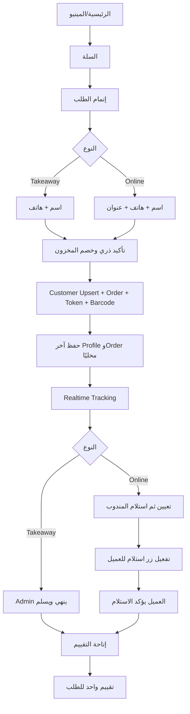

# التحليل الكامل لواجهة العميل — Online وTakeaway

## 1. الحدود والقرارات

المشروع له ثلاث واجهات: Admin وTable وCustomer. هذه الوثيقة تخص Customer Web للأونلاين والتيك أواي. الواجهة تشبه تجربة الطاولة في الرئيسية والمينيو والسلة والمتابعة والتقييم، مع اختلاف جوهري: العميل هنا يؤكد الطلب بنفسه، فينشأ Order حقيقي ويُخصم المخزون فور نجاح التأكيد.

- لا عروض في واجهة العميل.
- لا خدمات جرسون أو خدمات طاولة.
- يوجد «باريستا 404 الذكي» عبر DeepSeek API ثابت يمر من الباك إند.
- الباريستا يقرأ المنتجات الظاهرة وأسعارها وأنواعها وأحجامها ووصفها العام فقط. لا وصفات، خامات، تكلفة، دفعات، مخزون تفصيلي، بيانات عملاء أو طلبات.
- كل جدول في Admin أو سجل للعميل Pagination افتراضي 10.

## 2. الصفحات النهائية

1. الرئيسية والترحيب، البحث، الأقسام، الأكثر طلبًا، التقييمات العامة ومعلومات الفرع.
2. المينيو: بحث وفلاتر أقسام وأنواع وأحجام وإتاحة.
3. تفاصيل المنتج والتخصيصات العامة المسموحة.
4. السلة والإجماليات.
5. إتمام الطلب واختيار ONLINE أو TAKEAWAY.
6. نجاح الطلب: الرقم، Barcode، الإجمالي وزر المتابعة.
7. طلباتي: آخر طلب والطلبات السابقة المثبت ملكيتها.
8. تتبع الطلب والبحث برقم الطلب ورقم الهاتف.
9. التقييمات.
10. الباريستا الذكي.

تحذف Components العروض وWeeklyOfferBanner وSpecialOffers وروابطها. تحذف أي Call Waiter أو Table Services من Customer فقط.

## 3. بيانات العميل والـLocal Storage

المفتاح المقترح `404_customer_profile_v2`:

```json
{
  "profile": {"name":"أحمد","phone":"01000000000","address":{"city":"","area":"","street":"","building":"","floor":"","landmark":""}},
  "lastOrder": {"orderNumber":"ORD-...","trackingToken":"opaque-token","barcodeValue":"ORD-...","fulfillmentType":"DELIVERY","createdAt":"..."},
  "knownOrders": [{"orderNumber":"ORD-...","trackingToken":"opaque-token","phoneLast4":"0000","createdAt":"..."}],
  "schemaVersion": 2
}
```

- الاسم والهاتف والعنوان للملء التلقائي فقط، وليست حساب دخول أو مصدر حقيقة.
- بعد نجاح كل طلب تُستبدل `profile` بآخر بيانات مستخدمة، ويضاف الطلب إلى `knownOrders` دون حذف الطلبات السابقة.
- TAKEAWAY يحفظ الاسم والهاتف ويحتفظ بالعنوان السابق داخليًا دون إرساله للطلب؛ عند التحويل إلى ONLINE يظهر العنوان السابق للملء.
- تغيير الاسم/الهاتف في Checkout يحدث آخر Profile بعد نجاح الطلب فقط. فشل الطلب لا يمحو البيانات السابقة.
- إضافة منتج لطلب قائم لا تعدل Profile أو `lastOrder`; تستخدم `trackingToken` الخاص بنفس orderNumber.
- Local Storage قابل للتعديل من المستخدم؛ لا يمنح صلاحية. كل قراءة حساسة أو تعديل يحتاج Tracking Token عشوائي مخزن Hash في الخادم.
- لا يعاد trackingToken في بحث الهاتف العام. البحث يثبت الهاتف ثم يصدر Challenge/Token محدودًا أو يستخدم Token محفوظًا سابقًا.

## 4. إنشاء/تحديث العميل في Admin

الهاتف بعد التطبيع هو مفتاح المطابقة: `phoneNormalized` unique. عند تأكيد طلب:

1. يطبع الخادم الهاتف ويتحقق من الاسم والحقول المطلوبة.
2. Upsert ذري للعميل بالهاتف.
3. العميل الجديد يُنشأ تلقائيًا؛ الحالي يحدث `lastName`, `lastAddress`, `lastOrderAt` ببيانات آخر طلب ناجح.
4. الطلب يحمل `customerId` وSnapshot للاسم والهاتف والعنوان لحماية التاريخ.
5. لا تندمج حسابات هاتفين تلقائيًا. إدخال رقم جديد ينشئ/يستخدم عميلًا آخر.
6. صفحة العميل في Admin تعرض كل الطلبات، التسليمات، التقييمات، الإلغاءات، وتاريخ تحديث البيانات Pagination 10.
7. كل فعل متعلق بالعميل يكتب Customer Timeline/Audit، لكن لا يسجل Tracking Token أو نص محادثة حساس دون تنقية.

## 5. Checkout

### TAKEAWAY

مطلوب: الاسم ورقم الهاتف. لا عنوان ولا مندوب. العميل يؤكد؛ الخادم يعيد التسعير، يتحقق من الإتاحة، ينشئ Customer/Order/Items/Allocations/Movements/Status Event وTracking Credential داخل Mongo Transaction، ثم يخصم المخزون.

### ONLINE/DELIVERY

مطلوب: الاسم، الهاتف، المدينة/المنطقة/الشارع/المبنى، وباقي العنوان اختياري حسب سياسة الفرع. ينشأ الطلب ثم يمر بالتحضير والتعيين للمندوب والتوصيل.

العميل لا يرسل إجماليًا موثوقًا أو تكلفة أو حالة. الخادم يعيد حساب السعر والتوصيل والإجماليات. `Idempotency-Key` يمنع طلبًا مزدوجًا عند النقر أو timeout.

## 6. Workflow الحالات



الحالات القانونية العامة: `CONFIRMED -> PREPARING -> READY`. TAKEAWAY ينتقل `READY -> COMPLETED` عندما يسلمه Admin. DELIVERY ينتقل `READY -> OUT_FOR_DELIVERY` عند استلام المندوب، ويبقى كذلك مع `customerReceiptStatus=AVAILABLE` حتى ينتقل إلى `COMPLETED` عند ضغط العميل «استلام».

إذا لم يؤكد العميل الاستلام، يظل الطلب Pending ويظهر للأدمن. يمكن للأدمن إكماله بصلاحية وسبب وإثبات تسليم؛ لا يكرر الضغطان الإكمال.

## 7. زر استلام والتقييم

- يظهر زر «استلام» للأونلاين فقط، ويتفعل عندما يسجل المندوب استلامه للطلب ويصبح `OUT_FOR_DELIVERY`/`CUSTOMER_RECEIPT_PENDING`.
- الضغط يحتاج Tracking Token و`expectedVersion` وIdempotency-Key، ويسجل `receivedAt`, `receivedBy=CUSTOMER`, IP/device hash الآمن وحدث الحالة.
- لا يظهر الزر للتيك أواي. بعد إنهاء Admin للطلب يصبح التقييم متاحًا تلقائيًا.
- بعد اكتمال أي طلب تظهر خانة «اترك تقييمًا». تقييم واحد لكل orderId، مع نجوم وتعليق اختياري. التعديل إن سمح به النظام ينشئ Revision ولا يمحو الأصل.
- استلام العميل لا يعني تلقائيًا تسوية COD في الدرج؛ تحصيل المندوب وتسويته المالية Workflow منفصل.

## 8. التتبع والبحث التلقائي

- الصفحة تقرأ `lastOrder` وتفتح الطلب تلقائيًا بالرقم وTracking Token.
- تعرض Barcode، رقم الطلب، Timeline، عدد الجاهز/الإجمالي، حالة كل منتج، الإجماليات، بيانات الاستلام الآمنة والمندوب عند الحاجة.
- البحث اليدوي يستخدم orderNumber + phone. الخطأ لا يكشف هل الرقم أو الهاتف الصحيح؛ يرجع رسالة عامة مع Rate Limit.
- الطلبات السابقة تُقرأ باستخدام Tokens المعروفة أو Customer Access Session مثبتة بالهاتف. لا تعاد كل طلبات هاتف بمجرد إدخال الهاتف بلا إثبات.
- عند تغيير الحالة أو العناصر تصل Socket events مرتبة بـ`eventSequence`; بعد reconnect تجلب الصفحة Snapshot REST.

## 9. إضافة منتجات لطلب قائم

متاحة فقط في `CONFIRMED/PREPARING/READY` وقبل `OUT_FOR_DELIVERY` أو إنهاء TAKEAWAY.

1. يفتح العميل المينيو من الطلب الحالي، والـURL يحمل orderNumber لا بيانات العميل.
2. يرسل العناصر الجديدة مع Tracking Token وexpectedVersion وIdempotency-Key.
3. الخادم يعيد السعر ويتحقق من المخزون، ثم يضيف Items ويخصص الدفعات ويخصمها في Transaction.
4. إذا كان الطلب READY يعود PREPARING. حالات المنتجات والإجماليات تتحدث Realtime في Admin وCustomer والتحضير.
5. لا تتغير بيانات Local Storage الشخصية أو lastOrder. الطلب نفسه يتحدث في الخادم.
6. لا يسمح باستبدال بيانات العميل أو نوع التنفيذ من Endpoint الإضافة.
7. فشل خام واحد يرجع العملية كلها دون إضافة جزئية أو خصم.

## 10. الباريستا الذكي وDeepSeek

- Endpoint خلفي ثابت `POST /api/v1/customer-ai/chat`; مفتاح DeepSeek في Secret Server فقط.
- Tool وحيد `searchVisibleProducts` يعيد: id، الاسم، الوصف العام، القسم، النوع/الحجم، سعر البيع، الصورة، tags، و`isAvailable` فقط.
- ممنوع إرجاع recipe، rawMaterialIds، quantities، batch data، costs، margins أو stock count.
- الباريستا يستطيع اقتراح منتجات وبناء Draft Cart في رد Structured، لكنه لا يؤكد طلبًا ولا يخصم مخزونًا ولا يقرأ طلبات العميل.
- قبل إضافة اقتراح للسلة يعاد التحقق من المنتج والسعر بالـCatalog API.
- Rate Limit، timeout، max tokens، تنقية prompt، وعدم السماح للـModel باختيار endpoint حر. عند فشل DeepSeek تظهر رسالة إعادة المحاولة ولا تتعطل السلة.
- تحفظ telemetry تقنية منزوعة البيانات؛ لا تحفظ أسرار أو أرقام هواتف أو Tracking Tokens داخل prompt/log.

## 11. Schemas

### customers

`phoneNormalized` unique، `lastName`, `lastAddress`, `lastOrderAt`, `orderCount`, `status`, timestamps/version. الطلبات لا تُضمّن كمصفوفة؛ تربط بـcustomerId لتفادي تضخم الوثيقة.

### customerOrderCredentials

`orderId` unique، `customerId`, `trackingTokenHash` select:false unique، `status ACTIVE/REVOKED/EXPIRED`, `expiresAt`, `lastUsedAt`, `version`. لا يخزن Token خام.

### orders additions

`channel=CUSTOMER_WEB`, `fulfillmentType=DELIVERY|TAKEAWAY`, `customerId`, customer snapshots، `publicOrderNumber`, `barcodeValue`, `eventSequence`, `customerReceiptStatus NOT_APPLICABLE|LOCKED|AVAILABLE|CONFIRMED`, `customerReceivedAt`, `customerReceivedBy`, `version`.

`barcodeValue` يحمل publicOrderNumber أو URL قصير + opaque token، ولا يحتوي هاتفًا أو ObjectId مباشرًا.

## 12. API

- `GET /api/v1/customer/catalog` و`/products/:id`.
- `POST /api/v1/public-orders` لإنشاء الطلب.
- `POST /api/v1/public-orders/lookup` بـorderNumber+phone مع حماية Rate Limit.
- `GET /api/v1/public-orders/:orderNumber/tracking` مع `X-Tracking-Token`.
- `GET /api/v1/public-orders/:orderNumber/invoice`.
- `POST /api/v1/public-orders/:orderNumber/items` لإضافة منتجات.
- `POST /api/v1/public-orders/:orderNumber/receive` للأونلاين.
- `POST /api/v1/public-orders/:orderNumber/reviews` بعد الإكمال.
- `GET /api/v1/customer/orders?page=1&limit=10` فقط مع Customer Access Session مثبتة.
- `POST /api/v1/customer-ai/chat`.

## 13. Race Conditions والحالات

1. ضغط تأكيد مرتين: Order واحدة بالمفتاح نفسه.
2. طلبان لنفس الهاتف: Customer واحدة وOrderان.
3. آخر طلبين متزامنين: `lastOrderAt` الأحدث زمنيًا فقط يحدث Last Profile؛ كل Order يحتفظ Snapshot الصحيح.
4. تغير السعر قبل التأكيد: يعاد السعر وتطلب الواجهة قبول الإجمالي الجديد إن اختلف.
5. نفاد المخزون أثناء التأكيد/الإضافة: Conditional batch update؛ لا خصم سالب.
6. إلغاء بعد الخصم: يعيد نفس Allocations للدفعات وتكلفتها داخل Transaction.
7. إضافة متزامنة مع الإلغاء/التسليم: version والحالة يحسمان؛ لا إضافة بعد الإغلاق.
8. إضافة إلى READY تعيده PREPARING ولا يبقى جاهزًا بعنصر جديد.
9. المندوب والاستلام متزامنان: receive لا ينجح قبل حالة الإتاحة.
10. ضغط استلام مرتين: نفس النتيجة ولا حدث/تسوية مكررة.
11. Admin والعميل يكملان معًا: Conditional transition يقبل عملية واحدة ويحفظ actor الحقيقي.
12. تقييم قبل الإكمال أو مكرر: رفض/إرجاع الحالي.
13. Barcode مصور أو مسرب: Token قابل للإلغاء ومحدود للطلب، مع Rate Limit؛ لا يفتح سجل العميل كله.
14. Local Storage محذوف: البحث المثبت يعيد إصدار صلاحية الطلب، ولا تضيع بيانات الخادم.
15. Local Storage معدل: الخادم لا يثق في السعر أو الهاتف أو الحالة الموجودة فيه.
16. تغيير الهاتف في طلب جديد لا ينقل الطلبات القديمة تلقائيًا للعميل الجديد.
17. Socket event مكرر/خارج الترتيب: `eventSequence` يتجاهل القديم ثم REST resync.
18. DeepSeek يرجع Product ID غير ظاهر: Catalog validation يرفض إضافته.
19. Prompt injection يطلب وصفة: Tool projection لا يملك الحقول أصلًا.
20. DeepSeek timeout: 504/رسالة ودية بلا إنشاء Order أو تعديل Cart Server-side.

## 14. الأداء والتدقيق

القراءات التفاعلية p95 ≤500ms وp99 ≤1000ms. إنشاء الطلب وإضافة العناصر يستهدفان نفس الحد مع Mongo Transaction قصيرة. DeepSeek له timeout مستقل ولا يدخل Transaction. فهارس: customer phone، publicOrderNumber، trackingTokenHash، customerId+createdAt، status+updatedAt.

Audit يسجل إنشاء العميل/الطلب، تحديث بياناته الأخيرة، الإضافة، الإلغاء، استلام العميل، التقييم، بحث فاشل أو Rate Limit، واستدعاء AI بmetadata منزوعة المحتوى الحساس. لا يسجل Token أو عنوان كامل في Audit العام.

## 15. معايير القبول

- Online لا يؤكد بلا عنوان كامل، وTakeaway لا يطلب عنوانًا.
- نجاح الطلب يحدث Local Storage بآخر بيانات ورقم وBarcode وToken.
- الطلب الجديد يظهر في صفحة العميل القديمة عند نفس الهاتف.
- الرقم الجديد ينشئ/يستخدم Customer مختلفًا.
- إضافة منتج تحدث الطلب والمتابعة والتحضير Realtime ولا تغير Profile المحلي.
- زر استلام Online مقفول قبل استلام المندوب ومتاح بعده.
- Takeaway يتيح التقييم فقط بعد إنهاء Admin.
- كل طلب له رقم وBarcode وفاتورة وتتبع مستقل.
- لا عروض ولا خدمات جرسون في Customer.
- الباريستا يرى المنتجات العامة فقط، ولا توجد الوصفات في Query أو Tool أو Response.
