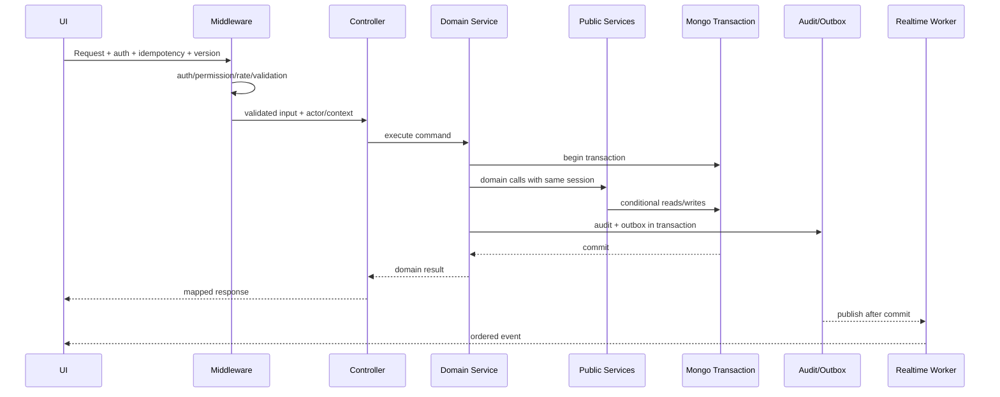

# الهيكل الكامل للباك إند — Modular Monolith

التقنية: Node.js + Express + MongoDB + Mongoose، JavaScript ESM. هذا الهيكل لتطبيق مستقل جديد، بسيط في التشغيل لكنه مقسم حسب مجال العمل. كل موديول يملك بياناته وقواعده، ويكشف وظائف محددة لباقي الموديولات عبر `*.public-service.js` وEvents.

# 1. قواعد المعمارية

- `route` يربط HTTP فقط، ولا يحتوي Business Logic.
- `validation` يتحقق من الشكل والأنواع والحدود قبل Controller.
- `controller` يحول HTTP إلى Command/Query ويختار status code، ولا يستدعي Model.
- `service` ينفذ Use Case وقواعد الحالات والصلاحيات الدقيقة والمعاملات.
- `query` ينفذ القراءة والـaggregation والـpagination والـscreen endpoints.
- `model` يعرف Mongoose schema/indexes/invariants فقط.
- `mapper` يحول Document إلى DTO آمن ويخفي الأسرار.
- `policy` يقرر هل العملية مسموحة حسب الحالة والسياق.
- `public-service` هو الباب الوحيد لاستدعاء الموديول من موديول آخر.
- `events` يعرف أسماء الأحداث وPayload المسموح؛ `handlers` تنفذ آثارًا بعد Commit.
- كل عملية تمس عدة Collections تستخدم Session يمرر صراحة، ولا يبدأ موديول فرعي Transaction جديدة.
- Controllers لا تستورد Models. Models لا تستورد Services. الموديولات لا تستورد ملفات داخلية من بعضها.

# 2. شجرة الجذر

```text
backend/
├── package.json                         # السكربتات والاعتماديات ونسخة Node المطلوبة.
├── package-lock.json                    # قفل الإصدارات لضمان Build متكرر.
├── .env.example                         # أسماء المتغيرات فقط دون أسرار.
├── .gitignore                           # يستبعد env/logs/uploads/coverage.
├── README.md                            # التشغيل المحلي والأوامر وترتيب الموديولات.
├── Dockerfile                           # صورة Production متعددة المراحل ومستخدم غير root.
├── docker-compose.dev.yml               # Mongo Replica Set محلي وRedis اختياري والتطبيق.
├── eslint.config.js                     # قواعد جودة ومنع imports المخالفة للحدود.
├── prettier.config.js                   # تنسيق موحد.
├── vitest.config.js                     # إعداد Unit/Integration tests.
├── jsconfig.json                        # aliases مثل @modules و@shared.
├── docs/
│   ├── openapi.yaml                     # العقد القابل للتوليد من API Doc.
│   └── event-catalog.md                 # أسماء الأحداث ومالكوها.
├── scripts/
│   ├── create-indexes.js                # ينشئ/يفحص indexes خارج app startup.
│   ├── seed-reference-data.js           # وحدات القياس والصلاحيات والأدوار الأساسية.
│   ├── create-first-admin.js             # ينشئ أول Admin بصورة مقصودة ومدققة.
│   ├── reconcile-projections.js         # يقارن المجاميع مع ledgers دون إصلاح صامت.
│   └── rotate-table-qr.js                # يدور qrVersion ويلغي Tokens القديمة.
├── src/
│   ├── server.js                         # يبدأ HTTP بعد نجاح bootstrap ويغلق بأمان.
│   ├── app.js                            # يبني Express ويثبت middleware/routes/errors.
│   ├── bootstrap.js                      # اتصال DB، فحص config، workers، Socket، shutdown.
│   ├── config/                           # إعدادات typed/validated فقط.
│   ├── platform/                         # قدرات تقنية مشتركة بلا Business rules.
│   ├── shared/                           # أنواع وأدوات نقية مشتركة.
│   ├── modules/                          # موديولات العمل.
│   ├── jobs/                             # Runner موحد للوظائف الدورية.
│   └── routes/                           # تركيب v1 وhealth فقط.
└── tests/
    ├── setup/                            # Replica set، fixtures، clock، app factory.
    ├── contract/                         # مطابقة OpenAPI والـDTOs.
    ├── integration/                      # Workflows عبر أكثر من موديول.
    └── performance/                      # أهداف p95/p99 وquery-count budgets.
```

# 3. ملفات التشغيل والإعداد

## `src/server.js`

يستدعي `bootstrap()`, ينشئ `http.Server`, يستمع على PORT، ويربط `SIGTERM/SIGINT`. عند الإغلاق يوقف قبول Requests، ينتظر الطلبات الجارية بمهلة، يوقف Workers وSocket ثم يغلق Mongo. لا يحتوي Routes أو أسرار أو منطق مجال.

## `src/app.js`

ينشئ Express instance، يثبت requestId وsecurity headers وJSON size limit وCORS وlogger وrate limiter، ثم `/api/v1` وhealth وnotFound وerrorHandler بالترتيب. يصدر app بدون listen حتى يسهل اختباره.

## `src/bootstrap.js`

يقرأ Config validated، يفتح Mongo Replica Set، يفحص schema/index version دون autoIndex، يهيئ Socket وOutbox publisher وJob runner. لو Dependency أساسية فشلت لا يعلن Ready. يعيد handles للإغلاق المنظم.

## `src/config/`

```text
env.js                 # يقرأ env مرة واحدة، يحول الأنواع ويرفض القيمة الناقصة.
database.js            # URI/pool/timeouts/readConcern/writeConcern.
auth.js                # TTLs وأسماء cookies/token issuer دون مفاتيح مطبوعة.
http.js                # PORT/CORS/body limits/request timeout.
realtime.js            # Socket transports/heartbeat/reconnect limits.
providers.js           # DeepSeek URL وtimeout فقط؛ لا توجد بوابة دفع.
business.js            # بيانات الكافيه والضريبة والخدمة والتوصيل كإعداد نشر ثابت.
features.js            # flags صريحة لا تغير invariants المالية.
```

كل ملف يصدر Object مجمدًا. Secret values لا تطبع في startup log، ويختبر وجودها فقط عندما Feature مفعلة.

# 4. Platform والـShared

```text
src/platform/
├── database/
│   ├── mongoose.js                 # connect/disconnect وpool monitoring.
│   ├── transaction.js              # withTransaction موحد وretry للأخطاء المؤقتة فقط.
│   ├── decimal.js                  # Decimal128 add/subtract/compare وتحويل JSON String.
│   ├── pagination.js               # page/limit=10، stable sort وmeta.
│   └── query-budget.js             # maxTimeMS وقياس query count في الاختبارات.
├── http/
│   ├── async-handler.js            # تمرير Promise errors إلى middleware.
│   ├── response.js                 # success/list/accepted envelopes.
│   ├── api-error.js                # Error class بالكود/status/fields/retryable.
│   ├── error-handler.js            # Mapping آمن بلا stack في Production.
│   ├── request-id.js               # يقبل/ينشئ requestId ويعيده في Header/meta.
│   ├── idempotency.middleware.js   # يحجز operationRequest ويتحقق من requestHash.
│   ├── version.middleware.js       # يقرأ If-Match/expectedVersion.
│   ├── rate-limiters.js            # سياسات Admin/public/login/AI.
│   └── validate.middleware.js      # يشغل schema ويعيد fieldErrors موحدة.
├── auth/
│   ├── employee-auth.middleware.js # يتحقق Access Token والجهاز والموظف والنسخ.
│   ├── permission.middleware.js    # requirePermission(key).
│   ├── table-token.middleware.js   # يحل Guest Session/table ولا يثق في tableId.
│   ├── tracking-read.middleware.js # قراءة Order واحدة فقط.
│   └── order-action.middleware.js  # Mutation Order واحدة فقط.
├── audit/
│   ├── audit-writer.js             # كتابة Audit آمن داخل session عند الحرج.
│   └── redact.js                   # allowlist وحذف password/tokens/address الحساس.
├── events/
│   ├── outbox-writer.js            # يسجل Event داخل نفس Transaction.
│   ├── outbox-publisher.js         # lease/retry/publish/mark دون ازدواج.
│   ├── event-bus.js                # توزيع داخلي على handlers المسجلة.
│   └── socket-publisher.js         # يحول Domain Event إلى rooms آمنة.
├── cache/
│   ├── cache.js                    # interface get/set/invalidate.
│   ├── memory-cache.js             # Local dev/single process فقط.
│   └── cache-keys.js               # keys بإصدارات المصادر لمنع بيانات قديمة.
├── observability/
│   ├── logger.js                   # structured logs مع redaction.
│   ├── metrics.js                  # latency/error/query/outbox/job metrics.
│   └── tracing.js                  # request/correlation spans.
└── providers/
    ├── deepseek.client.js          # HTTP timeout/circuit breaker/schema parsing.
    └── whatsapp.interface.js       # يبني رابط المشاركة فقط دون إثبات إرسال.
```

```text
src/shared/
├── constants/order.constants.js    # حالات Order/Item/channel/fulfillment.
├── constants/payment.constants.js  # طرق وحالات الدفع والاسترجاع.
├── constants/inventory.constants.js# أنواع الحركة والوحدات وحالة Batch.
├── constants/table.constants.js    # Session/Proposal/Service enums.
├── constants/auth.constants.js     # Employee/device/session/login results.
├── constants/audit.constants.js    # event results/severity/categories.
├── utils/normalize-phone.js        # phoneNormalized بصورة deterministic.
├── utils/business-date.js          # Cairo day boundaries إلى UTC.
├── utils/hash-token.js             # HMAC/Hash ومقارنة ثابتة الزمن.
├── utils/safe-snapshot.js          # يبني snapshots محدودة.
├── validators/common.js            # ObjectId/Money/Date/Page schemas.
└── types/dtos.js                   # JSDoc typedefs للعقود المشتركة.
```

# 5. قالب كل موديول

```text
module-name/
├── module.routes.js            # تعريف method/path/middleware/controller.
├── module.controller.js        # HTTP adapter بلا Model access.
├── module.validation.js        # body/params/query schemas.
├── module.model.js             # schema/indexes/hooks المحلية الآمنة.
├── module.service.js           # Commands وBusiness invariants.
├── module.queries.js           # Screen/detail/list projections.
├── module.policy.js            # state transition والقرارات.
├── module.mapper.js            # DTO safe projection.
├── module.events.js            # event names/payload builders.
├── module.public-service.js    # API داخلي للموديولات الأخرى.
└── index.js                    # exports العامة فقط.
```

الـRoute ينفذ middleware من الأرخص للأغلى: auth → permission → rate limit → validation → idempotency/version → controller. Controller يبني actor/context، يستدعي Use Case واحدًا ويرسل Mapper result. Service يعيد قراءة الكيانات داخل Transaction، يطبق policy، يحدث بشرط version/state، يكتب ledgers وAudit وOutbox، ثم Commit. Socket/Cache invalidation بعد Commit من Event handler.

# 6. موديول الموردين `modules/suppliers/`

```text
supplier.model.js                    # تعريف المورد وحالته وفهارس البحث.
supplier-account.model.js            # الرصيدين الحاليين، لا تعديل مباشر.
supplier-account-entry.model.js      # ledger immutable وتسلسل وعكس الأصل.
supplier.validation.js               # إنشاء/تعديل/حالة وفلاتر القوائم.
supplier-account.validation.js       # أنواع القيد والمبلغ والتاريخ والسبب.
supplier.controller.js               # CRUD/status/detail endpoints.
supplier-account.controller.js       # entry/reverse/list endpoints.
supplier.service.js                  # إنشاء المورد والحساب، التعديل والإيقاف.
supplier-account.service.js          # دين/مستحق/دفع/تحصيل والعكس ذريًا مع الدرج.
supplier.queries.js                  # suppliers-screen وصفحة المورد includes.
supplier.policy.js                   # Active/use/delete/account constraints.
supplier.mapper.js                   # Supplier/Account/Entry DTOs.
supplier.events.js                   # created/updated/status/account-entry.
supplier.public-service.js           # assertActive/getSnapshot/getAccountRef.
supplier.routes.js                   # يركب مسارات المورد والحساب.
```

إنشاء المورد يبدأ Transaction تنشئ Supplier وAccount صفريًا وAudit. الدفع يستدعي `drawer.public-service.createTransaction` بنفس Mongo session، ثم يكتب Entry ويحدث الرصيد بشرط version؛ أي فشل يرجع الاثنين. العكس يثبت أن الأصل لم يُعكس وأن الرصيد/الدرج يسمحان.

# 7. المخزون `modules/inventory/`

```text
measurement-unit.model.js            # وحدات القياس المرجعية وحالتها.
raw-material.model.js                # المورد والوحدات والحدود ونسخ المخزون.
raw-material-batch.model.js          # كمية وقيمة كل دفعة وأولوية البيع.
inventory-movement.model.js          # ledger immutable لكل دخول/خروج/استعادة.
inventory.validation.js              # تعريف المادة والسحب والترتيب والفلاتر.
inventory.controller.js              # screens/details/withdraw/priorities.
inventory.service.js                 # إنشاء المادة وقفل المورد والوحدات والسحب.
stock-allocation.service.js          # محاكاة/تخصيص دفعات بشرط الرصيد.
stock-restoration.service.js         # إعادة نفس allocations مرة واحدة.
batch-priority.service.js            # reorder ذري وpriorityVersion.
inventory-cost.service.js            # قيمة Batch والتقريب وآخر حركة للصفر.
inventory.queries.js                 # material screen/batches/movements.
inventory.policy.js                  # supplier/unit locks وexpired allowed.
inventory.mapper.js                  # quantities بوحدتين وDTO snapshots.
inventory.events.js                  # received/consumed/restored/withdrawn.
inventory.public-service.js          # allocate/restore/registerBatch/simulate.
inventory.routes.js                  # Admin material and withdrawal routes.
```

`allocate` يجمع احتياج كل مادة، يقرأ الدفعات حسب priority، ثم conditional updates للكمية والقيمة ويحفظ Movement/Allocation. لا Commit جزئي. `simulate` يستخدم نفس خوارزمية القراءة دون كتابة. `restore` يعيد batch IDs والقيم الأصلية ولا يسعر من جديد.

# 8. التحذيرات `modules/warnings/`

```text
warning.controller.js                # screen وsummary endpoints.
warning.validation.js                # type/material/supplier/page filters.
warning.queries.js                   # Read Model مشتق للمخزون والصلاحية والوردية.
warning-evaluator.js                 # يحسب severity/days/threshold بصورة نقية.
warning-cache.js                     # cache قصير بمفاتيح sourceVersions.
warning.events-handler.js            # invalidation بعد inventory/drawer events.
warning.mapper.js                    # WarningItem وsummary بنفس evaluatedAt.
warning.routes.js                    # Read-only routes.
```

لا Model إلزامي لتحذيرات المخزون؛ Query يجمع المواد والدفعات. تحذير الوردية المحفوظ يأتي من Drawer Alerts. فشل مصدر يعيد dataQuality/error ولا يحول إلى صفر.

# 9. المشتريات `modules/purchases/`

```text
purchase-group.model.js              # الفاتورة المجمعة وحالتها وsplitVersion.
purchase-item.model.js               # سطور المواد وحالة التسجيل وروابط Batch.
supplier-purchase-invoice.model.js   # مستند المورد الناتج عن Split.
purchase.validation.js               # draft/edit/split/register/register-many.
purchase.controller.js               # endpoints وشاشات غير/مدرج.
purchase.service.js                  # CRUD draft، قفل السطور، transitions.
purchase-split.service.js            # grouping حسب supplier snapshot.
purchase-registration.service.js     # Batch+Movement+status transaction.
purchase.queries.js                  # screen/details/invoices/print DTO.
purchase.policy.js                   # ما يسمح بتعديله حسب التسجيل.
purchase.mapper.js                   # group/item/invoice DTOs.
purchase.events.js                   # draft/split/item-registered/completed.
purchase.public-service.js           # lookup purchase origin للمرتجعات.
purchase.routes.js                   # v1 routes.
```

Split يقرأ supplierId الحالي من المادة ولا يقبل override. Register يعيد التحقق أن Split غير قديم، يستدعي Inventory لإنشاء Batch داخل نفس session، ويربط IDs ثم يعيد اشتقاق حالات الطفل والمجموعة.

# 10. مرتجعات المشتريات `modules/purchase-returns/`

```text
purchase-return.model.js             # رأس الفاتورة النهائية.
purchase-return-item.model.js        # Batch والكمية والقيمة والسبب.
purchase-return.validation.js        # create/filter params.
purchase-return.controller.js        # create/list/detail/print.
purchase-return.service.js           # خصم batch وإنشاء movement ذريًا.
purchase-return.queries.js           # screen/history/print-data.
purchase-return.policy.js            # remaining/status/source rules.
purchase-return.mapper.js            # DTO تاريخي بالمورد والوحدات.
purchase-return.events.js            # returned/printed.
purchase-return.routes.js            # endpoints.
```

الخدمة تتحقق من كل العناصر أولًا، ثم تخصم من الدفعات عبر Inventory public service. لا تستدعي Supplier Account أو Drawer. operationRequest يمنع فاتورة مكررة.

# 11. المنتجات `modules/products/`

```text
product-category.model.js            # الأقسام والترتيب والحالة.
product.model.js                     # المنتج والوصف والصورة والظهور.
product-type.model.js                 # الأنواع والمواد المسموحة تنظيميًا.
product-size.model.js                 # الحجم وسعر البيع.
product-recipe.model.js               # وصفة الحجم بالوحدة الصغيرة.
product-addon.model.js                # الإضافة وسعرها ووصفاتها الاختيارية.
product.validation.js                 # كل create/update/reorder schemas.
product.controller.js                 # Admin CRUD/cost preview.
catalog.controller.js                 # Public projection + ETag.
product.service.js                    # transitions والحذف الآمن.
recipe.service.js                     # validate material/units/save version.
product-cost.service.js               # يستدعي inventory.simulate ويحسـب الربح.
catalog.queries.js                    # aggregation بلا Recipe/Cost leakage.
product.queries.js                    # Admin screen/details.
product.policy.js                     # visibility/history/material active rules.
product.mapper.js                     # Admin/Public DTOs منفصلة.
product.events.js                     # catalog/version/cache invalidation.
product.public-service.js             # snapshotForOrder/searchVisibleProducts.
product.routes.js                     # Admin routes.
catalog.routes.js                     # Customer/Table public routes.
```

حفظ Recipe يتحقق من عدم تكرار المادة ويقفل supplier/units للمادة. Snapshot الطلب يبنى من `snapshotForOrder`. Catalog mapper لا يملك مفاتيح الوصفة أصلًا حتى لا تتسرب للعميل أو AI.

# 12. الطلبات `modules/orders/`

```text
order.model.js                        # الرأس والحالات والمجاميع والreceipt status.
order-item.model.js                   # السطور وsnapshot والتجهيز.
order-allocation.model.js             # ربط السطر بالدفعات والقيمة.
order-status-event.model.js           # timeline immutable للرأس.
order-item-status-event.model.js      # timeline immutable للسطر.
order.validation.js                   # create/add/cancel/complete/filter.
order.controller.js                   # Admin commands/details.
order.service.js                      # create/add/cancel/transition orchestration.
order-pricing.service.js              # server price/tax/delivery/rounding.
order-confirmation.service.js         # snapshot+allocation+events transaction.
order-cancellation.service.js         # restore/refund case/state transition.
order-completion.service.js           # Takeaway/Table/customer completion.
order-state.policy.js                 # transition matrix والقناة.
order-progress.js                     # اشتقاق ready/total/status pure function.
order.queries.js                      # screens/history/detail/progress.
order.mapper.js                       # Admin/public/preparation DTOs.
order.events.js                       # created/items/ready/cancel/completed.
order.public-service.js               # confirmTableProposal/add/complete/lookup.
order.routes.js                       # Admin routes.
```

الـorchestrator يثبت Product snapshots والأسعار، يستدعي Customer upsert ثم Inventory allocate بنفس session، ينشئ Order/Items/Events/Audit/Outbox. الإلغاء يستدعي restore ويتعامل مع Payment عبر Public Service. State policy تمنع الإضافة أو الإلغاء في الحالة الخطأ.

# 13. التحضير `modules/preparation/`

```text
preparation.controller.js             # screen/list/detail/ready.
preparation.validation.js             # group/tab/page/version.
preparation.service.js                # markItemReady وتحديث Order ذريًا.
preparation.queries.js                # لوحات current/ready بلا N+1.
preparation.mapper.js                 # Recipe Snapshot المسموح للموظف.
preparation.policy.js                 # PREPARING only وصلاحيات المطبخ.
preparation.events.js                 # item-ready/order-ready.
preparation.routes.js                 # endpoints.
```

آخر Item يتحول READY ثم `order-progress` يعيد اشتقاق الرأس داخل Transaction. Event sequence واحد يمنع ترتيب Realtime خاطئ.

# 14. العملاء `modules/customers/`

```text
customer.model.js                     # phoneNormalized وآخر profile والمجاميع.
order-review.model.js                 # تقييم واحد ومالك channel-aware.
review-revision.model.js              # تاريخ التعديل/الإخفاء immutable.
customer.validation.js                # create/update/search/merge مستقبلي.
review.validation.js                  # rating/comment/moderation.
customer.controller.js                # Admin screen/details/update.
review.controller.js                  # submit/edit/moderate/list.
customer.service.js                   # atomic upsert by phone وتحديث الأحدث.
review.service.js                     # eligibility/unique/revision.
customer.queries.js                   # profile orders/reviews/timeline.
customer.policy.js                    # status/history/ownership.
customer.mapper.js                    # Admin/Public masked DTOs.
customer.events.js                    # created/profile/review events.
customer.public-service.js            # upsertForOrder/getSnapshot.
customer.routes.js                    # Admin/review routes.
```

Upsert يستخدم unique phoneNormalized ويتعامل مع duplicate-key retry. `lastProfileOrderAt` يمنع Commit متأخر لطلب أقدم من الكتابة فوق أحدث بيانات.

# 15. تجربة العميل `modules/customer-experience/`

```text
customer-order-credential.model.js    # Hash منفصل للقراءة والفعل.
customer-access-session.model.js      # جلسة تاريخ العميل بعد إثبات الملكية.
public-order.validation.js            # checkout/lookup/add/receive/cancel request.
public-order.controller.js            # HTTP public endpoints.
tracking-token.middleware.js          # يحل read token إلى order scope.
order-action.middleware.js            # يحل action token ولا يقبل barcode token.
customer-experience.service.js        # create credentials/receive/access session.
public-order.queries.js               # tracking/invoice/history safe projections.
customer-experience.mapper.js         # tokens مرة واحدة وmasked data.
customer-experience.events.js         # viewed/received/access-created.
customer-experience.routes.js         # public routes/rate limits.
```

إنشاء Public Order يستدعي Orders public service، ثم يولد token entropy قوية ويحفظ Hash ويعيد الخام مرة واحدة. Receive يثبت delivery assignment والحالة والنسخة، ثم يكمل Order ويكتب confirmation، دون تسوية COD تلقائيًا.

# 16. الباريستا الذكي `modules/customer-ai/`

```text
customer-ai.validation.js             # message/context lengths وrate limits.
customer-ai.controller.js             # chat endpoint وtimeout mapping.
customer-ai.service.js                # prompt ثابت، tool loop محدود، structured response.
product-catalog.tool.js                # searchVisibleProducts public projection فقط.
customer-ai.guard.js                   # يمنع tools/fields غير المسموحة وينقي المدخلات.
customer-ai.mapper.js                  # suggestions/draft actions بلا تنفيذ.
customer-ai.routes.js                  # public AI limiter.
```

Service يرسل prompt لا يحتوي بيانات عميل حساسة، يسمح بـTool واحد، يحدد محاولات/tool calls/tokens. Product IDs تعاد مراجعتها عبر Catalog قبل العرض. فشل DeepSeek لا يغير Cart أو Order.

# 17. المندوبون `modules/delivery/`

```text
delegate.model.js                     # بيانات المندوب والحالة والعدادات.
delivery-assignment.model.js          # التكليف النشط والتواريخ وعهدة COD.
delivery-event.model.js               # timeline immutable.
delivery-confirmation.model.js        # Customer/Admin override proof.
delivery.validation.js                # assign/handover/reassign/fail/return/settle.
delegate.controller.js                # CRUD/screens.
delivery.controller.js                # commands وWhatsApp event.
delivery.service.js                   # assignment lifecycle.
delivery-confirmation.service.js      # customer/admin completion once.
delegate-settlement.service.js        # COD to Drawer transaction.
delivery.queries.js                   # delegate details/history/cash ledger.
delivery.policy.js                    # active/capacity/order-state rules.
delivery.mapper.js                    # Admin/customer safe DTOs.
delivery.events.js                    # assigned/handover/failed/delivered/settled.
delivery.public-service.js            # assertReceiptAvailable/complete/linkOrder.
delivery.routes.js                    # endpoints.
```

Handover يجعل receipt AVAILABLE. Customer confirmation هو الطبيعي؛ Admin override يحتاج Permission/سبب. Settlement يستدعي Drawer بنفس session ومصدر unique لمنع إدخال COD مرتين.

# 18. الطاولات `modules/tables/`

```text
table.model.js                        # 1..20 والحالة التشغيلية الثابتة.
table-session.model.js                # جلسة البيع OPEN/CLOSING/CLOSED.
table-session-event.model.js          # timeline للجلسة.
table.validation.js                   # board/open/add/close/cancel.
table.controller.js                   # Admin board/session endpoints.
table-session.service.js              # إنشاء/إغلاق وربط Order/Payment.
table-board.queries.js                # 20 cards في aggregation واحدة.
table-session.queries.js              # history/detail/print.
table.policy.js                       # empty/occupied/out-of-service transitions.
table.mapper.js                       # card/session DTOs.
table.events.js                       # occupied/status/closed.
table.public-service.js               # openOrGet/linkGuest/close.
table.routes.js                       # Admin routes.
```

Board لا يخزن EMPTY/OCCUPIED؛ يستنتجها من active session partial unique. Close يضع CLOSING أولًا، ينفذ الدفع وإكمال Order وإغلاق الخدمات ثم CLOSED في Transaction.

# 19. تجربة ضيف الطاولة `modules/table-experience/`

```text
table-guest-session.model.js          # QR session/token hash/version/expiry.
table-order-proposal.model.js         # سلة مرسلة للمراجعة بلا خصم.
table-experience.validation.js        # bootstrap/proposal/cancel/filters.
table-experience.controller.js        # Guest endpoints.
proposal-admin.controller.js          # review/change/reject/confirm.
table-guest-session.service.js        # bootstrap/refresh/revoke/token scope.
table-order-proposal.service.js       # proposal lifecycle/server pricing.
proposal-confirmation.service.js      # Table+Order+Inventory transaction.
table-experience.queries.js           # home/tracking/proposals screen.
table-experience.policy.js            # guest/proposal/table state rules.
table-experience.mapper.js            # public/admin DTOs.
table-experience.events.js            # proposal lifecycle.
table-experience.routes.js            # Table routes.
proposal-admin.routes.js              # Admin proposal routes.
```

Bootstrap يتحقق qrVersion ويصدر Token scoped. Proposal يعيد السعر من Products ثم ينشئ CALL_WAITER عبر Table Services. Confirm يعيد التحقق من كل شيء وينادي Tables وOrders في Transaction واحدة؛ لا يوجد خصم قبلها.

# 20. خدمات الطاولة `modules/table-services/`

```text
table-service-request.model.js        # الطلب وrequestOwnerKey والحالة.
table-service-event.model.js          # status timeline immutable.
table-service.validation.js           # الأنواع الخمسة وحقول كل نوع.
table-service.controller.js           # Guest/Admin endpoints.
table-service.service.js              # create/deduplicate/resolve/cancel/close cleanup.
table-service.queries.js              # Admin screen/open/completed.
table-service.policy.js               # owner/session/type/status constraints.
table-service.mapper.js               # Guest/Admin DTOs.
table-service.events.js               # realtime created/resolved/cancelled.
table-service.public-service.js       # createOrderReviewRequest/closeSessionServices.
table-service.routes.js               # routes.
```

Create يبني owner key من Guest أو Session ولا يثق في Client. Partial unique يعيد الموجود. الخدمة لا تخصم أو تفوتر؛ المنتج المدفوع يضاف عبر Order.

# 21. المدفوعات والفواتير `modules/payments/` و`modules/invoices/`

```text
payments/payment.model.js             # Payment status/method/amount/references.
payments/refund.model.js              # رد نقدي وحالته ومرجع حركة الدرج.
payments/payment.validation.js        # تحصيل/رد كاش فقط.
payments/payment.controller.js        # أوامر التحصيل والرد النقدي.
payments/payment.service.js           # payment state وbalanceDue.
payments/refund.service.js            # refund workflow/idempotency.
payments/payment.policy.js            # method/channel/order rules.
payments/payment.public-service.js    # collect/refund/settle/checkBalance.
payments/payment.events.js            # paid/collected/settled/refunded.
payments/payment.routes.js            # endpoints الكاش والـCOD والتسوية.
invoices/invoice-snapshot.model.js    # Final payload/checksum/revision.
invoices/invoice.service.js           # finalize once after completion.
invoices/invoice.queries.js           # unified print DTO/history.
invoices/invoice.mapper.js            # 80mm/A4 neutral data.
invoices/invoice.routes.js            # read/print event endpoints.
```

الدفع كاش فقط. Payment لا يغير Order خارج Orders orchestration. التحصيل المباشر يدخل الدرج، والـCOD يسجل عهدة المندوب ثم التسوية في الدرج. Invoice Final ينشأ مرة لكل revision بعد نجاح الإكمال، والطباعة لا تغير المال أو الحالة.

# 22. الدرج `modules/drawer/`

```text
cash-drawer-shift.model.js            # الوردية والمجاميع والمصالحة والتنبيه التالي.
cash-drawer-transaction.model.js      # ledger IN/OUT immutable.
drawer-shift-alert.model.js           # thresholds 12 ساعة unique.
drawer.validation.js                  # open/manual/reverse/close/filter.
drawer.controller.js                  # screen/commands/history/print.
drawer.service.js                     # open/movement/close/reconcile.
drawer-transaction.service.js         # source dedupe/balance/update totals.
drawer-reversal.service.js            # عكس اليدوي والأثر المقابل.
open-shift-warning.service.js         # create thresholds/outbox/update next.
drawer.queries.js                     # screen/shifts/transactions/alerts.
drawer.policy.js                      # active shift/cash/status/permission.
drawer.mapper.js                      # totals/reconciliation/print DTO.
drawer.events.js                      # opened/transaction/closed/long-open.
drawer.public-service.js              # createSourceTransaction/settle/reverse.
drawer.routes.js                      # endpoints.
```

كل حركة تحدث ledger وshift projection في Session واحدة. Close يقفل الحالة CLOSING قبل الحساب. Worker التحذير يستدعي service بLease؛ التنبيه وOutbox والموعد التالي داخل Transaction.

# 23. الموظفون والمصادقة `modules/employees/` و`modules/auth/`

```text
employees/employee.model.js           # الموظف وكلمة المرور المخفية والجدول.
employees/role.model.js               # الدور ومستواه.
employees/permission.model.js         # catalog keys.
employees/role-permission.model.js    # default grants.
employees/employee-permission.model.js# ALLOW/DENY overrides.
employees/employee-page-access.model.js# Sidebar visibility.
employees/employee.validation.js      # create/update/status/matrix.
employees/employee.controller.js      # screens/details/commands.
employees/employee.service.js         # CRUD/status/password/permission version.
employees/permission.service.js       # effective matrix وحفظ ذري.
employees/employee.queries.js         # details includes بلا password افتراضي.
employees/employee.mapper.js          # permission-aware password projection.
employees/employee.events.js          # created/status/permissions/password-viewed.
employees/employee.public-service.js  # assertActive/effectivePermissions.
employees/employee.routes.js          # endpoints.
auth/employee-device.model.js         # fingerprint hash والحالة.
auth/auth-session.model.js             # refresh hash/revocation/TTL.
auth/login-attempt.model.js            # security ledger وTTL policy.
auth/auth.validation.js                # login/refresh/device decisions.
auth/auth.controller.js                # login/refresh/logout.
auth/auth.service.js                   # password comparison والجهاز والجلسات.
auth/token.service.js                  # sign/verify/rotate hashes.
auth/device.service.js                 # pending/approve/block/revoke sessions.
auth/auth.queries.js                   # bootstrap payload.
auth/auth.routes.js                    # public auth + protected device routes.
```

Login يتحقق plaintext حسب القرار دون تسجيله، ثم الموظف والجهاز. Device جديد لا يحصل Session كاملة. Refresh يعيد فحص status/device/permissionsVersion. عرض password عملية مستقلة مدققة بالصلاحية.

# 24. الحضور `modules/attendance/`

```text
attendance.model.js                   # check-in/out وschedule snapshots.
attendance-adjustment.model.js        # التصحيحات immutable.
attendance.validation.js              # filters/checkout/adjustment.
attendance.controller.js              # check-in/admin checkout/list/detail.
attendance.service.js                 # open uniqueness وحساب late/worked.
attendance-adjustment.service.js      # correction with reason/recalculation.
attendance.queries.js                 # history/summary.
attendance.policy.js                  # admin checkout/open drawer rule.
attendance.mapper.js                  # Attendance DTO.
attendance.events.js                  # checked-in/out/corrected.
attendance.routes.js                  # endpoints.
```

الجدول Snapshot عند check-in، ويحسب overnight بمنطقة القاهرة. الانصراف يرفض إذا على الموظف درج مفتوح حتى إغلاقه/نقله. التصحيح لا يعدل التاريخ دون Adjustment.

# 25. التقارير `modules/reports/`

```text
report-export.model.js                # queued/running/completed/file/expiry.
financial-report-cache.model.js       # payload/sourceVersions/TTL.
report-insight.model.js               # قرار قابل للعرض وdataQuality.
report.validation.js                  # periods/filters/export format.
report.controller.js                  # screen/details/export/status.
financial-report.service.js           # orchestrates read models/cache.
sales-report.queries.js               # net sales/channel/product.
inventory-report.queries.js           # asset/cogs/waste/purchases.
drawer-report.queries.js              # cash classes/reconciliation.
supplier-report.queries.js            # manual balances/history.
delegate-report.queries.js            # deliveries/COD outstanding.
report-insight.service.js             # قواعد بسيطة لاتخاذ القرار.
report-export.service.js              # queue job/file/checksum/expiry.
report.mapper.js                      # money strings/dataQuality.
report.routes.js                      # endpoints.
```

كل Query تستخدم نفس period object وحدود UTC. Screen يقرأ cache فقط إذا sourceVersions مطابقة. Export Job يعيد تشغيل نفس Query بمنهج pagination داخلي ولا يحمل كل البيانات في الذاكرة.

# 26. التدقيق والإشعارات `modules/audit/` و`modules/notifications/`

```text
audit/audit-event.model.js            # immutable comprehensive event.
audit/audit-event-catalog.model.js    # required fields/retention/severity.
audit/event-outbox.model.js            # reliable post-commit messages.
audit/operation-request.model.js       # idempotency lease/result/requestHash.
audit/audit.validation.js              # safe filters/export.
audit/audit.controller.js              # screen/detail/timeline/export.
audit/audit.queries.js                 # indexed filters/projections.
audit/audit-integrity.service.js       # chained hashes/check verification.
audit/audit.mapper.js                  # redacted DTO حسب permission.
audit/audit.routes.js                  # read routes.
notifications/notification.model.js   # recipient/dedupe/read/archive.
notifications/notification.controller.js# list/read/read-all.
notifications/notification.service.js # createMany idempotent/read state.
notifications/notification.queries.js # unread count + page.
notifications/notification.mapper.js  # safe payload.
notifications/notification.routes.js  # endpoints.
```

Business Service يكتب Audit/Outbox عبر Platform writer. Audit module نفسه يدير القراءة والتحقق. Notification ينشأ من Event handler ولا يعيد تنفيذ العملية الأصلية.

# 27. Jobs

```text
src/jobs/job-runner.js                 # يسجل schedules ويمنع تشغيلًا متداخلًا.
src/jobs/job-lock.model.js             # distributed lease باسم job.
src/jobs/outbox-publisher.job.js       # كل ثوانٍ ينشر pending events.
src/jobs/open-shift-warning.job.js     # كل دقيقة يفحص next warning.
src/jobs/report-export.job.js          # يستهلك jobs بحد concurrency.
src/jobs/token-cleanup.job.js          # revocation/cleanup؛ TTL مساعد.
src/jobs/cache-cleanup.job.js          # حذف caches المنتهية عند الحاجة.
```

Runner يحصل على Lease بوقت انتهاء، يجدد للمهام الطويلة ويسجل start/success/failure. Job logic يستدعي Service عامة ولا يكرر Business logic.

# 28. تركيب Routes

```text
src/routes/v1.routes.js                # Router يجمع module routers تحت /api/v1.
src/routes/health.routes.js            # live/ready/version دون auth حساس.
src/routes/not-found.js                # 404 API موحد.
```

`v1.routes.js` يستورد `index.js` العام لكل موديول فقط. ترتيب المسارات يمنع `/:id` من ابتلاع `/screen` أو `/current`. لا توجد مسارات Webhook للدفع لأن النظام كاش فقط.

# 29. الملفات والصور وتوليد الأرقام

```text
src/modules/media/
├── media-asset.model.js              # metadata/checksum/owner/status/storage key.
├── media.validation.js               # mime/size/dimensions/owner constraints.
├── media.controller.js               # upload intent/complete/read/delete-unused.
├── media.service.js                  # يفحص الملف ويربطه بكيان ويمنع orphan abuse.
├── image-processor.service.js        # resize/thumbnail/metadata خارج request الحرج.
├── storage.adapter.js                # interface للقرص المحلي أو S3-compatible.
├── media.mapper.js                   # public signed URL بلا storage secrets.
├── media.routes.js                   # multipart limits وpermissions.
└── index.js                          # public attach/assertReady methods.

src/platform/counters/
├── counter.model.js                  # scope وnextValue.
├── counter.service.js                # atomic $inc وformat prefix/year.
└── counter.formats.js                # SUP/PUR/ORD/RET/SHIFT/INV formats.
```

Upload لا يمر كـBase64 داخل JSON. Controller يقبل multipart محدودًا، Service يتحقق MIME الحقيقي والحجم والصورة، يخزن Asset `PENDING_SCAN/READY/REJECTED` ويرجع mediaId. Product يحفظ mediaId جاهزًا فقط. حذف Product لا يحذف Asset تاريخيًا مستخدمًا. Counter قد يترك فجوات عند Rollback، لكنه لا يكرر رقمًا؛ الرقم للعرض و`_id` للهوية.

# 30. الاختبارات

```text
tests/setup/mongo-replset.js           # MongoMemoryReplSet للTransactions.
tests/setup/app-fixture.js             # app بدون listen وauth helpers.
tests/setup/factories.js               # إنشاء كيانات صالحة دون إخفاء intent.
tests/contract/openapi.test.js          # كل Route/response يطابق العقد.
tests/integration/order-stock.test.js   # confirm/add/cancel/restore races.
tests/integration/table-flow.test.js    # QR/proposal/service/confirm/close.
tests/integration/delivery-cod.test.js  # handover/receive/settle/idempotency.
tests/integration/drawer.test.js        # opening/movements/close/12h alert.
tests/integration/auth-device.test.js   # pending/approve/block/revoke.
tests/integration/purchase.test.js      # split/register/batch/return.
tests/integration/report-ledger.test.js # source ledgers vs summaries.
tests/performance/screen-budgets.test.js# latency/query-count/no N+1.
```

نختبر الحالات ذات أثر أو Race حقيقي، لا نكرر implementation في Unit tests. Clock وIDs وDeepSeek adapter قابلة للحقن لجعل النتائج ثابتة.

# 31. آلية تنفيذ Request كاملة



القراءة لا تمر بالخدمات الكتابية: Controller → Query → Aggregation/Projection → Mapper → Response. Screen query تجمع اللازم في طلب واحد لكن تظل projections محدودة، ولا تعيد Arrays غير محدودة.

# 32. منع الاعتماد الدائري

- Orders يعتمد على Public Services لـProducts/Inventory/Customers/Payments.
- Purchases يعتمد على Suppliers/Inventory.
- Delivery يعتمد على Orders/Payments/Drawer عبر Public APIs، وOrders لا يستورد Delivery داخليًا؛ orchestration المحدد يستخدم Event أو public contract.
- Tables يعتمد على Orders/Payments/Table Services؛ Table Experience ينسق بينها.
- Reports وAudit يقرآن projections ولا تستوردهم موديولات المجال، بل تكتب لهم عبر Platform.
- Notification وRealtime يتلقيان Events ولا يُستدعيان قبل Commit.

يفحص ESLint boundaries أن `modules/a` لا يستورد `modules/b/*.model.js`، وأن المسموح فقط `modules/b/index.js`.

# 33. ترتيب التنفيذ المقترح

1. Platform/config/auth/audit/outbox/operationRequests.
2. Employees/permissions/devices/attendance.
3. Suppliers/inventory/warnings.
4. Products/catalog.
5. Purchases/returns.
6. Orders/payments/invoices/preparation.
7. Customers/customer-experience/AI.
8. Delivery.
9. Tables/table-experience/table-services.
10. Drawer integrations/reconciliation ثم reports.

كل مرحلة لا تعتبر مكتملة قبل Models+indexes، validation، services، queries، API contract، permissions، audit/events، واختبارات التكامل الخاصة بها.

# 34. نتيجة مراجعة الهيكل والنواقص التي أُكملت

المراجعة التنفيذية أظهرت أن التقسيم السابق يغطي منطق العمل الأساسي، لكنه كان يحتاج أماكن صريحة لمسؤوليات لا يصح وضعها في Controllers أو ملفات Config ثابتة:

- إعدادات الكافيه القابلة للتعديل مثل بيانات الفرع والضريبة ورسوم التوصيل وسياسة الإلغاء.
- Dashboard Admin الذي يجمع ملخصًا من أكثر من موديول من غير أن يجعل الفرونت يرسل طلبات كثيرة.
- طلبات الإلغاء قبل اعتماد الإلغاء الفعلي، خصوصًا Customer Web وDelivery.
- Dead-letter ومراقبة Outbox بعد استنفاد المحاولات.
- Migrations واضحة بدل تعديل البيانات تلقائيًا عند تشغيل السيرفر.
- سياسة نسخ احتياطي واستعادة وفحص سلامة، من غير ادعاء أن التطبيق نفسه ينفذ Backup قاعدة البيانات.
- إدارة Business Sequence وCatalog Version وSource Versions.

الأقسام التالية تضيف هذه الأجزاء وتصبح جزءًا إلزاميًا من الهيكل.

# 35. Dashboard الإدارة `modules/dashboard/`

```text
dashboard.controller.js                # Endpoint واحد لأول شاشة Admin.
dashboard.validation.js                # period/location ومحددات العرض.
dashboard.queries.js                   # يجمع Read Models بعمليات متوازية محدودة.
dashboard-summary.projector.js         # يحدث العدادات من Domain Events.
dashboard-summary.model.js             # projection يومية/لحظية قابلة لإعادة البناء.
dashboard.mapper.js                    # cards/queues/alerts/recent activity.
dashboard.policy.js                    # يخفي Cards حسب الصلاحيات.
dashboard.events-handler.js            # order/drawer/warning/attendance projection updates.
dashboard.routes.js                    # GET /dashboard-screen.
index.js                               # public router only.
```

Dashboard لا يقرأ كل Collections في كل Request. الـProjector يحدث Projection صغيرة بعد الأحداث، والـQuery يضيف البيانات اللحظية الضرورية فقط. لو Projection متأخرة يرجع `generatedAt`, `lastEventSequence`, `dataQuality`; لا يعرض رقمًا قديمًا كأنه لحظي. صلاحية المستخدم تتحكم في Projection النهائية، فلا يرى أرقامًا مالية لمجرد أن Dashboard جمعها داخليًا.

# 36. طلبات الإلغاء والاسترجاع `modules/order-cases/`

```text
order-cancellation-request.model.js    # طلب العميل والسبب والحالة والقرار.
refund-case.model.js                   # يربط إلغاء المخزون برد الدفع وحالة التعافي.
order-case-event.model.js              # Timeline للطلب/الموافقة/الرفض/التنفيذ.
order-case.validation.js               # request/approve/reject/execute/retry-refund.
order-case.controller.js               # Customer request وAdmin decision endpoints.
order-case.service.js                  # lifecycle ومنع أكثر من Case نشطة لنفس النطاق.
cancellation-executor.service.js       # يستدعي Orders restore وPayments refund بنفس orchestration.
refund-recovery.service.js             # يعالج PENDING_REFUND دون تكرار المخزون.
order-case.queries.js                  # Admin queue وCustomer status والتاريخ.
order-case.policy.js                   # auto-approve windows والحالات التي تحتاج Admin.
order-case.mapper.js                   # لا يكشف ملاحظات داخلية للعميل.
order-case.events.js                   # requested/approved/rejected/executed/refund-pending.
order-case.public-service.js           # createSystemCase/linkReturn.
order-case.routes.js                   # public/admin routes.
index.js                               # exports العامة.
```

الـCase يفصل «طلب الإلغاء» عن «تنفيذ الإلغاء». التنفيذ يحمل خطوات محددة: قفل Order version، عكس Allocations، إنشاء/تحديث Refund نقدي، تحديث الحالة، Audit/Outbox. رد الكاش ينشئ حركة OUT في درج مفتوح. إذا لم يوجد درج أو لم يكف الرصيد يبقى Case `PENDING_CASH_REFUND` من دون تكرار عكس المخزون، ويستكمل لاحقًا بمفتاح العملية نفسه.

# 37. موثوقية الأحداث والـDead Letter

```text
src/platform/events/
├── outbox-writer.js                    # يكتب الحدث داخل Business transaction.
├── outbox-publisher.js                 # claim lease ونشر ومحاولة جديدة.
├── outbox-dead-letter.model.js         # نسخة الحدث بعد الحد الأقصى وفشل آمن.
├── outbox-recovery.service.js          # retry يدوي مصرح أو mark-resolved.
├── event-handler-registry.js           # eventType -> handlers، يمنع التسجيل المكرر.
├── processed-event.model.js            # consumer+eventId unique لمنع أثر مكرر.
├── event-schema.registry.js            # schemaVersion وvalidation لكل Payload.
└── socket-publisher.js                 # rooms/projections بعد التحقق.
```

كل Consumer يحجز `processed-event` أو يستخدم مفتاحًا فريدًا لأثره. Outbox لا يمسح الحدث فور النشر؛ يحفظ publishedAt وattempts. بعد الحد الأقصى ينتقل إلى Dead Letter وينشئ Notification حرجة. إعادة المحاولة اليدوية تسجل الموظف والسبب، ولا تعيد Business Transaction الأصلية.

# 38. إصدارات البيانات والـRead Models

```text
src/platform/versions/
├── source-version.model.js             # version لكل source: catalog/inventory/orders/drawer.
├── source-version.service.js           # atomic increment داخل transaction.
├── projection-checkpoint.model.js      # آخر eventSequence لكل projector.
└── consistency-token.js                # يبني token يوضع في screen/report response.
```

Catalog ETag يبنى من catalog version. Warning cache يعتمد inventory version وbusiness day. Financial report cache يعتمد versions لكل مصدر. الـProjector يحفظ checkpoint بعد نجاح الأثر فقط. إذا وجد gap يتوقف ويطلب replay/rebuild بدل القفز وإنتاج أرقام ناقصة.

# 39. Migrations وتهيئة البيانات

```text
migrations/
├── 001-create-reference-units.js       # وحدات القياس الأساسية بصورة idempotent.
├── 002-create-permissions.js           # Permission catalog والإصدارات.
├── 003-backfill-phone-normalized.js    # تطبيع وفحص التعارض قبل unique index.
├── 004-split-customer-tokens.js        # تحويل credential القديم إلى read/action policy.
├── 005-add-shift-warning-schedule.js   # next warning للورديات المفتوحة.
├── migration-runner.js                 # lock/order/checksum/up/down policy.
└── migration.model.js                  # name/checksum/status/timestamps/runner.

scripts/
├── migrate.js                          # يشغل pending migrations قبل deployment.
├── migration-status.js                 # يعرض applied/pending/failed دون تعديل.
├── create-indexes.js                   # يقارن index manifest ويطبق المخطط.
├── verify-data-integrity.js            # فحص read-only للقيود التي لا يضمنها Mongo.
└── rebuild-projection.js               # يعيد Projection محددة من ledgers/events.
```

Migration لها Distributed Lock وChecksum. لا تعدل Migration مطبقة؛ ينشأ ملف جديد. Backfill يعمل chunks ويحفظ checkpoint. Unique index لا ينشأ قبل تقرير duplicates. فشل Migration يمنع Ready ولا يجعل التطبيق يعمل بنصف Schema.

# 40. Manifest الفهارس

```text
src/platform/database/
├── index-manifest.js                   # قائمة indexes القانونية وoptions/partial filters.
├── index-diff.js                       # يقارن المطلوب بالموجود دون حذف تلقائي.
├── index-health.js                     # duplicate/missing/build status للـreadiness.
└── explain-check.js                    # CI يفحص queries الحرجة بلا COLLSCAN غير مقصود.
```

Models تعرف Indexes قرب البيانات، والـManifest يجمعها للنشر والفحص. Production يستخدم `autoIndex:false`. حذف Index قرار Deployment مستقل لأن سقوطه قد يرفع الحمل أو يكسر uniqueness أثناء المرور.

# 41. Security كملفات صريحة

```text
src/platform/security/
├── cors-policy.js                      # origins حسب البيئة ولا يستخدم wildcard مع credentials.
├── helmet-policy.js                    # headers وCSP لمسارات HTML/print.
├── input-sanitizer.js                  # يمنع prototype pollution وMongo operator injection.
├── secret-redactor.js                  # keys/paths/patterns للـlogs/errors.
├── token-crypto.js                     # randomBytes/hash/constant-time compare.
├── pii-policy.js                       # mask phone/address وحقول كل Role.
├── upload-security.js                  # MIME sniff/size/pixel limits/quarantine.
└── abuse-monitor.js                    # lookup/login/AI/table-service abuse signals.
```

لا يوضع Sanitizer عام يغير نصوص المستخدم بصمت؛ validation يرفض operators غير المسموحة. PII policy تستخدمها Mappers لا Controllers. كلمة المرور الواضحة قرار منتج، لذلك عزل قراءتها بصلاحية وAudit ومنعها من كل projection افتراضي إلزامي.

# 42. النسخ الاحتياطي والتعافي التشغيلي

```text
ops/
├── backup-policy.md                    # frequency/retention/encryption/owner.
├── restore-runbook.md                  # restore إلى بيئة معزولة وفحوص ما بعد الاستعادة.
├── incident-runbook.md                 # DB/provider/outbox/inventory mismatch response.
├── deployment-runbook.md               # migrate/index/deploy/readiness/rollback order.
└── observability-runbook.md             # alerts وdashboards وكيفية التشخيص.

scripts/
├── record-backup-verification.js       # يسجل دليل اختبار restore، لا يصنع backup وهميًا.
└── post-restore-integrity-check.js      # counters/ledgers/references/projections checks.
```

Backup تنفذه منصة Mongo/Infrastructure المشفرة، بينما التطبيق يسجل آخر Backup موثوق إن وصل من مصدر رسمي. الاختبار الحقيقي هو Restore دوري في بيئة معزولة ثم تشغيل Integrity checks، وليس نجاح أمر النسخ وحده.

# 43. شرح موسع لأنواع الملفات

## Model

يضع أسماء الحقول وأنواعها وrequired/default/enum وindexes. يمكن أن يحتوي validation محليًا لا يحتاج I/O، مثل أن الرصيد غير سالب. لا ينفذ استدعاء لموديول آخر في `pre-save`; لأن Hooks المخفية تجعل ترتيب المعاملات غير واضح. الـModel يصدر أيضًا أسماء indexes أو static queries الصغيرة الخاصة بنفس Collection فقط.

## Validation

يقسم إلى `paramsSchema`, `querySchema`, `bodySchema`. يحول الصفحة والحد إلى Number ويقيد limit=10، لكنه لا يتحقق أن ObjectId موجود؛ هذا دور Service. يمنع الحقول الزائدة حتى لا يقبل API قيمة مثل `status` في Checkout. رسائل fieldErrors لها code ثابت وترجمة عربية.

## Controller

لا يستخدم try/catch مكرر؛ يلفه async-handler. لا يبني Transaction أو يرسل Socket. يستخرج DTO المدخل المعتمد، actor/request context، يستدعي وظيفة واحدة، ثم Mapper/response helper. Status codes: 200 قراءة/تعديل، 201 إنشاء، 202 Job/Pending approval، 204 فقط عندما لا يحتاج الفرونت Body.

## Service

يمثل Use Case باسم فعل واضح مثل `confirmOrder`, لا Service عام ضخم. يعيد قراءة الحالة الحساسة داخل Transaction، لا يعتمد على Document قرأه Controller. يستخدم conditional update أو version. يكتب Audit/Outbox قبل Commit. يعيد Domain Result غنيًا بما يكفي للMapper، ولا يعيد Express response.

## Query

يستخدم Projection صريحة وAggregation واحدة أو عددًا ثابتًا من queries المتوازية. لا يستدعي Service كتابة. يطبق permission projection وstable sort. Screen query تعيد أول صفحة وSummary من snapshot منطقي واحد قدر الإمكان. كل Query حرجة لها explain test وميزانية query count.

## Policy

Pure أو شبه Pure: تدخل entity state وactor/capabilities والوقت والسياسة الفعالة وتعيد allow/deny/code. لا تحدث DB. وجودها يمنع اختلاف قواعد نفس الانتقال بين Admin وPublic routes. Service يظل مسؤولًا عن إعادة التحقق من البيانات الفعلية.

## Mapper

هو الحاجز ضد تسريب الحقول. توجد Mappers منفصلة Admin/Public/Print/Realtime إذا اختلفت الرؤية. يحول Decimal128 إلى String وObjectId إلى id، ويستخدم Snapshots التاريخية، ولا يقوم Query إضافية.

## Public Service

عقد داخلي صغير ومستقر. يقبل `{session,actor,requestId,operationId}` عند الحاجة. لا يعرض Model أو Mongoose Document لموديول آخر، بل Domain DTO. التغيير الكاسر له Contract test. لا يعاد استخدام Controller داخليًا.

## Event Handler

ينفذ أثرًا بعد Commit مثل تحديث Projection أو Notification. يجب أن يكون idempotent بواسطة eventId. لا يفترض ترتيبًا عالميًا؛ يستخدم aggregate sequence. الفشل يعيد المحاولة ولا يرجع العملية الأصلية.

## Job

ملف Job يحدد schedule وlease وbatch size وtimeout وينادي Service. لا يضع Business logic كاملًا. يسجل metrics وAudit تقنيًا، ويستخدم cursor/checkpoint كي يكمل بعد restart ولا يعيد من البداية.

# 44. أربعة تدفقات تنفيذ مرجعية

## إنشاء طلب Customer Web

`public-order.routes` يتحقق rate/body/idempotency → Controller يبني Customer context → customer-experience Service يولد operation → Orders Service يعيد التسعير ويأخذ business config snapshot → Customers upsert → Products snapshots → Inventory allocations → Order/Items/Events → Credentials hashes → Audit/Outbox → Commit → Mapper يعيد الخام للـTokens مرة واحدة → Publisher يحدث Admin/Preparation/Customer rooms.

## تسجيل دفعة شراء

Route يتحقق الموظف والصلاحية وversion → Purchase registration يقفل Item/Group → يراجع supplier snapshot وsplitVersion → Inventory ينشئ Batch وMovement → يحدث Item/Invoice/Group counts → يزيد inventory sourceVersion → Audit/Outbox → Commit → Warning cache invalidation بعد Commit.

## إغلاق درج

Route يتحقق permission وactual balance → Drawer Service يغير OPEN إلى CLOSING بشرط version → يعيد حساب ledger ويقارنه بالprojection → يحفظ expected/actual/difference/status → يمنع أي حركة جديدة → يغير CLOSED → ينشئ Audit/Outbox → يعيد Print DTO. لو الأرقام غير متطابقة يبقى CLOSING_ERROR أو يعود OPEN بقرار موحد؛ القرار المعتمد هنا: Transaction تفشل وتظل OPEN مع Consistency Alert.

# 45. حدود الحجم لتجنب الملفات الضخمة

إذا تجاوز `*.service.js` نحو 300 سطر أو احتوى أكثر من 5 Use Cases، يقسم إلى خدمات مسماة حسب العملية كما حدث في Orders/Drawer. لا ينشأ `utils.js` عام داخل الموديول؛ كل أداة لها اسم مسؤوليتها. Controller واحد يمكن تقسيمه إلى `admin.controller` و`public.controller`. Query الشاشة منفصلة عن Query التفاصيل. التقسيم يعتمد اختلاف المسؤولية والاختبار، لا رقم السطر وحده.

# 46. Definition of Done لكل ملف وموديول

الملف المكتمل له exports محدودة، JSDoc للمدخل/الناتج، لا أسرار، ولا imports مخالفة. الموديول المكتمل لديه Routes/validation/permissions، state policies، models/indexes، commands/queries، DTO mappers، Audit/Events، idempotency/transaction rules، error mapping، contract/integration tests، query explain، metrics، ووثيقة تشغيل إن كان Worker أو External AI Adapter. لا يقبل PR لموديول مالي أو مخزني إذا كان مسار العكس أو التعافي غير موضح.

